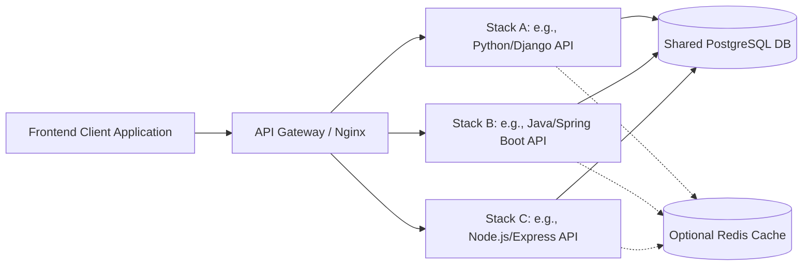

# Postkid: API Playground 🚀

Postkid: API Playground is a multi-stack backend application designed to empower developers in defining, testing, and monitoring API endpoints through an intuitive web interface. This project demonstrates how a consistent set of features can be implemented across various modern technology stacks, serving as both a functional tool and a technical showcase.

## Table of Contents

- [About The Project](#about-the-project)
- [Core Features](#core-features)
- [Architectural Overview](#architectural-overview)
- [Technology Stacks](#technology-stacks)
- [Getting Started](#getting-started)
  - [Prerequisites](#prerequisites)
  - [Running a Stack](#running-a-stack)
- [Documentation Hub](#documentation-hub)
- [Contributing](#contributing)
- [License](#license)

## About The Project

The primary objective of the Postkid: API Playground is to provide a robust, self-hostable environment for API interaction, focusing on developer productivity. This repository contains multiple implementations of the same core application, each built with a different backend technology stack and typically paired with a corresponding modern frontend framework.

This project aims to:
- Ensure consistency in usage, features, and API requirements across all implementations.
- Demonstrate full-stack development expertise using diverse technologies.
- Adhere to rapid development cycles for each stack.
- Promote containerized deployments.

For a deep dive into the project's technical specifications, motivations, and acceptance criteria, please refer to the [Project Yellow Paper](./docs/YellowPaper.md).

## Core Features

- **Visual API Testing**: Interactively construct and execute HTTP requests.
- **Collection Management**: Group related API endpoints into reusable collections and projects.
- **Request History**: Log all request executions with comprehensive details for debugging and reference.
- **Variable Management**: Use variables within your requests for dynamic testing.
- **Authentication Support**: Configure various authentication methods for your requests.
- **Multi-Stack Implementation**: Experience the same application built with different technologies.

## Architectural Overview

The Postkid: API Playground follows a modular, multi-stack architecture. While each stack implementation is independent, they all adhere to common principles:

- **Shared API Specification**: All backends expose the same API contract, detailed in [`docs/Endpoints.md`](./docs/Endpoints.md).
- **Unified Data Model**: A consistent data structure, defined in [`docs/Models.md`](./docs/Models.md), is used by all stacks, targeting a shared PostgreSQL database.
- **Containerization**: Each stack (backend and frontend) is designed to be run in Docker containers.
- **Gateway Pattern**: Production deployments typically involve an API Gateway (e.g., Nginx) for routing, SSL termination, and load balancing.

The general system flow is:


For detailed architectural insights into each specific stack and shared components, please visit the [Architecture Documentation Hub](./docs/architecture/readme.md).

## Technology Stacks

This project explores implementing the Postkid: API Playground using the following technology stacks, as defined in [`docs/Stacks.md`](./docs/Stacks.md):

1.  **Python/Django + React**:
    *   Backend: Django 5.0, Django REST Framework
    *   Frontend: React 18, TypeScript, Vite
    *   Details: [`docs/architecture/django.md`](./docs/architecture/django.md)
2.  **Java/Spring Boot + Angular**:
    *   Backend: Spring Boot 3.2, Spring Data JPA
    *   Frontend: Angular 17, TypeScript
    *   Details: [`docs/architecture/springboot.md`](./docs/architecture/springboot.md)
3.  **C#/.NET + Blazor WASM**:
    *   Backend: .NET 8 Web API
    *   Frontend: Blazor WebAssembly
    *   Details: [`docs/architecture/dotnet.md`](./docs/architecture/dotnet.md)
4.  **Go/Fiber + SvelteKit**:
    *   Backend: Go, Fiber, sqlc
    *   Frontend: SvelteKit, TypeScript
    *   Details: [`docs/architecture/go.md`](./docs/architecture/go.md) (placeholder)
5.  **Node.js/Express + Next.js**:
    *   Backend: Node.js, Express.js, TypeScript, Prisma
    *   Frontend: Next.js 14 (App Router), TypeScript
    *   Details: [`docs/architecture/next.md`](./docs/architecture/next.md)

## Getting Started

### Prerequisites

- Git
- Docker Engine
- Docker Compose

### Running a Stack

Each technology stack is intended to be run independently using Docker. While specific instructions might vary slightly per stack (and would ideally be in a README within each stack's own subdirectory), the general approach is:

1.  **Clone the repository:**
    ```sh
    git clone https://github.com/your-username/api-playground.git
    cd api-playground
    ```
2.  **Navigate to a specific stack's directory** (once subdirectories for each stack are created):
    ```sh
    cd stacks/django-react # Example path
    ```
3.  **Run using Docker Compose:**
    ```sh
    docker-compose up --build
    ```
4.  Access the application via the port specified in the stack's `docker-compose.yml` (e.g., `http://localhost:3000` for frontend, `http://localhost:8000` for backend API).

*(Note: The exact directory structure and `docker-compose` setup for each stack will be detailed as implementations progress.)*

## Documentation Hub

All project documentation, including technical specifications, architectural details, and data models, can be found in the [`/docs`](./docs/) directory.
- [Project Yellow Paper](./docs/YellowPaper.md): Core concepts, features, and requirements.
- [Technology Stacks Overview](./docs/Stacks.md): Definition of each stack.
- [Data Models](./docs/Models.md): Database schema.
- [API Endpoints](./docs/Endpoints.md): API specification.
- [Detailed Stack Architectures](./docs/architecture/readme.md): Links to individual stack architecture documents.
- [Agent Definitions](./Agents.md): Overview of system agents and their interactions.

## Contributing

Contributions are welcome! Please read our `CONTRIBUTING.md` (placeholder - to be created) for details on our code of conduct, and the process for submitting pull requests.

## License

Distributed under the MIT License. See `LICENSE` (placeholder - to be created) for more information.
