# API Playground - Java/Spring Boot + Angular Stack Architecture ☕

This document provides a detailed technical reference for the Java/Spring Boot and Angular implementation of the API Playground application. It aligns with `../../Specs/Yellow Paper.md` and the simplified technology stack in `../../Tech-Stacks/Technology Stacks.md`. This guide covers system architecture, component responsibilities, dependencies, project structure, security, deployment, and testing.

---

## 1. Overview

This stack features a Java backend built with Spring Boot 3.2 (including Spring Web and Spring Security 6) and an Angular 17 frontend (using TypeScript 5.0). The backend uses Spring Data JPA with Hibernate 6.2 for data access to PostgreSQL 15 (with HikariCP for connection pooling). Authentication is JWT-based via Spring Security. The focus is on leveraging Spring Boot's robust ecosystem for a reliable backend and Angular's comprehensive framework for a feature-rich frontend.

**Stack Highlights (as per `../../Tech-Stacks/Technology Stacks.md`):**
-   **Backend (Spring Boot):** Java, Spring Boot 3.2, Spring Web, Spring Security 6. Spring Data JPA with Hibernate 6.2 for ORM to PostgreSQL 15 (HikariCP). JWT for authentication. Bucket4j for rate limiting. SpringDoc OpenAPI 3 for API documentation. Initial task processing via Spring `@Async` methods. Build with Maven 3.9 or Gradle 8.0. Code quality via SpotBugs, Checkstyle, JaCoCo.
-   **Frontend (Angular):** Angular 17, TypeScript 5.0. UI with Angular Material and CDK. State management with NgRx and RxJS. Angular HttpClient for API calls. Angular Reactive Forms. Testing with Jasmine and Karma. Build with Angular CLI.
-   **Objective:** To deliver a fully functional API Playground instance using the Java/Spring Boot and Angular stack, adhering to project core requirements and the streamlined technology choices in `../../Tech-Stacks/Technology Stacks.md`. References to `common_foundations.md` are incorrect.

---

## 2. System Architecture Diagram

The diagram illustrates the architecture with Spring Boot backend, Angular frontend, and simplified asynchronous task processing.

```mermaid
%%{init: {
  'theme': 'base',
  'themeVariables': {
    'primaryColor': '#7aa2f7',
    'primaryTextColor': '#1a1b26',
    'primaryBorderColor': '#3b4261',
    'lineColor': '#bb9af7',
    'background': '#1a1b26',
    'mainBkg': '#1a1b26',
    'secondBkg': '#24283b',
    'tertiaryBkg': '#292e42',
    'fontFamily': '"Segoe UI", sans-serif',
    'fontSize': '14px',
    'fontWeight': '600',
    'labelBackground': '#24283b',
    'edgeLabelBackground': '#24283b',
    'clusterBkg': '#24283b',
    'clusterBorder': '#3b4261',
    'defaultLinkColor': '#bb9af7',
    'titleColor': '#c0caf5'
  },
  'flowchart': {
    'nodeSpacing': 40,
    'rankSpacing': 60,
    'curve': 'basis'
  }
}}%%

flowchart TB
    subgraph SpringBoot_Angular_System["☕ Java/Spring Boot + Angular System"]
        subgraph Client_Layer["Client Layer (Angular SPA)"]
            direction LR
            AngularApp["🅰️ Angular 17 (TypeScript 5.0)"]
        end
        
        subgraph Gateway_Layer["Gateway Layer (Conceptual)"]
            direction LR
            ReverseProxy["⚖️ Nginx / Cloud Gateway"]
        end
        
        subgraph Backend_Layer["Backend API Layer (Spring Boot)"]
            direction LR
            SpringBootApp["🍃 Spring Boot 3.2 (Embedded Tomcat)"] -- Served By --> ReverseProxy
            SpringBootApp --> SpringSecurity["🛡️ Spring Security 6 (JWT)"]
            SpringBootApp --> SpringWeb["🕸️ Spring Web (MVC)"]
            SpringBootApp --> SpringDataJPA["💾 Spring Data JPA (Hibernate 6.2, HikariCP)"]
            SpringBootApp --> RateLimiter["🚫 Bucket4j"]
            SpringBootApp --> AsyncTasks["⚙️ Spring @Async Methods"]
        end
        
        subgraph Data_Store["Data Layer"]
            direction LR
            PostgresDB["🐘 PostgreSQL 15 (Shared)"]
            RedisCache["⚡ Redis (Optional, for Rate Limiting if distributed)"]
        end

        subgraph External_Services["External Services (Conceptual)"]
            direction LR
            ThirdPartyAPIs["🔌 Third-party APIs (for testing)"]
            EmailService["📧 SMTP (for notifications)"]
        end
    end

    %% Connections
    AngularApp --> ReverseProxy

    SpringDataJPA --> PostgresDB
    RateLimiter -.-> RedisCache
    SpringBootApp --> AsyncTasks
    AsyncTasks --> ThirdPartyAPIs
    SpringBootApp --> EmailService

    subgraph SharedInfrastructure["Shared Infrastructure"]
      PostgresDB
      RedisCache
    end

    %% Node styling
    classDef clientNode fill:#ff9e64,stroke:#ff7043,stroke-width:2px,color:#1a1b26,font-weight:600
    classDef gatewayNode fill:#73daca,stroke:#41a6b5,stroke-width:2px,color:#1a1b26,font-weight:600
    classDef backendNode fill:#e0af68,stroke:#d19a66,stroke-width:2px,color:#1a1b26,font-weight:600
    classDef dataNode fill:#9ece6a,stroke:#73b25a,stroke-width:2px,color:#1a1b26,font-weight:600
    classDef taskNode fill:#7aa2f7,stroke:#5a7ec5,stroke-width:2px,color:#1a1b26,font-weight:600
    classDef externalNode fill:#f7768e,stroke:#db5a6b,stroke-width:2px,color:#1a1b26,font-weight:600
    classDef sharedInfra fill:#3b4261,stroke:#bb9af7,stroke-width:1px,color:#c0caf5

    %% Apply styles
    class AngularApp clientNode
    class ReverseProxy gatewayNode
    class SpringBootApp,SpringSecurity,SpringWeb,SpringDataJPA,RateLimiter,AsyncTasks backendNode
    class PostgresDB,RedisCache dataNode
    class ThirdPartyAPIs,EmailService externalNode
    class SharedInfrastructure sharedInfra

    %% Subgraph styling
    style SpringBoot_Angular_System fill:#1a1b26,stroke:#3b4261,stroke-width:2px,color:#c0caf5
    style Client_Layer fill:#24283b,stroke:#3b4261,stroke-width:1px,color:#c0caf5
    style Gateway_Layer fill:#24283b,stroke:#3b4261,stroke-width:1px,color:#c0caf5
    style Backend_Layer fill:#24283b,stroke:#3b4261,stroke-width:1px,color:#c0caf5
    style Data_Store fill:#24283b,stroke:#3b4261,stroke-width:1px,color:#c0caf5
    style External_Services fill:#24283b,stroke:#3b4261,stroke-width:1px,color:#c0caf5
    style SharedInfrastructure fill:#1f2335,stroke:#3b4261,stroke-width:1px,color:#c0caf5
```



**Explanation:** The Angular client application communicates with the Spring Boot backend API. A reverse proxy (Nginx or similar) manages traffic. The Spring Boot backend, running on an embedded Tomcat server, handles business logic, security (Spring Security with JWT), data access (Spring Data JPA to PostgreSQL), rate limiting (Bucket4j), and simplified background tasks using Spring's `@Async` methods. Redis is optional for distributed rate limiting.

---

## 3. Component Responsibilities

Component responsibilities are defined by `../../Tech-Stacks/Technology Stacks.md` and `../../Specs/Yellow Paper.md`:

-   **Angular Frontend (Angular 17, TypeScript 5.0):**
    -   Builds the client-side Single-Page Application (SPA).
    -   **UI:** Angular Material and Angular CDK (Component Dev Kit).
    -   **State Management:** NgRx for Redux-style state management, leveraging RxJS for reactive programming.
    -   **Forms:** Angular Reactive Forms for robust form handling and validation.
    -   **HTTP Client:** Angular `HttpClient` for communication with the Spring Boot backend, with interceptors for token handling.
    -   **Build:** Angular CLI.
-   **Spring Boot Backend (Spring Boot 3.2, Java):**
    -   Develops the core RESTful API service, running on an embedded Tomcat server.
    -   **Web Layer:** Spring Web (MVC) for controllers and request handling.
    -   **Security:** Spring Security 6 for authentication (JWT-based) and authorization.
    -   **Data Access:** Spring Data JPA with Hibernate 6.2 as the ORM, HikariCP for connection pooling to PostgreSQL 15. Database migrations managed by Flyway (or Liquibase, if preferred, though not explicitly in Stacks.md, it's good practice).
    -   **Rate Limiting:** Bucket4j, optionally using Redis for distributed environments.
    -   **API Documentation:** SpringDoc OpenAPI 3.
    -   **Task Processing:** Initially, Spring `@Async` methods for simple asynchronous operations. RabbitMQ/external message brokers are deferred.
    -   **Build:** Maven 3.9 or Gradle 8.0.
-   **PostgreSQL 15 (Shared):**
    -   Primary relational database.
-   **Redis (Shared, Optional):**
    -   For distributed rate limiting with Bucket4j or general caching.
-   **Reverse Proxy (Nginx/Cloud Gateway - Conceptual):**
    -   Manages incoming traffic, SSL termination, serves Angular static assets (if not served by Spring Boot), and routes API requests to Spring Boot.

---

## 4. Dependencies

Key dependencies are specified in `../../Tech-Stacks/Technology Stacks.md`. Versions should be pinned in `pom.xml` (Maven) or `build.gradle` (Gradle) for backend, and `package.json` for frontend.

**Backend (Java/Spring Boot 3.2):**
| Dependency (Maven groupId:artifactId)   | Version      | Purpose                                      |
|-----------------------------------------|--------------|----------------------------------------------|
| `org.springframework.boot:spring-boot-starter-web` | `3.2.x`      | Spring MVC, REST controllers, Embedded Tomcat |
| `org.springframework.boot:spring-boot-starter-security` | `3.2.x`  | Spring Security 6 features                   |
| `org.springframework.boot:spring-boot-starter-data-jpa` | `3.2.x`  | Spring Data JPA, Hibernate 6.2             |
| `org.postgresql:postgresql`             | `42.x.x`     | PostgreSQL JDBC driver                       |
| `com.zaxxer:HikariCP`                   | Bundled      | Default connection pool in Spring Boot 2+    |
| `io.jsonwebtoken:jjwt-api` (and impl, jackson) | `0.11.x`+    | JWT creation and parsing                   |
| `com.bucket4j:bucket4j-core`            | `~8.x.x`     | Rate limiting library                        |
| `org.springdoc:springdoc-openapi-starter-webmvc-ui` | `2.x.x`   | OpenAPI 3 documentation (Swagger UI)         |
| `org.flywaydb:flyway-core`                | `~9.x.x`     | Database migrations (if used)                |
| `org.springframework.boot:spring-boot-starter-test` | `3.2.x`  | Testing (JUnit 5, Mockito, Spring Test)    |
| `org.testcontainers:postgresql`           | `~1.19.x`    | For PostgreSQL integration testing           |

**Frontend (Angular 17 / TypeScript 5.0):**
| Package                         | Version      | Purpose                                      |
|---------------------------------|--------------|----------------------------------------------|
| `@angular/core`                 | `~17.x.x`    | Angular core framework                       |
| `@angular/common`               | `~17.x.x`    | Common Angular pipes, directives, HttpClient |
| `@angular/compiler`             | `~17.x.x`    | Angular template compiler                    |
| `@angular/platform-browser`     | `~17.x.x`    | Browser platform services                    |
| `@angular/router`               | `~17.x.x`    | Client-side routing                          |
| `@angular/forms`                | `~17.x.x`    | Reactive Forms module                        |
| `@angular/material`             | `~17.x.x`    | Angular Material components                  |
| `@angular/cdk`                  | `~17.x.x`    | Angular Component Dev Kit                    |
| `typescript`                    | `~5.x.x`     | Language superset for Angular                |
| `rxjs`                          | `~7.8.x`     | Reactive Extensions library for JavaScript   |
| `@ngrx/store`                   | `~17.x.x`    | NgRx state management (core store)           |
| `@ngrx/effects`                 | `~17.x.x`    | NgRx side effect model                       |
| `@ngrx/entity`                  | `~17.x.x`    | NgRx entity management                       |
| `jasmine-core`                  | `~5.1.x`     | Testing framework                            |
| `karma`                         | `~6.4.x`     | Test runner                                  |
| `karma-jasmine`                 | `~5.1.x`     | Karma adapter for Jasmine                    |
| `karma-chrome-launcher`         | `~3.2.x`     | Karma launcher for Chrome                    |

**Code Quality (Backend):**
- SpotBugs, Checkstyle, JaCoCo (configured via Maven/Gradle plugins).

---

## 5. Project Structure

Standard Maven/Gradle project structure for Spring Boot and Angular CLI structure for the frontend. A monorepo setup can manage both.

### Backend (Spring Boot - Maven/Gradle Structure)
```text
api-playground-springboot/
├── src/
│   ├── main/
│   │   ├── java/
│   │   │   └── com/apoplayground/springboot/   # Base package
│   │   │       ├── ApiPlaygroundApplication.java # Main application class
│   │   │       ├── config/                     # SecurityConfig, WebConfig, AsyncConfig, OpenAPIConfig
│   │   │       ├── controller/                 # REST Controllers (Auth, Collection, Endpoint, etc.)
│   │   │       ├── domain/                     # JPA Entities (User, Collection, Endpoint, RequestLog)
│   │   │       ├── dto/                        # Data Transfer Objects for API requests/responses
│   │   │       ├── exception/                  # Custom exceptions and @ControllerAdvice
│   │   │       ├── repository/                 # Spring Data JPA Repositories
│   │   │       ├── service/                    # Business logic services (AuthService, CollectionService)
│   │   │       │   └── impl/                   # Service implementations
│   │   │       └── util/                       # Utility classes
│   │   └── resources/
│   │       ├── application.yml                 # Main application configuration
│   │       ├── application-dev.yml             # Development profile configuration
│   │       ├── application-prod.yml            # Production profile configuration
│   │       └── db/migration/                   # Flyway SQL migration scripts (e.g., V1__Initial_Schema.sql)
│   └── test/
│       └── java/
│           └── com/apoplayground/springboot/   # Test classes mirroring main structure
├── pom.xml (or build.gradle)                   # Project build file
└── ... (other project files like .mvn, .gitignore)
```

### Frontend (Angular - Angular CLI Structure)
```text
api-playground-angular/
├── src/
│   ├── app/
│   │   ├── core/                             # Core module (guards, interceptors, singleton services)
│   │   ├── features/                         # Feature modules (e.g., auth, collections)
│   │   │   ├── auth/
│   │   │   │   ├── components/ (login, register)
│   │   │   │   ├── services/ (auth.service.ts)
│   │   │   │   └── auth.module.ts
│   │   │   └── ...
│   │   ├── shared/                           # Shared module (common components, pipes, directives)
│   │   ├── app-routing.module.ts
│   │   ├── app.component.html/ts/scss
│   │   └── app.module.ts
│   ├── assets/                               # Static assets (images, fonts, i18n files)
│   ├── environments/                         # Environment-specific configurations (dev, prod)
│   ├── main.ts                               # Main entry point
│   ├── polyfills.ts
│   ├── styles.scss                           # Global styles
│   └── test.ts                               # Test entry point
├── angular.json                              # Angular CLI configuration
├── package.json
├── tsconfig.app.json
├── tsconfig.json
└── tsconfig.spec.json
```

**Rationale:**
-   The Spring Boot backend follows typical Java project conventions (layered architecture: Controller-Service-Repository). Configuration is managed via `application.yml`.
-   The Angular frontend uses the structure generated by Angular CLI, organizing code into modules (core, shared, features) for better maintainability and lazy loading.

---

## 6. Entity-Relationship (ER) Diagram

The core data model is defined by `../../Specs/Yellow Paper.md` and implemented using Spring Data JPA entities, mapped to PostgreSQL tables. Flyway can be used for schema migrations.


**Explanation:**
-   JPA Entities (`@Entity`) map to PostgreSQL tables. IDs are typically `UUID`.
-   Fields like `tags`, `headers`, `queryParams`, `authConfig` are stored as JSON strings in `VARCHAR` or `TEXT` columns. For complex querying on these, separate related tables or JSONB type in PostgreSQL (if supported by Hibernate version and configured) would be alternatives.
-   Relationships are defined using JPA annotations (`@ManyToOne`, `@OneToMany`).

---

## 7. Service & Background Task Flows (Simplified)

As per `../../Tech-Stacks/Technology Stacks.md`, complex asynchronous processing (RabbitMQ) is deferred. The Spring Boot backend will use Spring's `@Async` annotation for simple, in-process asynchronous tasks.

-   **API Request Execution Flow (`POST /api/test/{endpoint_id}/` or ad-hoc):**
    1.  **Client Request (Angular):** Angular frontend sends an API execution request to the Spring Boot backend.
    2.  **Spring Boot Controller (`@RestController`):** Receives the request, validates input DTOs.
    3.  **Authentication (Spring Security):** JWT token in `Authorization` header is validated by Spring Security filters.
    4.  **Service Layer (`@Service`):** Business logic for preparing the HTTP request to the target external API.
    5.  **HTTP Execution (e.g., using `RestTemplate` or `WebClient`):**
        *   The Spring Boot application makes the HTTP call to the external API. `WebClient` is preferred for non-blocking calls, suitable for `@Async` methods.
        *   Timeout handling is applied.
    6.  **Response Processing:** Capture status, headers, body, duration from the external API.
    7.  **Logging:** Save details to `RequestLogEntity` in PostgreSQL via Spring Data JPA repository.
    8.  **Backend Response to Client:** Spring Boot controller returns the response DTO to the Angular client.

-   **Background Tasks (using Spring `@Async`):**
    *   **Configuration:** Enable asynchronous processing with `@EnableAsync` in a configuration class.
    *   **Implementation:** Annotate methods in Spring beans (typically services) with `@Async`. These methods will be executed in a separate thread from Spring's task executor pool.
    *   **Use Cases:**
        *   Sending non-critical notification emails after an action.
        *   Lightweight post-processing tasks that shouldn't block the main request thread.
    *   **Example `cleanup_tasks`:** A method annotated with `@Scheduled` (Spring's built-in scheduler) and `@Async` could perform periodic cleanup of old `RequestLogEntity` entries.
    *   **Limitations:** `@Async` tasks run within the same application process. They are not suitable for very long-running, CPU-intensive, or highly resilient distributed tasks where a message queue like RabbitMQ would excel. This aligns with the "defer RabbitMQ" directive.

**Simplification Note:** The absence of RabbitMQ means no external message broker dependency, simpler setup, and reliance on Spring's in-process task execution for asynchronous needs.

---

## 8. Authentication & Security Patterns

Security measures align with `../../Specs/Yellow Paper.md` and are implemented using Spring Security 6 and related practices as specified in `../../Tech-Stacks/Technology Stacks.md`.

-   **Spring Security 6:**
    *   Provides comprehensive security services including authentication and authorization.
    *   Configured using a `SecurityFilterChain` bean.
-   **JWT Authentication:**
    *   The backend uses JWTs for stateless API authentication. Custom services will handle JWT generation (on login/refresh) and validation (per request via a filter).
    *   Libraries like `io.jsonwebtoken:jjwt` are used for token operations.
    *   Access tokens are short-lived; refresh tokens are longer-lived and securely stored (e.g., HttpOnly cookie if applicable, or managed by client).
-   **Rate Limiting (Bucket4j):**
    *   Integrated with Spring Boot to limit request frequency to API endpoints.
    *   Can be configured with in-memory buckets or use Redis for distributed environments.
-   **CORS Configuration:**
    *   Managed via Spring Security's CORS configuration or a global `WebMvcConfigurer` bean to allow requests from the Angular frontend's origin.
-   **CSRF Protection:**
    *   Spring Security provides CSRF protection by default, often using a synchronized token pattern. For stateless JWT APIs, if cookies are not used for session management by Spring Security, CSRF protection might be relaxed for API paths, but this needs careful consideration. If any part of the app uses session cookies, CSRF must be active.
-   **HTTPS:** Enforced in production, typically at the reverse proxy/load balancer level.
-   **SSRF Prevention:**
    *   Validate and sanitize any user-supplied URLs that the backend will request (e.g., target URL in API execution). Use safe HTTP client configurations.
-   **Input Validation:**
    *   Spring Validation (Hibernate Validator) used on DTOs (`@Valid`, `@NotNull`, etc.) in controller methods.
-   **Secret Management:**
    *   `application.yml` or `application.properties` for configuration. Sensitive data (DB passwords, JWT secrets) via environment variables or Spring Cloud Config (if a more complex setup is warranted, but not for initial scope).
-   **Audit Logging:** Key actions logged to PostgreSQL via Spring Data JPA / Logback / SLF4J.

---

## 9. API Design Conventions & Documentation

-   **API Specification:** Adheres to `../../API-Reference/` (once populated).
-   **Documentation Generation (`SpringDoc OpenAPI 3`):**
    *   `springdoc-openapi-starter-webmvc-ui` dependency provides automatic generation of OpenAPI 3.0 specification and Swagger UI.
    *   Annotations like `@Operation`, `@Parameter` can enhance the generated documentation.
-   **Versioning:** API versioning (e.g., `/api/v1/`) implemented in request mappings.
-   **Response Format:** Standard Spring Boot JSON responses. Consistent error DTOs using `@ControllerAdvice` and `@ExceptionHandler`.
-   **Data Transfer Objects (DTOs):** Used for request and response payloads to decouple API contracts from JPA entities. Mapping can be done manually or with libraries like MapStruct (though not explicitly in `../../Tech-Stacks/Technology Stacks.md`, it's a common practice).

---

## 10. Frontend Architecture (Angular)

The Angular frontend architecture is detailed in section 5 ("Project Structure"). Key aspects include:

-   **Framework:** Angular 17 with TypeScript 5.0, built using Angular CLI.
-   **UI Components:** Angular Material and Angular CDK for a rich set of pre-built and customizable UI components.
-   **State Management:** NgRx (with RxJS) for robust, Redux-pattern state management across the application.
-   **Forms:** Angular Reactive Forms for type-safe, scalable form handling and validation.
-   **HTTP Client (`@angular/common/http`):**
    *   Angular's `HttpClient` for all communication with the Spring Boot backend.
    *   HTTP Interceptors (`HttpInterceptor`) are used to automatically attach JWT bearer tokens to outgoing requests and handle global error responses (e.g., 401 for token expiry).
-   **Routing:** Angular Router for client-side navigation and lazy loading of feature modules.
-   **Testing:** Jasmine and Karma for unit and component tests. Playwright/Cypress for E2E if essential (as per `../../Tech-Stacks/Technology Stacks.md`).

---

## 11. Deployment Topology

Deployment strategy aligns with `../../Specs/Yellow Paper.md` and `../../Tech-Stacks/Technology Stacks.md`, using Docker containers.

**Development Environment:**
-   **Spring Boot API:** Run using Maven (`mvn spring-boot:run`) or Gradle (`gradle bootRun`), or directly from an IDE. Embedded Tomcat server.
-   **Angular Client:** Served using Angular CLI's `ng serve` with live reload.
-   **Database:** Local or Dockerized PostgreSQL instance.
-   A reverse proxy (e.g., local Nginx) can be set up to mimic production routing if needed.

**Production Environment (Container-Based):**
-   **Containerization:**
    *   **Spring Boot API:** Packaged as an executable JAR (via `spring-boot-maven-plugin` or Gradle equivalent) and then Dockerized (e.g., using a base OpenJDK image).
    *   **Angular Client:** Built into static assets (`ng build`) and can be Dockerized with a simple Nginx server or served from a CDN.
-   **Reverse Proxy (Nginx or Cloud Gateway):**
    *   Single entry point for traffic.
    *   Serves Angular static assets (if not using a separate CDN).
    *   Routes API requests (e.g., `/api/**`) to the Spring Boot application container(s).
    *   Handles SSL termination, load balancing.
-   **Database:** Managed PostgreSQL service.
-   **Cache:** Managed Redis service (if used for Bucket4j).
-   **CI/CD:** GitHub Actions for building, testing (backend and frontend), and deploying Docker containers.

**Diagram: Production Deployment (Nginx, Spring Boot API Containers, Angular Static Assets on Nginx/CDN)**
```mermaid
graph TD
    User[End User] --> Internet[Internet]
    Internet --> LB_Nginx[Load Balancer / Nginx Reverse Proxy]

    subgraph "Cloud Environment"
        LB_Nginx -- Serves Static Content --> AngularStaticAssets[Angular Build Output (Static Files on Nginx/CDN)]
        LB_Nginx -- Proxies API Requests --> SpringBootApiContainer1[Spring Boot API Container 1]
        LB_Nginx -- Proxies API Requests --> SpringBootApiContainer2[Spring Boot API Container 2]

        SpringBootApiContainer1 --> DB[Managed PostgreSQL Database]
        SpringBootApiContainer2 --> DB
        SpringBootApiContainer1 -.-> Cache[(Optional) Managed Redis Cache]
        SpringBootApiContainer2 -.-> Cache
    end

    style User fill:#c9d1d9,stroke:#768390
    style Internet fill:#79c0ff,stroke:#58a6ff
    style LB_Nginx fill:#7ee787,stroke:#56d364
    style AngularStaticAssets fill:#ffab70,stroke:#e69963
    style SpringBootApiContainer1 fill:#d2a8ff,stroke:#b083f0
    style SpringBootApiContainer2 fill:#d2a8ff,stroke:#b083f0
    style DB fill:#f0b0a4,stroke:#e39387
    style Cache fill:#a5d6ff,stroke:#89bde8
```

---

## 12. Testing Strategy

Testing adheres to `../../Specs/Yellow Paper.md` and uses stack-specific tools from `../../Tech-Stacks/Technology Stacks.md`.

**Backend (Spring Boot API):**
-   **Unit Tests (`JUnit 5`, `Mockito`):** Test individual classes (services, utility components) in isolation. Mock dependencies using Mockito.
-   **Integration Tests (`Spring Boot Test`, `JUnit 5`, `MockMvc`, `Testcontainers`):**
    *   `@SpringBootTest` to load application context.
    *   `MockMvc` to test controllers without a running HTTP server (testing web layer).
    *   Full integration tests (e.g., service layer with repository layer) can use `@DataJpaTest` for JPA components or run against a test database.
    *   `Testcontainers` (with PostgreSQL module) to spin up a real PostgreSQL instance in Docker for database-dependent integration tests.
-   **Code Coverage (`JaCoCo`):** Configured via Maven/Gradle plugin. Aim for 80%+.

**Frontend (Angular Client):**
-   **Unit/Component Tests (`Jasmine`, `Karma`):**
    *   Test individual components, services, pipes, directives.
    *   Angular's `TestBed` for configuring testing modules and injecting dependencies.
    *   Mock services and child components as needed.
-   **End-to-End Tests (`Playwright`/`Cypress` - if essential):**
    *   As per `../../Tech-Stacks/Technology Stacks.md`, if deemed essential for critical user flows.

**CI/CD (`GitHub Actions`):**
-   Automated execution of backend (Maven/Gradle test) and frontend (`ng test`, `ng e2e` if applicable) tests.
-   Code quality checks (SpotBugs, Checkstyle for backend; ESLint, Prettier for frontend).
-   Build and containerization steps.
