# API Playground - Node.js/TypeScript Stack Architecture 🟨

This document provides a detailed technical reference for the Node.js/TypeScript implementation of the API Playground. This stack features an Express.js backend (Node.js 20, Express 4.18) and a Next.js frontend (Next.js 14, TypeScript, App Router). It aligns with `../../Specs/Yellow Paper.md` and the simplified technology choices in `../../Tech-Stacks/Technology Stacks.md`. This guide covers system architecture, component responsibilities, dependencies, project structure, security, deployment, and testing.

---

## 1. Overview

This stack leverages a Node.js backend built with Express.js and TypeScript, providing a dedicated API service. The frontend is a modern React application built with Next.js 14 (using the App Router and TypeScript). Data persistence is handled by PostgreSQL 15, with Prisma 5.0 as the ORM. The focus is on a full-stack TypeScript experience, emphasizing performance and developer productivity.

**Stack Highlights (as per `../../Tech-Stacks/Technology Stacks.md`):**
-   **Backend (Express.js):** Node.js 20, Express 4.18, TypeScript. Authentication via Passport.js (JWT strategy). Prisma 5.0 for ORM with PostgreSQL. API documentation using Swagger JSDoc. Rate limiting with `express-rate-limit`. Initial task processing via simple async operations. Build with `esbuild` or `tsc`.
-   **Frontend (Next.js):** Next.js 14 (App Router), TypeScript. UI with Tailwind CSS and `shadcn/ui` (or Radix UI). State management with Zustand and TanStack Query. Forms with React Hook Form and Zod. HTTP communication using native `fetch`.
-   **Objective:** To deliver a fully functional API Playground instance using a Node.js-centric stack, adhering to project core requirements and the streamlined technology choices in `../../Tech-Stacks/Technology Stacks.md`. References to `common_foundations.md` are incorrect; `../../Specs/Yellow Paper.md` and `../../Tech-Stacks/Technology Stacks.md` are the primary sources.

---

## 2. System Architecture Diagram

The diagram illustrates the architecture with a distinct Express.js backend API and a Next.js frontend client, communicating via a gateway.

```mermaid
%%{init: {
  'theme': 'base',
  'themeVariables': {
    'primaryColor': '#7aa2f7',
    'primaryTextColor': '#1a1b26',
    'primaryBorderColor': '#3b4261',
    'lineColor': '#bb9af7',
    'background': '#1a1b26',
    'mainBkg': '#1a1b26',
    'secondBkg': '#24283b',
    'tertiaryBkg': '#292e42',
    'fontFamily': '"Segoe UI", sans-serif',
    'fontSize': '14px',
    'fontWeight': '600',
    'labelBackground': '#24283b',
    'edgeLabelBackground': '#24283b',
    'clusterBkg': '#24283b',
    'clusterBorder': '#3b4261',
    'defaultLinkColor': '#bb9af7',
    'titleColor': '#c0caf5'
  },
  'flowchart': {
    'nodeSpacing': 40,
    'rankSpacing': 60,
    'curve': 'basis'
  }
}}%%

flowchart TB
    subgraph NodeJs_Stack_System["🟨 Node.js/TypeScript Stack System"]
        subgraph Client_Layer["Client Layer (Next.js SPA)"]
            direction LR
            NextJsApp["⚡ Next.js 14 (App Router, TypeScript)"]
        end
        
        subgraph Gateway_Layer["Gateway Layer (Conceptual)"]
            direction LR
            ReverseProxy["⚖️ Nginx / Cloud Gateway"]
        end
        
        subgraph Backend_Layer["Backend API Layer (Express.js)"]
            direction LR
            ExpressApp["🚀 Express.js 4.18 (Node.js 20, TypeScript)"] -- Served By --> ReverseProxy
            ExpressApp --> AuthMiddleware["🔑 Passport.js (JWT Strategy)"]
            ExpressApp --> PrismaORM["💎 Prisma 5.0 ORM"]
            ExpressApp --> RateLimiter["🚫 express-rate-limit"]
            ExpressApp --> BackgroundTasks["⚙️ Simple Async Operations / In-Memory Queue"]
        end
        
        subgraph Data_Store["Data Layer"]
            direction LR
            PostgresDB["🐘 PostgreSQL 15 (Shared)"]
            RedisCache["⚡ Redis (Optional, for Rate Limiting if distributed)"]
        end

        subgraph External_Services["External Services (Conceptual)"]
            direction LR
            ThirdPartyAPIs["🔌 Third-party APIs (for testing)"]
            EmailService["📧 SMTP (for notifications)"]
        end
    end

    %% Connections
    NextJsApp --> ReverseProxy
    ReverseProxy --> ExpressApp

    PrismaORM --> PostgresDB
    RateLimiter -.-> RedisCache
    ExpressApp --> BackgroundTasks
    BackgroundTasks --> ThirdPartyAPIs
    ExpressApp --> EmailService

    subgraph SharedInfrastructure["Shared Infrastructure"]
      PostgresDB
      RedisCache
    end

    %% Node styling
    classDef clientNode fill:#ff9e64,stroke:#ff7043,stroke-width:2px,color:#1a1b26,font-weight:600
    classDef gatewayNode fill:#73daca,stroke:#41a6b5,stroke-width:2px,color:#1a1b26,font-weight:600
    classDef backendNode fill:#e0af68,stroke:#d19a66,stroke-width:2px,color:#1a1b26,font-weight:600
    classDef dataNode fill:#9ece6a,stroke:#73b25a,stroke-width:2px,color:#1a1b26,font-weight:600
    classDef taskNode fill:#7aa2f7,stroke:#5a7ec5,stroke-width:2px,color:#1a1b26,font-weight:600
    classDef externalNode fill:#f7768e,stroke:#db5a6b,stroke-width:2px,color:#1a1b26,font-weight:600
    classDef sharedInfra fill:#3b4261,stroke:#bb9af7,stroke-width:1px,color:#c0caf5

    %% Apply styles
    class NextJsApp clientNode
    class ReverseProxy gatewayNode
    class ExpressApp,AuthMiddleware,PrismaORM,RateLimiter,BackgroundTasks backendNode
    class PostgresDB,RedisCache dataNode
    class ThirdPartyAPIs,EmailService externalNode
    class SharedInfrastructure sharedInfra

    %% Subgraph styling
    style NodeJs_Stack_System fill:#1a1b26,stroke:#3b4261,stroke-width:2px,color:#c0caf5
    style Client_Layer fill:#24283b,stroke:#3b4261,stroke-width:1px,color:#c0caf5
    style Gateway_Layer fill:#24283b,stroke:#3b4261,stroke-width:1px,color:#c0caf5
    style Backend_Layer fill:#24283b,stroke:#3b4261,stroke-width:1px,color:#c0caf5
    style Data_Store fill:#24283b,stroke:#3b4261,stroke-width:1px,color:#c0caf5
    style External_Services fill:#24283b,stroke:#3b4261,stroke-width:1px,color:#c0caf5
    style SharedInfrastructure fill:#1f2335,stroke:#3b4261,stroke-width:1px,color:#c0caf5
```



**Explanation:** The Next.js client application communicates with the dedicated Express.js backend API. A reverse proxy (Nginx or similar) manages traffic to both (serving Next.js static assets and proxying API calls to Express). The Express backend handles business logic, authentication (Passport.js), data access (Prisma to PostgreSQL), rate limiting, and simplified background tasks. Redis is optional for distributed rate limiting.

---

## 3. Component Responsibilities

Component responsibilities are defined by `../../Tech-Stacks/Technology Stacks.md` and `../../Specs/Yellow Paper.md`:

-   **Next.js Frontend (Next.js 14, TypeScript, App Router):**
    -   Builds the client-side Single-Page Application (SPA).
    -   **UI:** Tailwind CSS and `shadcn/ui` (or Radix UI) components.
    -   **State Management:** Zustand for client-side state, TanStack Query (React Query) for server state.
    -   **Forms:** React Hook Form with Zod for validation.
    -   **HTTP Client:** Native `fetch` API, wrapped in custom hooks or services for interacting with the Express.js backend.
-   **Express.js Backend (Node.js 20, Express 4.18, TypeScript):**
    -   Develops the core RESTful API service.
    -   **Build:** Transpiled from TypeScript to JavaScript using `esbuild` or `tsc`.
    -   **ORM:** Prisma 5.0 with Prisma Client for PostgreSQL 15.
    -   **Authentication:** Passport.js with `passport-jwt` strategy for JWT-based API authentication.
    -   **Rate Limiting:** `express-rate-limit`, optionally using a Redis store.
    -   **API Documentation:** `swagger-jsdoc` and `swagger-ui-express`.
    -   **Task Processing:** Initially, simple asynchronous JavaScript operations or a basic in-memory queue pattern. Bull/Agenda are deferred.
-   **PostgreSQL 15 (Shared):**
    -   Primary relational database for all persistent data.
-   **Redis (Shared, Optional):**
    -   Primarily for caching to support `express-rate-limit` in a distributed setup. Not used for task queuing in the initial simplified stack.
-   **Reverse Proxy (Nginx/Cloud Gateway - Conceptual):**
    -   Manages incoming traffic, SSL termination, serves Next.js static assets, and routes API requests to the Express.js application.

---

## 4. Dependencies

Key dependencies are specified in `../../Tech-Stacks/Technology Stacks.md`. Versions should be pinned in `package.json` files for both backend and frontend.

**Backend (Node.js 20 / Express 4.18 / TypeScript):**
| Package                 | Version      | Purpose                                      |
|-------------------------|--------------|----------------------------------------------|
| `express`               | `4.18.x`     | Web framework                                |
| `typescript`            | `~5.x.x`     | Superset of JavaScript                       |
| `@types/express`        | `^4.17.x`    | TypeScript definitions for Express           |
| `ts-node`               | `^10.9.x`    | TypeScript execution environment for Node.js (dev) |
| `esbuild`               | `^0.x.x`     | Fast bundler/minifier (alternative to tsc for build) |
| `prisma`                | `5.x.x`      | ORM CLI (for migrations, generation)       |
| `@prisma/client`        | `5.x.x`      | Prisma runtime client                        |
| `passport`              | `^0.6.x`     | Authentication middleware                    |
| `passport-jwt`          | `^4.0.x`     | JWT strategy for Passport                    |
| `jsonwebtoken`          | `^9.0.x`     | JWT signing and verification                 |
| `@types/passport-jwt`   | `^3.0.x`     | TypeScript definitions for passport-jwt      |
| `express-rate-limit`    | `^7.x.x`     | Rate limiting middleware                     |
| `swagger-jsdoc`         | `^6.2.x`     | Generates OpenAPI spec from JSDoc            |
| `swagger-ui-express`    | `^5.0.x`     | Serves Swagger UI for Express                |
| `pg`                    | `^8.x.x`     | PostgreSQL client (used by Prisma)           |
| `dotenv`                | `^16.x.x`    | Environment variable loading (dev)           |
| `eslint`                | `^8.x.x`     | Linter                                       |
| `prettier`              | `^3.x.x`     | Code formatter                               |
| `jest`                  | `^29.x.x`    | Testing framework                            |
| `supertest`             | `^6.x.x`     | HTTP assertion library for testing APIs      |
| `@testcontainers/postgresql`| `^10.x.x`| For PostgreSQL integration testing           |

**Frontend (Next.js 14 / TypeScript):**
| Package                 | Version      | Purpose                                      |
|-------------------------|--------------|----------------------------------------------|
| `next`                  | `14.x.x`     | React framework                              |
| `react`                 | `18.x.x`     | UI library                                   |
| `react-dom`             | `18.x.x`     | React DOM rendering                          |
| `typescript`            | `~5.x.x`     | Superset of JavaScript                       |
| `@types/react`          | `^18.x.x`    | TypeScript definitions for React             |
| `@types/node`           | `^20.x.x`    | TypeScript definitions for Node.js           |
| `tailwindcss`           | `^3.x.x`     | CSS framework                                |
| `zustand`               | `^4.x.x`     | State management                             |
| `@tanstack/react-query` | `^5.x.x`     | Server state management (React Query v5)     |
| `react-hook-form`       | `^7.x.x`     | Form handling                                |
| `zod`                   | `^3.x.x`     | Schema validation                            |
| `shadcn-ui`             | `latest`     | UI components (via CLI, e.g. `npx shadcn-ui@latest add button`) |
| `lucide-react`          | `^0.x.x`     | Icon library (often used with shadcn/ui)     |
| `eslint-config-next`    | `14.x.x`     | ESLint configuration for Next.js             |
| `jest`                  | `^29.x.x`    | Testing framework                            |
| `@testing-library/react`| `^14.x.x`    | React component testing utilities            |
| `msw`                   | `^2.x.x`     | Mock Service Worker for API mocking          |

**Code Quality (Both):**
- ESLint, Prettier, TypeScript (strict mode).

---

## 5. Project Structure (Monorepo with Express API & Next.js Client)

A monorepo structure (e.g., using npm/yarn/pnpm workspaces) is recommended to manage the separate Express.js backend and Next.js frontend projects.

```text
api-playground-node/
├── packages/
│   ├── api/                     # Express.js Backend Application
│   │   ├── src/
│   │   │   ├── config/          # Environment, Passport.js strategies
│   │   │   ├── modules/         # Feature modules (e.g., auth, collections, execution)
│   │   │   │   ├── auth/
│   │   │   │   │   ├── auth.controller.ts
│   │   │   │   │   ├── auth.service.ts
│   │   │   │   │   └── auth.routes.ts
│   │   │   │   └── ... (other modules)
│   │   │   ├── middleware/      # Custom Express middleware
│   │   │   ├── utils/           # Shared utilities for backend
│   │   │   └── server.ts        # Express app setup and start
│   │   ├── prisma/              # Prisma schema and migrations (could be top-level too)
│   │   │   └── schema.prisma
│   │   ├── package.json
│   │   └── tsconfig.json
│   └── web/                     # Next.js Frontend Application
│       ├── src/
│       │   ├── app/             # Next.js App Router structure
│       │   │   ├── (features)/  # Feature-based route groups
│       │   │   │   ├── auth/
│       │   │   │   └── collections/
│       │   │   ├── layout.tsx
│       │   │   └── page.tsx
│       │   ├── components/      # UI components (shadcn/ui based)
│       │   ├── lib/             # Frontend utilities, config (e.g. TanStack Query client)
│       │   ├── services/        # Typed API client services for Express backend
│       │   ├── store/           # Zustand stores
│       │   └── hooks/           # Custom React hooks
│       ├── public/
│       ├── package.json
│       └── tsconfig.json
├── package.json                 # Root package.json for monorepo workspaces
└── tsconfig.base.json           # Base TypeScript config (if needed)
```

**Rationale:**
-   **`packages/api`**: Contains the standalone Express.js backend. It has its own `package.json`, `tsconfig.json`, and `prisma` schema. Logic is organized into modules (e.g., by feature/domain).
-   **`packages/web`**: Contains the Next.js frontend application, also with its own `package.json` and `tsconfig.json`. It uses the App Router for file-system based routing and organization.
-   **Monorepo Root**: Manages workspaces, shared dev dependencies (like Prettier, ESLint configs), and scripts to run/build both apps.
-   This separation ensures clear boundaries between the backend API and the frontend client, aligning with the distinct technology choices for each in `../../Tech-Stacks/Technology Stacks.md`.

---

## 6. Entity-Relationship (ER) Diagram

The core data model is defined by `../../Specs/Yellow Paper.md` and implemented in the Express.js backend using Prisma ORM, targeting PostgreSQL.


**Explanation:**
-   Prisma models map to PostgreSQL tables. IDs are typically strings (`cuid()` or `uuid()`).
-   JSON fields (`Json` type in Prisma) store flexible data like tags, headers, query parameters, and authConfig.
-   Relationships are defined as per `../../Specs/Yellow Paper.md` and `../../API-Reference/` (once populated).

---

## 7. Service & Background Task Flows (Simplified)

As per `../../Tech-Stacks/Technology Stacks.md`, complex asynchronous processing with Bull/Agenda is deferred. The Express.js backend will handle API request execution primarily through simple asynchronous operations.

-   **API Request Execution Flow (`POST /api/test/{endpoint_id}/` or ad-hoc):**
    1.  **Client Request (Next.js):** The Next.js frontend sends an API execution request to the Express.js backend.
    2.  **Express.js Controller/Route Handler:** Receives the request, validates input using Zod or similar.
    3.  **Authentication (Passport.js):** JWT token is validated using `passport-jwt` strategy.
    4.  **Request Preparation:** Backend service prepares the HTTP request to the target external API.
    5.  **HTTP Execution (using `axios` or Node.js `fetch`):**
        *   The Express.js application makes the async HTTP call to the external API.
        *   Timeout handling is applied.
    6.  **Response Processing:** Capture status, headers, body, duration from the external API.
    7.  **Logging:** Save details to `RequestLog` in PostgreSQL via Prisma Client.
    8.  **Backend Response to Client:** Express.js sends the response back to the Next.js client.

-   **Background Tasks (Simple Async / In-Memory Queue):**
    *   **Implementation:** For tasks that can be deferred slightly but don't need robust distributed queuing (e.g., sending a non-critical notification email after an action):
        *   Use `setImmediate()` or `process.nextTick()` for very short-lived tasks.
        *   A simple in-memory array acting as a queue, processed by a `setInterval` loop, could handle slightly longer tasks. This is volatile and not suitable for critical tasks.
    *   **Example `cleanup_tasks`:** A simple script run via cron (OS-level) or a route triggered externally would be more reliable for purging old logs than an in-memory queue for the initial phase.
    *   **Limitations:** This approach lacks persistence, retry mechanisms, and monitoring of dedicated job queues like Bull. It's suitable only for non-critical, short-lived background operations.

**Simplification Note:** The absence of Bull/Agenda means no distributed job processing, no Redis dependency for queues, and simpler operational management initially.

---

## 8. Authentication & Security Patterns

Security measures align with `../../Specs/Yellow Paper.md` and are implemented using libraries specified in `../../Tech-Stacks/Technology Stacks.md` for the Express.js backend and Next.js frontend.

-   **Authentication (Express.js Backend):**
    *   **`Passport.js` with `passport-jwt` Strategy:** The Express API uses Passport.js to authenticate requests using JWTs.
        *   Clients (Next.js app) include the JWT in the `Authorization: Bearer <token>` header.
        *   The `passport-jwt` strategy extracts and verifies the token.
    *   **Token Issuance:** Login/registration endpoints on the Express API issue JWTs (access and refresh tokens) upon successful authentication.
    *   **`jsonwebtoken`:** Used for signing and verifying JWTs.
-   **Token Management (Next.js Frontend):**
    *   The Next.js client securely stores JWTs (e.g., in HttpOnly cookies if using Next.js API routes as a BFF, or secure browser storage if directly calling Express from client components – care must be taken for XSS).
    *   Handles token refresh by calling a dedicated refresh endpoint on the Express API.
-   **Rate Limiting (Express.js Backend - `express-rate-limit`):**
    *   Applied to Express API endpoints to prevent abuse. Configurable per route, potentially using Redis for distributed environments.
-   **CORS (Express.js Backend):**
    *   The `cors` middleware in Express is configured to allow requests specifically from the Next.js application's origin.
-   **CSRF Protection:**
    *   For the Express API (stateless with JWTs), CSRF is generally not a primary concern for the API endpoints themselves if tokens are sent via Authorization header.
    *   If Next.js uses its own API routes for any stateful operations with cookies, Next.js built-in CSRF protection or libraries like `csurf` (if applicable to Next.js API routes) should be considered. However, the primary API is Express.
-   **HTTPS:** Enforced in production via the reverse proxy (Nginx).
-   **SSRF Prevention (Express.js Backend):**
    *   Validate and sanitize any user-supplied URLs that the Express backend will request (e.g., target URL in API execution). Disallow internal/private IPs.
-   **Input Validation:**
    *   **Backend (Express.js):** Use libraries like Zod or Joi with Express middleware to validate incoming request bodies, params, and query strings.
    *   **Frontend (Next.js):** React Hook Form with Zod for client-side form validation.
-   **Secret Management:**
    *   `.env` files (using `dotenv` library) for local development.
    *   Environment variables directly injected in production (Docker, cloud provider).
-   **Audit Logging:** Key actions logged to PostgreSQL via Prisma.

---

## 9. API Design Conventions & Documentation (Express.js Backend)

-   **API Specification:** Adheres to `../../API-Reference/` (once populated).
-   **Documentation Generation (`swagger-jsdoc`, `swagger-ui-express`):**
    *   JSDoc comments in Express route handlers and controller files are used by `swagger-jsdoc` to generate an OpenAPI 3.0 specification.
    *   `swagger-ui-express` serves the interactive Swagger UI from an Express endpoint.
-   **Versioning:** API versioning (e.g., `/api/v1/`) implemented in Express routes.
-   **Response Format:** Consistent JSON responses. Standardized error response structure.
-   **Error Handling:** Centralized error handling middleware in Express.

---

## 10. Frontend Architecture (Next.js)

The Next.js frontend architecture is detailed in section 5 ("Project Structure"). Key aspects include:

-   **Framework:** Next.js 14 with TypeScript, using the App Router.
-   **UI Components:** Tailwind CSS for styling, with `shadcn/ui` (built on Radix UI) for accessible, unstyled component primitives.
-   **State Management:**
    *   Zustand for client-side global state.
    *   TanStack Query (React Query v5) for server state management (caching, optimistic updates, background refetching of data from the Express API).
-   **Forms:** React Hook Form with Zod for type-safe form handling and validation.
-   **HTTP Client:** Native `fetch` API, typically wrapped in custom hooks or service functions to interact with the Express backend. These services will handle attaching JWTs to requests.
-   **Routing:** File-system based routing provided by Next.js App Router.
-   **Testing:** Jest and React Testing Library for unit/integration tests. MSW for mocking API calls to the Express backend during tests.

---

## 11. Deployment Topology

Deployment strategy aligns with `../../Specs/Yellow Paper.md` and `../../Tech-Stacks/Technology Stacks.md`, using Docker containers.

**Development Environment (Monorepo with `npm/yarn/pnpm workspaces`):**
-   **Express.js API:** Run using `nodemon` or `ts-node-dev` for TypeScript compilation and hot reloading.
-   **Next.js Client:** Run using `next dev`.
-   **Database:** Local or Dockerized PostgreSQL instance.
-   **Scripts:** Monorepo root `package.json` scripts to concurrently start both backend and frontend.

**Production Environment (Container-Based):**
-   **Containerization:**
    *   **Express.js API:** Dockerized Node.js application (Node Alpine base), running the compiled TypeScript code with `node`. `PM2` can be used as a process manager within the container.
    *   **Next.js Client:** Built into a static export (`next build && next export` if fully static, or a standalone Node.js server via `next build` if using SSR/ISR features not covered by static export). Dockerized if it runs its own Node.js server, or static assets deployed to a CDN/static host. Given the primary backend is Express, a static export or serving via Nginx from the Next.js build output is common.
-   **Reverse Proxy (Nginx):**
    *   Serves as the single entry point.
    *   Serves static assets from the Next.js build output.
    *   Routes `/api` requests to the Express.js API container(s).
    *   Handles SSL termination, load balancing (if multiple API instances).
-   **Database:** Managed PostgreSQL service.
-   **Cache:** Managed Redis service (if used for `express-rate-limit`).
-   **CI/CD:** GitHub Actions for building, testing, and deploying Docker containers for API and frontend assets.

**Diagram: Production Deployment (Nginx, Express API Containers, Next.js Static Assets)**
```mermaid
graph TD
    User[End User] --> Internet[Internet]
    Internet --> LB_Nginx[Load Balancer / Nginx Reverse Proxy]

    subgraph "Cloud Environment"
        LB_Nginx -- Serves Static Content --> NextJsStaticAssets[Next.js Build Output (Static Files on Nginx/CDN)]
        LB_Nginx -- Proxies API Requests --> ExpressApiContainer1[Express.js API Container 1]
        LB_Nginx -- Proxies API Requests --> ExpressApiContainer2[Express.js API Container 2]

        ExpressApiContainer1 --> DB[Managed PostgreSQL Database]
        ExpressApiContainer2 --> DB
        ExpressApiContainer1 -.-> Cache[(Optional) Managed Redis Cache]
        ExpressApiContainer2 -.-> Cache
    end

    style User fill:#c9d1d9,stroke:#768390
    style Internet fill:#79c0ff,stroke:#58a6ff
    style LB_Nginx fill:#7ee787,stroke:#56d364
    style NextJsStaticAssets fill:#ffab70,stroke:#e69963
    style ExpressApiContainer1 fill:#d2a8ff,stroke:#b083f0
    style ExpressApiContainer2 fill:#d2a8ff,stroke:#b083f0
    style DB fill:#f0b0a4,stroke:#e39387
    style Cache fill:#a5d6ff,stroke:#89bde8
```

---

## 12. Testing Strategy

Testing adheres to `../../Specs/Yellow Paper.md` and uses stack-specific tools from `../../Tech-Stacks/Technology Stacks.md`.

**Backend (Express.js API):**
-   **Unit Tests (`Jest`):** Test individual functions, services, utilities. Mock dependencies (like Prisma Client methods, external service calls).
-   **Integration Tests (`Jest` + `Supertest`):** Test API endpoints by making HTTP requests to the Express app. Verify responses, status codes, and database interactions (potentially with `@testcontainers/postgresql` for a real DB).
-   **Code Coverage:** Jest's built-in coverage or `nyc`. Aim for 80%+.

**Frontend (Next.js Client):**
-   **Unit/Integration Tests (`Jest` + `React Testing Library`):** Test components, pages, custom hooks. Simulate user interactions.
-   **API Mocking (`msw`):** Mock API calls to the Express backend during frontend tests to isolate frontend logic.

**CI/CD (`GitHub Actions`):**
-   Automated execution of backend and frontend tests.
-   Linting (ESLint, Prettier) and type checking (TypeScript) for both projects.
-   Build and containerization steps.
