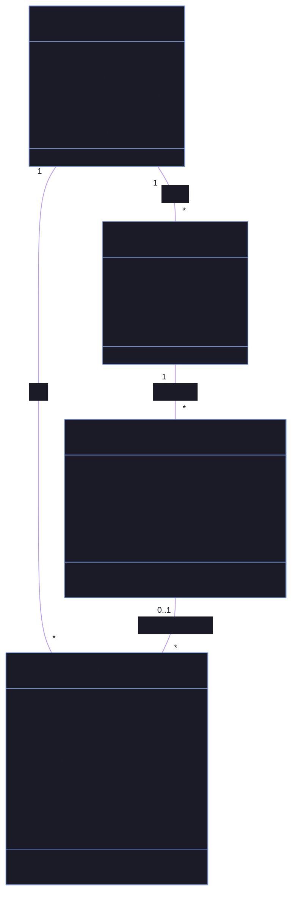
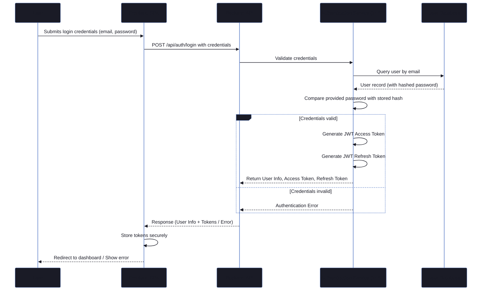
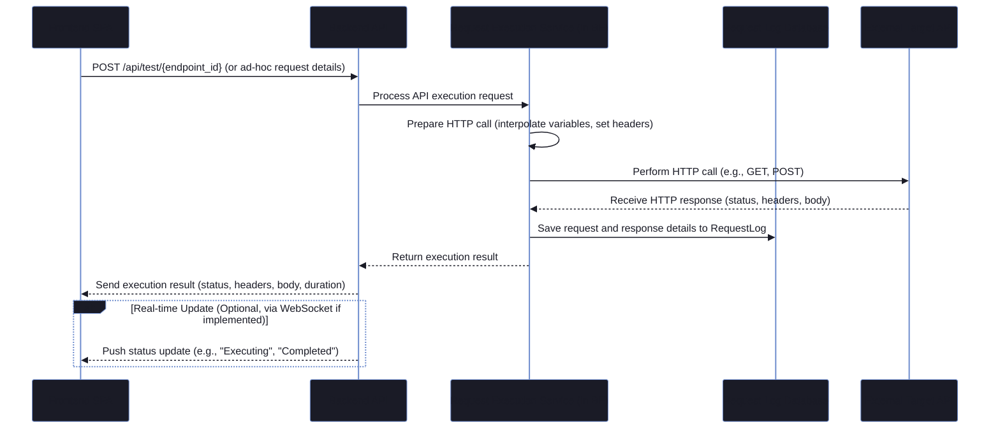

# API Playground - Architecture Overview

This document serves as the central point for understanding the architecture of the API Playground application across its various technology stack implementations.

It provides links to detailed architecture documents for each stack, outlines shared principles, and offers a comparative overview.

The primary sources of truth for requirements and technology choices are:
-   `docs/Specs/Yellow Paper.md`: Defines the overall project, its features, and acceptance criteria.
-   `docs/Tech-Stacks/Technology Stacks.md`: Specifies the precise technologies for each implemented stack.
-   `docs/API-Reference/`: Details the common API specification (once populated).

---

## Table of Contents

-   [1. Implemented Technology Stacks](#1-implemented-technology-stacks)
-   [2. Shared Design Principles](#2-shared-design-principles)
-   [3. High-Level System Architecture](#3-high-level-system-architecture)
-   [4. Data Model Overview](#4-data-model-overview)
-   [5. Core Workflow Diagrams](#5-core-workflow-diagrams)
    -   [5.1. Authentication Handshake](#51-authentication-handshake)
    -   [5.2. API Request Execution Flow (Simplified)](#52-api-request-execution-flow-simplified)
-   [6. Technology Stack Comparison](#6-technology-stack-comparison)

---

## 1. Implemented Technology Stacks

Detailed architecture for each implemented stack can be found in their respective documents:

-   **Python/Django + React:** [`./Python Django Stack.md`](./Python%20Django%20Stack.md)
-   **C#/.NET + Blazor WASM:** [`./NET Stack.md`](./NET%20Stack.md)
-   **Node.js/TypeScript (Express.js + Next.js):** [`./Node-js TypeScript Stack.md`](./Node-js%20TypeScript%20Stack.md)
-   **Java/Spring Boot + Angular:** [`./Java Spring Boot Stack.md`](./Java%20Spring%20Boot%20Stack.md)
-   **Go/Fiber + SvelteKit:** [`./Go Fiber Stack.md`](./Go%20Fiber%20Stack.md) (Documentation to be created)

*Note: The Go stack is defined in `docs/Tech-Stacks/Technology Stacks.md`; its detailed architecture document is pending.*

---

## 2. Shared Design Principles

The following principles, derived primarily from `docs/Specs/Yellow Paper.md`, guide the development of all stack implementations to ensure consistency and quality:

-   **Consistency:** All stacks must implement the features and API endpoints (as will be detailed in [`docs/API-Reference/`](../API-Reference/)) as defined in [`docs/Specs/Yellow Paper.md`](../Specs/Yellow%20Paper.md) to ensure identical functionality and user experience.
-   **Modularity:** Codebases should be organized logically (e.g., following Domain-Driven Design principles where appropriate, or standard conventions for the framework) to promote maintainability and separation of concerns.
-   **Security:**
    -   Robust authentication (JWT-based) and authorization mechanisms are mandatory.
    -   Rate limiting must be implemented to prevent abuse.
    -   Input validation is critical on all incoming data.
    -   Protection against common web vulnerabilities (XSS, CSRF, SSRF) must be considered and implemented.
-   **Simplified Task Processing (Initial Scope):** As per [`docs/Tech-Stacks/Technology Stacks.md`](../Tech-Stacks/Technology%20Stacks.md), complex background task queues (Celery, RabbitMQ, Bull, Hangfire) are deferred. Initial implementations will use simpler, in-process asynchronous mechanisms native to each stack (e.g., Spring `@Async`, ASP.NET `BackgroundService`, Django `BackgroundTasks`, simple Node.js async patterns).
-   **Performance:** While full optimization is iterative, applications should be responsive. API response times and frontend load times are key considerations (see [`docs/Specs/Yellow Paper.md#📈-performance-requirements`](../Specs/Yellow%20Paper.md#📈-performance-requirements) for targets).
-   **Testability:** Each stack must include a comprehensive testing strategy, covering unit, integration, and (conceptually) end-to-end tests, as outlined in the [Testing Strategy of the Yellow Paper](../Specs/Yellow%20Paper.md#🧪-testing-strategy).
-   **Containerization:** All implementations are designed to be deployed via Docker containers, as outlined in the [Deployment Architecture of the Yellow Paper](../Specs/Yellow%20Paper.md#🚀-deployment-architecture).
-   **API Documentation:** Each backend API must be documented using OpenAPI 3.0 standards (e.g., Swashbuckle, drf-spectacular, SpringDoc, Swagger JSDoc), further detailed in [`docs/API-Reference/`](../API-Reference/).
-   **Database:** PostgreSQL 15 is the shared relational database, with the schema detailed in [`docs/Models/Data Models.md`](../Models/Data%20Models.md).
-   **Configuration:** Sensitive configurations should be managed via environment variables.

---

## 3. High-Level System Architecture

The general system architecture applies conceptually to all stacks, with specific tooling varying.

```mermaid
%%{init: { 'theme': 'base', 'themeVariables': { 'primaryColor': '#7aa2f7', 'primaryTextColor': '#1a1b26', 'lineColor': '#bb9af7', 'background': '#1a1b26', 'mainBkg': '#1a1b26'}}}%%
graph TD
    A[User] --> B{Frontend SPA};
    B --> C{API Gateway / Reverse Proxy};
    C --> D[Backend API Service (Stack Specific)];
    D --> E[Shared PostgreSQL Database];
    D -.-> F[(Optional) Shared Redis Cache];
    D -- In-Process Async --> G((External API Call));
    D --> H[Logging Service/Mechanism];

    subgraph "Client Layer"
        B
    end
    subgraph "Gateway/CDN Layer"
        C
    end
    subgraph "Application Layer (Stack Specific Implementation)"
        D
        G
        H
    end
    subgraph "Data Layer (Shared)"
        E
        F
    end

    style A fill:#c9d1d9,stroke:#768390
    style B fill:#ff9e64,stroke:#ff7043
    style C fill:#73daca,stroke:#41a6b5
    style D fill:#e0af68,stroke:#d19a66
    style E fill:#9ece6a,stroke:#73b25a
    style F fill:#a5d6ff,stroke:#89bde8
    style G fill:#f7768e,stroke:#db5a6b
    style H fill:#bb9af7,stroke:#9d7cd8
```
**Key Components:**
-   **Frontend SPA:** Single Page Application specific to each stack (React, Blazor WASM, Next.js, Angular, SvelteKit).
-   **API Gateway/Reverse Proxy:** (e.g., Nginx) Manages incoming requests, SSL termination, load balancing (if applicable), and routing to the appropriate backend service. Serves static frontend assets.
-   **Backend API Service:** The core application logic, implemented in one of the five defined technology stacks. Handles business logic, authentication, and interaction with the data layer.
-   **Shared PostgreSQL Database:** The primary data store for all stacks.
-   **Shared Redis Cache (Optional):** Used for rate limiting (if distributed) or general caching.
-   **External API Call:** Represents the execution of user-defined API requests to third-party services.
-   **Logging Service/Mechanism:** For recording application events, errors, and request history.

**Note on Background Workers:** The "Background Workers" concept from `docs/Specs/Yellow Paper.md` is simplified in the initial implementations to in-process asynchronous tasks within the Backend API Service.

---

## 4. Data Model Overview

The core data model is consistent across all stacks to ensure functional parity and is primarily defined by the requirements in `docs/Specs/Yellow Paper.md` and the API specification (once populated in `docs/API-Reference/`). Key entities include:

-   **User:** Represents registered users of the platform.
    -   Key attributes: `id`, `email`, `password_hash`, `first_name`, `last_name`, timestamps.
-   **Collection:** A group of saved API endpoints belonging to a user.
    -   Key attributes: `id`, `user_id` (FK to User), `name`, `description`, `is_public`, `tags`, timestamps.
-   **Endpoint:** A saved API request definition within a collection.
    -   Key attributes: `id`, `collection_id` (FK to Collection), `name`, `method`, `url`, `headers`, `query_params`, `body_type`, `body_content`, `timeout_seconds`, `auth_config`, `pre_request_script`, `post_request_script`, timestamps.
-   **RequestLog:** Records the history of executed API requests.
    -   Key attributes: `id`, `user_id` (FK to User), `endpoint_id` (FK to Endpoint, nullable for ad-hoc requests), `method`, `url`, `request_headers`, `request_body`, `status_code`, `response_headers`, `response_body`, `duration_ms`, `response_size_bytes`, `executed_at`.

A simplified conceptual class diagram:

*Detailed ER diagrams and model definitions are available in each stack-specific architecture document and in [`docs/Models/Data Models.md`](../Models/Data%20Models.md).*

---

## 5. Core Workflow Diagrams

These diagrams illustrate key workflows common to all stacks, adapted for the simplified initial implementations.

### 5.1. Authentication Handshake

(As per the [JWT Token Strategy in `docs/Specs/Yellow Paper.md`](../Specs/Yellow%20Paper.md#jwt-token-strategy))


### 5.2. API Request Execution Flow (Simplified)

(Reflecting synchronous or simple async processing within the backend)

*Note: The "Background Task Retry Flow" and "Job Lifecycle State Diagram" from the original document are less relevant for the initial simplified task processing and have been omitted here. Retries, if implemented for simple async tasks, would be part of the `Request Execution Service` logic.*

---

## 6. Technology Stack Comparison

This table provides a high-level comparison of the core technologies used in each implemented stack, based on `docs/Tech-Stacks/Technology Stacks.md`.

| Feature                       | Python/Django + React                                   | C#/.NET + Blazor WASM                                     | Node.js/Express + Next.js                                | Java/Spring Boot + Angular                                       | Go/Fiber + SvelteKit                                         |
| :---------------------------- | :------------------------------------------------------ | :-------------------------------------------------------- | :------------------------------------------------------- | :--------------------------------------------------------------- | :----------------------------------------------------------- |
| **Stack Name (Docs)**       | `Python Django Stack.md`                                | `NET Stack.md`                                            | `Node-js TypeScript Stack.md`                            | `Java Spring Boot Stack.md`                                      | `Go Fiber Stack.md` (pending)                                |
| **Backend Framework**         | Django 5.0, Django REST Framework 3.14                  | .NET 8 Web API (ASP.NET Core)                             | Express.js 4.18 (Node.js 20, TypeScript)                 | Spring Boot 3.2 (Spring Web, Java)                               | Go 1.21, Fiber v2.50                                         |
| **Frontend Framework**        | React 18 (TypeScript 5.0, Vite 4.0)                     | Blazor WebAssembly (.NET 8)                               | Next.js 14 (App Router, TypeScript)                      | Angular 17 (TypeScript 5.0)                                      | SvelteKit (TypeScript, Vite)                                 |
| **Database ORM/Access**     | Django ORM (with psycopg3)                              | Entity Framework Core 8.0 (Npgsql)                        | Prisma 5.0 ORM                                           | Spring Data JPA (Hibernate 6.2, HikariCP)                        | sqlc (pgx driver)                                            |
| **Authentication (Backend)**  | `django-rest-framework-simplejwt`                       | ASP.NET Core Identity + JWT Bearer                        | Passport.js (JWT Strategy)                               | Spring Security 6 (JWT)                                          | `golang-jwt` + custom middleware                             |
| **API Documentation**         | `drf-spectacular` (OpenAPI 3.0)                         | Swashbuckle (OpenAPI/Swagger)                             | Swagger JSDoc + `swagger-ui-express`                     | SpringDoc OpenAPI 3 (Swagger)                                    | `go-swagger` / `swag`                                        |
| **Task Processing (Initial)** | Synchronous / Django Background Tasks                   | ASP.NET Core `BackgroundService`                          | Simple Async Operations / In-Memory Queue                | Spring `@Async` Methods                                          | Go routines / channels                                       |
| **UI Library (Frontend)**     | Tailwind CSS 3.3 + Headless UI                          | Blazor Bootstrap (or similar)                             | Tailwind CSS + `shadcn/ui` (or Radix UI)                 | Angular Material + CDK                                           | Tailwind CSS + Skeleton UI                                   |
| **State Management (FE)**   | Zustand + React Query (TanStack Query)                  | Blazor built-in features                                  | Zustand + React Query (TanStack Query)                   | NgRx + RxJS                                                      | Svelte stores                                                |
| **HTTP Client (FE)**        | Axios                                                   | `HttpClient` (Blazor configured)                          | Native `fetch` API                                       | Angular `HttpClient`                                             | Native `fetch` API                                           |
| **Forms (FE)**                | React Hook Form + Zod                                   | Blazor `EditForm`                                         | React Hook Form + Zod                                    | Angular Reactive Forms                                           | Svelte forms (e.g., `svelte-forms-lib`)                      |
| **Backend Testing**         | `pytest-django`, `factory-boy`, `pytest-cov`            | `xUnit`, `Moq`, `FluentAssertions`, `Testcontainers`    | `Jest`, `Supertest`, `@testcontainers/postgresql`        | `JUnit 5`, `Mockito`, Spring Test, `Testcontainers`              | `Testify`, `GoMock`, `httptest`                              |
| **Frontend Testing**        | `Jest`, `React Testing Library`, `MSW`                  | `bUnit`                                                   | `Jest`, `React Testing Library`, `MSW`                   | `Jasmine`, `Karma`                                               | `Vitest`, `Playwright`                                       |
| **Backend Linting/Quality** | `black`, `flake8`, `isort`, `mypy`                      | Roslyn Analyzers (StyleCop)                               | ESLint, Prettier, TypeScript (strict)                    | SpotBugs, Checkstyle, JaCoCo                                     | `golangci-lint`                                              |
| **Build Tool (Backend)**      | Not Applicable (Python runtime)                         | `dotnet build` (MSBuild)                                  | `tsc` or `esbuild`                                       | Maven 3.9 / Gradle 8.0                                           | Go modules / `Makefile`                                      |
| **Build Tool (Frontend)**     | Vite 4.0                                                | `dotnet build` (part of Blazor WASM build)                | Next.js CLI (Turbopack/Webpack)                          | Angular CLI                                                      | Vite (via SvelteKit)                                         |
| **Configuration (Backend)**   | `python-decouple` / Env Vars                            | `appsettings.json` / Env Vars                             | `dotenv` / Env Vars                                      | `application.yml` / Env Vars                                     | Viper / Env Vars                                             |

This table provides a snapshot of the primary tools and libraries for each stack as defined for the initial, simplified implementation phase.
