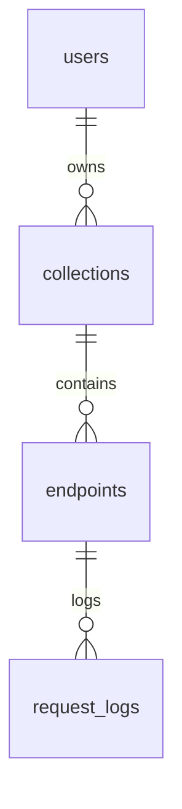

# API Playground - Python/Django + React Stack Architecture 🐍

This document provides a detailed technical reference for the Python/Django and React implementation of the API Playground application. It aligns with the specifications outlined in `docs/Specs/Yellow Paper.md` and the simplified technology choices in `docs/Tech-Stacks/Technology Stacks.md`. This guide covers the precise system architecture, component responsibilities, dependencies, folder structure, security patterns, deployment strategies, and testing approaches for this specific stack.

---

## 1. Overview

This implementation pairs a Python backend, utilizing the Django framework (version 5.0) and Django REST Framework (DRF version 3.14), with a React frontend (version 18 with TypeScript 5.0). The focus is on leveraging Django's robust capabilities for rapid development of the backend API and React's modern features for a dynamic and responsive user interface, built with Vite 4.0.

**Stack Highlights (as per `docs/Tech-Stacks/Technology Stacks.md`):**
- **Backend:** Django 5.0 for core logic, Django REST Framework 3.14 for RESTful APIs, `django-rest-framework-simplejwt` for authentication, and `django-ratelimit` for rate limiting. PostgreSQL 15 serves as the database. Task processing will initially be synchronous or use simple Django Background Tasks, deferring Celery.
- **Frontend:** React 18 with TypeScript 5.0, built using Vite 4.0. Key libraries include Tailwind CSS 3.3, Headless UI, Zustand for state management, React Query (TanStack Query) for data fetching, React Router 6 for navigation, React Hook Form with Zod for forms, and Axios for HTTP requests.
- **Objective:** To deliver a fully functional API Playground instance adhering to the project's core requirements, emphasizing the streamlined technology stack defined in `docs/Tech-Stacks/Technology Stacks.md` for efficient development and deployment. `common_foundations.md` is not a specified source of truth; primary references are `docs/Specs/Yellow Paper.md` and `docs/Tech-Stacks/Technology Stacks.md`.

---

## 2. System Architecture Diagram (Initial Simplified Implementation)

The following flowchart illustrates the high-level architecture of the Django + React implementation for the initial phase, emphasizing simplified, in-process task handling. This modular design ensures scalability, maintainability, and clear separation of concerns.

```mermaid
%%{init: {
  'theme': 'base',
  'themeVariables': {
    'primaryColor': '#7aa2f7',
    'primaryTextColor': '#1a1b26',
    'primaryBorderColor': '#3b4261',
    'lineColor': '#bb9af7',
    'background': '#1a1b26',
    'mainBkg': '#1a1b26',
    'secondBkg': '#24283b',
    'tertiaryBkg': '#292e42',
    'fontFamily': '"Segoe UI", sans-serif',
    'fontSize': '14px',
    'fontWeight': '600',
    'labelBackground': '#24283b',
    'edgeLabelBackground': '#24283b',
    'clusterBkg': '#24283b',
    'clusterBorder': '#3b4261',
    'defaultLinkColor': '#bb9af7',
    'titleColor': '#c0caf5'
  },
  'flowchart': {
    'nodeSpacing': 30,
    'rankSpacing': 50,
    'curve': 'basis'
  }
}}%%

flowchart TB
    subgraph Stack_1_System_Diagram["🐍 Stack 1 - Django System (Initial Phase)"]
        subgraph Client["Client Layer"]
            direction LR
            React["⚛️ React + Vite"]
        end
        
        subgraph Gateway["Gateway Layer"]
            direction LR
            Nginx["⚖️ Nginx LB / Reverse Proxy"]
        end
        
        subgraph Backend["Backend Layer"]
            direction LR
            Dj["🐍 Django + DRF"]
            Dj --> Auth["🔑 SimpleJWT"]
            Dj --> RateLimitLib["🚫 django-ratelimit"]
            Dj --> TaskHandling["🔄 Sync / Django BG Tasks (In-Process)"]
        end
        
        subgraph Services["Services Layer (within Django Apps)"]
            direction LR
            ReqSvc["📡 Request Execution Service"]
            ColSvc["📁 Collection Mgmt Service"]
            UserSvc["👤 User Mgmt Service"]
        end
        
        subgraph Data["Data Layer"]
            direction LR
            PG["🐘 PostgreSQL"]
            RD["⚡ Redis Cache (Optional for Rate Limit)"]
        end
        
        subgraph External["External Services"]
            direction LR
            APIs["🔌 Third-party APIs (Target for execution)"]
        end
    end

    %% Connections
    React --> Nginx
    Nginx --> Dj

    Dj --> ReqSvc
    Dj --> ColSvc
    Dj --> UserSvc

    ReqSvc --> TaskHandling
    TaskHandling --> APIs # External API calls made here

    Dj --> PG
    RateLimitLib -.-> RD # django-ratelimit can optionally use Redis

    %% Node styling
    classDef clientNode fill:#ff9e64,stroke:#ff7043,stroke-width:2px,color:#1a1b26,font-weight:600
    classDef gatewayNode fill:#73daca,stroke:#41a6b5,stroke-width:2px,color:#1a1b26,font-weight:600
    classDef backendNode fill:#e0af68,stroke:#d19a66,stroke-width:2px,color:#1a1b26,font-weight:600
    classDef serviceNode fill:#bb9af7,stroke:#9d7cd8,stroke-width:2px,color:#1a1b26,font-weight:600
    classDef databaseNode fill:#9ece6a,stroke:#73b25a,stroke-width:2px,color:#1a1b26,font-weight:600
    classDef taskNode fill:#7aa2f7,stroke:#5a7ec5,stroke-width:2px,color:#1a1b26,font-weight:600
    classDef externalNode fill:#f7768e,stroke:#db5a6b,stroke-width:2px,color:#1a1b26,font-weight:600

    %% Apply styles
    class React clientNode
    class Nginx gatewayNode
    class Dj,Auth,RateLimitLib,TaskHandling backendNode
    class ReqSvc,ColSvc,UserSvc serviceNode
    class PG,RD databaseNode
    class APIs externalNode

    %% Subgraph styling
    style Stack_1_System_Diagram fill:#1a1b26,stroke:#3b4261,stroke-width:2px,color:#c0caf5
    style Client fill:#24283b,stroke:#3b4261,stroke-width:1px,color:#c0caf5
    style Gateway fill:#24283b,stroke:#3b4261,stroke-width:1px,color:#c0caf5
    style Backend fill:#24283b,stroke:#3b4261,stroke-width:1px,color:#c0caf5
    style Services fill:#24283b,stroke:#3b4261,stroke-width:1px,color:#c0caf5
    style Data fill:#24283b,stroke:#3b4261,stroke-width:1px,color:#c0caf5
    style External fill:#24283b,stroke:#3b4261,stroke-width:1px,color:#c0caf5
```

**Explanation:** The architecture is layered. The React client interacts via Nginx (gateway) with the Django backend. Django, using DRF, handles API requests, authentication (SimpleJWT), and rate limiting (`django-ratelimit`). Business logic is encapsulated in services within Django apps. Data is persisted in PostgreSQL, with Redis as an optional cache for rate limiting. External API calls for testing are made directly or via simple in-process background tasks. Complex workers (Celery), S3, SMTP, and Sentry are deferred for the initial simplified build, aligning with `docs/Tech-Stacks/Technology Stacks.md`.

---

## 3. Component Responsibilities

Each component in the Django + React stack is assigned specific roles to ensure modularity and maintainability. Below is a detailed breakdown of the responsibilities of each major component:

- **React/Vite & React Native:** 
  - Single-Page Application (SPA) for web and mobile UI development.
  - Uses Zustand for lightweight state management, React Query for data fetching and caching, `react-hook-form` for efficient form handling, and Zod for schema validation.
  - Focuses on delivering a responsive and interactive user experience for API testing and management.
- **Django & Django REST Framework (DRF):**
  - Core backend framework providing RESTful API endpoints.
  - Utilizes serializers for data validation and transformation, viewsets for endpoint logic, and custom middleware for request logging and rate-limiting.
  - Manages authentication, routing, and business logic execution.
- **SimpleJWT (Django REST Framework Extension):**
  - Handles JSON Web Token (JWT) authentication.
  - Issues short-lived access tokens (e.g., 15 minutes) and rotating refresh tokens (e.g., 7 days) for secure session management.
  - Implements token blacklisting to prevent unauthorized access after logout.
- **Task Processing (Synchronous / Django Background Tasks):**
  - Initially, API request execution and other tasks will be handled synchronously within the Django request-response cycle.
  - For slightly longer operations that should not block the main thread but don't require a full distributed task queue, simple Django Background Tasks (e.g., using `django-background-tasks` or a custom lightweight solution) will be used. This defers the complexity of Celery and a dedicated message broker like Redis for the initial phase.
- **`django-ratelimit`:**
  - Provides rate limiting capabilities. Can use database, cache (Redis if configured), or in-memory stores. For the initial simplified setup, database or in-memory is sufficient, with Redis as an option for scalability.
- **PostgreSQL:**
  - Primary relational database for storing structured data like users, collections, endpoints, and logs.
  - Leverages JSONB fields for flexible storage of API schemas and request/response data.
- **S3 / MinIO (Future Consideration):**
  - Object storage for large files, exports, or extensive log archiving is a future consideration and not part of the initial simplified stack.

**Note:** Components are chosen to align with the simplified stack defined in `docs/Tech-Stacks/Technology Stacks.md`, prioritizing rapid development for the initial phase.

---

## 4. Dependencies

The following table lists the key dependencies for both backend and frontend components, including version constraints, purposes, and justifications for their selection. These dependencies are critical for building, running, and testing the application.

| Package                         | Version | Purpose                       | Justification                                    |
|---------------------------------|---------|-------------------------------|-------------------------------------------------|
| **django**                     | 5.0.x   | Web framework                | Aligns with `Tech-Stacks.md` & latest features  |
| **djangorestframework**        | 3.14.x  | REST toolkit                 | Aligns with `Tech-Stacks.md`                    |
| **djangorestframework-simplejwt** | latest | JWT authentication          | Supports token blacklisting and rotation        |
| **django-cors-headers**         | latest  | CORS header management       | Standard for Django CORS handling               |
| **django-ratelimit**            | latest  | Rate limiting                | Specified in `Tech-Stacks.md`                   |
| **drf-spectacular**             | latest  | OpenAPI 3.0 schema gen.    | Specified in `Tech-Stacks.md`                   |
| **psycopg2-binary**            | latest  | PostgreSQL adapter           | Stable and performant database connection       |
| **gunicorn**                    | latest  | WSGI HTTP Server             | Common production server for Django             |
| **python-decouple**             | latest  | Settings management          | Easy env var based config (per TS)          |
| **pytest-django**               | latest  | Django testing with pytest   | Specified in `Tech-Stacks.md`                   |
| **factory-boy**                 | latest  | Test data generation         | Specified in `Tech-Stacks.md`                   |
| **pytest-cov**                  | latest  | Test coverage                | Specified in `Tech-Stacks.md`                   |
| **black, flake8, isort, mypy**  | latest  | Linting & Type Checking      | Specified in `Tech-Stacks.md`                   |
| **react**                      | 18.x    | Frontend UI library          | Modern features like hooks and concurrent mode  |
| **vite**                       | latest  | Dev server & bundler         | Fast hot module replacement (HMR) and builds    |
| **zustand**                    | latest  | State management             | Lightweight API for managing React state        |
| **react-query**                | latest  | Data fetching                | Efficient caching and invalidation mechanisms   |
| **react-router-dom**           | latest  | Routing                      | Standard navigation for SPA development         |
| **react-hook-form**            | latest  | Form handling                | High-performance form validation and management |
| **zod**                        | latest  | Schema validation            | TypeScript-first validation library             |
| **axios**                      | latest  | HTTP client                  | Supports interceptors for auth and logging      |
| **eslint**                     | latest  | Linting                      | Ensures code quality and consistency            |
| **prettier**                   | latest  | Code formatting              | Maintains consistent code style across team     |
| **jest**                       | latest  | Unit testing                 | Robust testing framework for React ecosystem    |
| **@testing-library/react**     | latest  | Component testing            | Focuses on accessibility and user behavior      |

**Best Practice:** Pin exact versions in production to avoid breaking changes, and use dependency management tools like `pip` for Python and `npm` or `yarn` for JavaScript to handle updates and compatibility.

---

## 5. Domain-Driven Design (DDD) Folder Structure

The project follows a Domain-Driven Design (DDD) approach to organize code into meaningful domains, enhancing modularity and maintainability. Below is the folder structure for the Django backend and React frontend:

### Backend (Django)
```text
Postkid/
├── Postkid/           # Main project package
│   ├── __init__.py
│   ├── settings/              # Project settings
│   │   ├── __init__.py
│   │   ├── base.py            # Common settings
│   │   ├── development.py     # Development-specific settings
│   │   ├── production.py      # Production-specific settings
│   │   └── test.py            # Test-specific settings
│   ├── urls.py                # Root URL configuration
│   ├── asgi.py                # ASGI configuration
│   └── wsgi.py                # WSGI configuration
├── apps/                      # Django applications
│   ├── authentication/        # User authentication app
│   │   ├── __init__.py
│   │   ├── models.py          # Models
│   │   ├── views.py           # Views
│   │   ├── serializers.py     # DRF serializers
│   │   ├── urls.py            # App-specific URLs
│   │   ├── admin.py           # Admin configuration
│   │   ├── forms.py           # Forms (if needed)
│   │   ├── tests.py           # Tests
│   │   └── apps.py            # App configuration
│   ├── collections/           # Collection management app
│   │   └── ...                # (Similar structure to authentication)
│   ├── environments/          # Environment variables app
│   │   └── ...
│   ├── history/               # Request logs and history tracking app
│   │   └── ...
│   ├── proxy/                 # API proxying logic app
│   │   └── ...
│   └── codegen/               # Client SDK generation app
│       └── ...
├── core/                      # Reusable components and utilities
│   ├── models/                # Abstract base models
│   │   ├── __init__.py
│   │   └── base_model.py      # Example: TimeStampedModel
│   ├── serializers/           # Custom serializers
│   │   ├── __init__.py
│   │   └── base_serializer.py # Example: BaseSerializer
│   ├── permissions/           # Custom permissions
│   │   ├── __init__.py
│   │   └── custom_permissions.py
│   ├── middleware/            # Custom middleware
│   │   ├── __init__.py
│   │   └── request_logging.py # Example: for audit logging or custom headers
│   └── utils/                 # Utility functions
│       ├── __init__.py
│       └── helpers.py         # Example: general utility functions
├── static/                    # Static files (though typically served by Nginx in prod)
└── manage.py                  # Django management script
```

### Frontend (React)
```text
frontend/
├── src/                       # Source code for React application
│   ├── components/            # Reusable UI components
│   ├── hooks/                 # Custom React hooks
│   ├── services/              # API interaction services
│   ├── stores/                # Zustand state stores
│   ├── pages/                 # Page components for routing (via Vite)
│   └── utils/                 # Utility functions and helpers
├── public/                    # Static assets
└── tests/                     # Test files for components and services
```

**Rationale:** The DDD structure separates concerns by domain (e.g., authentication, collections), making it easier to navigate and extend the codebase. Shared utilities in `core/` prevent duplication, while the React structure aligns with modern frontend practices for scalability.

---

## 6. Entity-Relationship (ER) Diagram

The ER diagram below represents the core data relationships for the API Playground application, consistent across all stacks. This diagram is implemented in Django using its ORM to map to PostgreSQL tables.



**Explanation:** The diagram illustrates a hierarchical relationship where users own multiple collections, each collection contains multiple endpoints, and each endpoint is linked to multiple request logs. This structure ensures traceability of API interactions and aligns with the shared data model described in `../../Models/Data Models.md`.

---

## 7. Service & Background Task Flows (Simplified Initial Implementation)

For the initial simplified implementation, complex background task queues like Celery are deferred. Tasks will be handled either synchronously or using simple in-process background task mechanisms if provided by Django or a lightweight third-party app.

- **`execute_api_request` (API Endpoint: `/api/test/{endpoint_id}/` or similar):**
  - **Initiation:** User triggers an API test call from the frontend.
  - **Processing (Synchronous or Simple Async):**
    - The Django view/DRF ViewSet receives the request.
    - The associated service function directly prepares and executes the HTTP call to the external target API using a library like `requests` (synchronously) or `httpx` (for async views if used).
    - Timeout handling for the external call is managed by the HTTP client library.
    - **No Celery Queuing:** The request is not handed off to a separate Celery worker in this initial phase.
  - **Result Handling:**
    - The response (status, headers, body, duration) from the external API is captured.
    - Details are logged to the `RequestLog` model in the PostgreSQL database.
    - The result is returned to the client.
  - **WebSocket Updates:** Real-time updates via WebSockets (e.g., Django Channels) are a future consideration, not part of this initial simplified flow.

- **`cleanup_tasks` (e.g., purging old `RequestLog` entries):**
  - **Implementation:** This would likely be implemented as a Django management command.
  - **Scheduling:** The management command would be scheduled to run periodically using an OS-level cron job or a similar scheduler external to the Django application process itself for reliability. Django Background Tasks could potentially also manage this if a very simple in-app scheduler is preferred and the task is not resource-intensive.
  - **No Celery Beat:** Celery Beat is not used in this phase.

- **`notifications` (e.g., email on critical error or specific user actions):**
  - **Implementation:** For critical notifications that must be sent reliably, they might be handled synchronously as part of the request that triggers them (e.g., using Django's `send_mail` function).
  - For non-critical notifications, if `django-background-tasks` or a similar lightweight library is integrated, they could be queued through that. Otherwise, they might be logged, and a separate process/script could handle batch sending, or they are deferred.
  - **No Celery Queuing for Emails:** Emails are not queued via Celery in this phase.

**Rationale for Simplification:** This approach aligns with `docs/Tech-Stacks/Technology Stacks.md` which specifies: *"Task Processing: Initial: Synchronous or simple Django Background Tasks. Defer Celery unless Redis is actively used for other core features."* This prioritizes rapid initial development by reducing operational complexity.

---

## 8. Authentication & Security Patterns

Security measures align with `../../Specs/Yellow Paper.md` and are implemented using specific Django tools from `../../Tech-Stacks/Technology Stacks.md`.

- **JWT Authentication (`django-rest-framework-simplejwt`):**
  - Handles token-based authentication (access and refresh tokens).
  - Access tokens are short-lived (e.g., 15 minutes).
  - Refresh tokens are longer-lived (e.g., 7 days) and can be used to obtain new access tokens. Token rotation and blacklisting features of `simplejwt` will be utilized as per standard secure practices.
  - Tokens should be stored securely by the client (e.g., HttpOnly cookies for web clients if server-side rendering or BFF pattern is used, otherwise secure browser storage for SPAs).
- **CORS (`django-cors-headers`):**
  - Configured to allow requests from the React frontend's origin. In production, this will be restricted to the specific frontend domain.
- **Rate Limiting (`django-ratelimit`):**
  - Applied to sensitive endpoints (e.g., login, registration, API execution) to prevent abuse.
  - Can be configured to use database, cache (Redis if available and configured), or in-memory stores. For distributed setups, Redis is preferred.
- **CSRF Protection (Django Built-in):**
  - Django's default CSRF protection will be active for any traditional Django views/forms. For DRF APIs using token authentication, CSRF is typically not required for session-less requests but will be evaluated based on specific endpoint needs (e.g., if session auth is ever enabled for certain parts).
- **SSRF Prevention:**
  - Implemented by validating and sanitizing any user-supplied URLs that the server will make requests to (e.g., the target URL in the API execution feature). This involves disallowing requests to internal/private IP ranges and ensuring URL schemes are appropriate (HTTP/HTTPS).
- **Input Validation (DRF Serializers / Zod for Frontend):**
  - All incoming data is validated using DRF serializers on the backend.
  - Frontend forms use Zod with `react-hook-form` for client-side validation before submission.
- **HTTPS:**
  - Enforced in production through Nginx configuration (SSL termination).
- **Secret Management:**
  - Sensitive configurations (secret key, database credentials, API keys) managed via environment variables (e.g., using `python-decouple` locally and environment variables in production).
- **Audit Logging:**
  - Key security-relevant events (logins, significant data changes, executed API requests) are logged to the `RequestLog` model or a dedicated audit log model, including user ID, IP address, timestamp, and action performed.

---

## 9. API Design Conventions & Documentation

- **API Specification:** Endpoints adhere to `../../API-Reference/` (once populated).
- **Documentation Generation (`drf-spectacular`):**
  - Used to generate an OpenAPI 3.0 schema and Swagger UI for the API. This provides interactive documentation.
- **Versioning:** API will be versioned (e.g., `/api/v1/`).
- **Response Format:** Consistent JSON response structure (e.g., `{ "data": ..., "message": ..., "status_code": ... }` or standard DRF responses).
- **Error Handling:** DRF's standard exception handling will be used, providing clear error messages and appropriate HTTP status codes.
- **Pagination:** DRF's pagination classes for paginated list responses.

---

## 10. Frontend Architecture (React + Vite)

The React frontend architecture is detailed in section 5 ("Domain-Driven Design (DDD) Folder Structure"). Key aspects include:

- **Build Tool:** Vite 4.0 with TypeScript 5.0.
- **UI:** Tailwind CSS 3.3 and Headless UI for accessible, unstyled components.
- **State Management:** Zustand for global state, TanStack Query (React Query) for server state management (caching, refetching, optimistic updates).
- **Routing:** React Router 6 for client-side navigation.
- **Forms:** React Hook Form with Zod for schema-based validation.
- **HTTP Client:** Axios, with interceptors configured for handling JWT tokens (attaching to requests, handling refresh flows) and global error handling.
- **Component Structure:** Organized by features and shared common components.
- **Testing:** Jest, React Testing Library, and MSW (Mock Service Worker) for unit, integration, and mocked API testing.

---

## 11. Deployment Topology

Deployment strategy aligns with `../../Specs/Yellow Paper.md` and `../../Tech-Stacks/Technology Stacks.md`.

**Development Environment (Docker Compose):**
- **Orchestration:** `docker-compose.yml` defines services for:
    - Django/Gunicorn application server.
    - React development server (Vite with HMR).
    - PostgreSQL database.
    - Redis (optional, if `django-ratelimit` is configured to use it).
- **Workflow:** Facilitates easy local setup, consistent environments, and rapid iteration.
- **Configuration:** Environment variables via `.env` files (e.g., using `python-decouple` for Django).

**Production Environment (Conceptual - Container-Based):**
- **Containerization:** Both Django (with Gunicorn) and React (static build served by Nginx or a CDN) applications are packaged into Docker containers.
- **Web Server/Gateway:** Nginx serves as the reverse proxy, load balancer (if multiple app instances), and handles SSL termination. It will serve the static React frontend files and proxy API requests to the Gunicorn/Django backend.
- **Application Server:** Gunicorn runs the Django application.
- **Database:** PostgreSQL (shared, managed service like AWS RDS recommended).
- **Cache:** Redis (shared, managed service like AWS ElastiCache recommended if used for rate limiting or caching).
- **CI/CD:** GitHub Actions for automated building, testing, and deployment of containers.
- **Static Assets (Frontend):** The built React application (static HTML, CSS, JS) can be served by Nginx or, for better performance and scalability, hosted on a CDN (e.g., AWS CloudFront).
- **Configuration:** Environment variables injected into containers by the orchestration platform.

**Diagram: High-Level Production Deployment**
```mermaid
graph TD
    User[End User] --> Internet[Internet]
    Internet --> LB[Load Balancer / CDN (e.g., AWS ALB/CloudFront)]

    subgraph "Cloud Environment (e.g., AWS)"
        LB --> NginxGateway[Nginx Reverse Proxy / Static Content Server]

        subgraph "Application Servers (Containers)"
            NginxGateway --> AppServer1[Django + Gunicorn Container 1]
            NginxGateway --> AppServer2[Django + Gunicorn Container 2]
            NginxGateway --> AppServerN[Django + Gunicorn Container N]
        end

        AppServer1 --> DB[Managed PostgreSQL Database]
        AppServer2 --> DB
        AppServerN --> DB

        AppServer1 -.-> Cache[(Optional) Managed Redis Cache]
        AppServer2 -.-> Cache
        AppServerN -.-> Cache

        NginxGateway -- Serves Static Files --> LB
    end

    style User fill:#c9d1d9,stroke:#768390
    style Internet fill:#79c0ff,stroke:#58a6ff
    style LB fill:#7ee787,stroke:#56d364
    style NginxGateway fill:#ffab70,stroke:#e69963
    style AppServer1 fill:#d2a8ff,stroke:#b083f0
    style AppServer2 fill:#d2a8ff,stroke:#b083f0
    style AppServerN fill:#d2a8ff,stroke:#b083f0
    style DB fill:#f0b0a4,stroke:#e39387
    style Cache fill:#a5d6ff,stroke:#89bde8
```
This diagram illustrates Nginx serving static React files (potentially via CDN) and proxying API calls to multiple Django/Gunicorn application container instances, which connect to shared PostgreSQL and Redis services.

---

## 12. Testing Strategy

Testing adheres to `../../Specs/Yellow Paper.md` guidelines and uses stack-specific tools from `../../Tech-Stacks/Technology Stacks.md`.

**Backend (Python/Django):**
- **Unit Tests (`pytest-django`):**
    - Test individual functions, methods, and classes (models, services, utilities).
    - Use `factory-boy` for generating test data/model instances.
    - Mock external dependencies (e.g., external API calls made by the request execution service).
- **Integration Tests (`pytest-django`):**
    - Test interactions between components, particularly API endpoints.
    - Use DRF's `APIClient` or `pytest-django`'s client to make requests to endpoints and assert responses, status codes, and database state changes.
    - Test authentication, permissions, serializers, and view logic together.
- **Coverage (`pytest-cov`):** Aim for 80%+ test coverage.

**Frontend (React/TypeScript):**
- **Unit Tests (`Jest` + `React Testing Library`):**
    - Test individual React components, custom hooks, and utility functions in isolation.
- **Integration Tests (`Jest` + `React Testing Library`):**
    - Test interactions between multiple components, context providers, and routing.
    - Simulate user events and verify UI changes and application behavior.
- **API Mocking (`msw` - Mock Service Worker):**
    - Intercept HTTP requests made by the frontend during tests and return mock responses. This allows testing of data fetching logic, state updates, and UI rendering based on API responses without actual backend calls.
- **End-to-End Tests (Future Consideration, e.g., Playwright/Cypress):**
    - As specified in `../../Specs/Yellow Paper.md`, full E2E tests covering user journeys. For the simplified stack, focus is on unit/integration for frontend and backend first.

**CI/CD (`GitHub Actions`):**
- All tests (backend and frontend) will be run automatically on every push and pull request to ensure code quality and prevent regressions.
- Linting (`black`, `flake8`, `isort`, `mypy` for backend; `eslint`, `prettier` for frontend) and static analysis will also be part of the CI pipeline.
