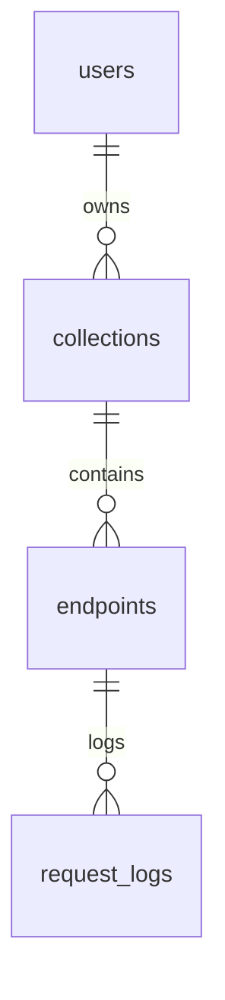

# API Playground - Python/Django + React Stack Architecture 🐍

This document provides a detailed technical reference for the Python/Django and React implementation of the API Playground application. It aligns with the specifications outlined in `docs/Specs/Yellow Paper.md` and the simplified technology choices in `docs/Tech-Stacks/Technology Stacks.md`. This guide covers the precise system architecture, component responsibilities, dependencies, folder structure, security patterns, deployment strategies, and testing approaches for this specific stack.

---

## 1. Overview

This implementation pairs a Python backend, utilizing the Django framework (version 5.0) and Django REST Framework (DRF version 3.14), with a React frontend (version 18 with TypeScript 5.0). The focus is on leveraging Django's robust capabilities for rapid development of the backend API and React's modern features for a dynamic and responsive user interface, built with Vite 4.0.

**Stack Highlights (as per `docs/Tech-Stacks/Technology Stacks.md`):**
- **Backend:** Django 5.0 for core logic, Django REST Framework 3.14 for RESTful APIs, `django-rest-framework-simplejwt` for authentication, and `django-ratelimit` for rate limiting. PostgreSQL 15 serves as the database. Task processing will initially be synchronous or use simple Django Background Tasks, deferring Celery.
- **Frontend:** React 18 with TypeScript 5.0, built using Vite 4.0. Key libraries include Tailwind CSS 3.3, Headless UI, Zustand for state management, React Query (TanStack Query) for data fetching, React Router 6 for navigation, React Hook Form with Zod for forms, and Axios for HTTP requests.
- **Objective:** To deliver a fully functional API Playground instance adhering to the project's core requirements, emphasizing the streamlined technology stack defined in `docs/Tech-Stacks/Technology Stacks.md` for efficient development and deployment. `common_foundations.md` is not a specified source of truth; primary references are `docs/Specs/Yellow Paper.md` and `docs/Tech-Stacks/Technology Stacks.md`.

---

## 2. System Architecture Diagram

The following flowchart illustrates the high-level architecture of the Django + React implementation, detailing the interaction between client, gateway, backend, services, data, workers, and external services layers. This modular design ensures scalability, maintainability, and clear separation of concerns.

```mermaid
%%{init: {
  'theme': 'base',
  'themeVariables': {
    'primaryColor': '#7aa2f7',
    'primaryTextColor': '#1a1b26',
    'primaryBorderColor': '#3b4261',
    'lineColor': '#bb9af7',
    'background': '#1a1b26',
    'mainBkg': '#1a1b26',
    'secondBkg': '#24283b',
    'tertiaryBkg': '#292e42',
    'fontFamily': '"Segoe UI", sans-serif',
    'fontSize': '14px',
    'fontWeight': '600',
    'labelBackground': '#24283b',
    'edgeLabelBackground': '#24283b',
    'clusterBkg': '#24283b',
    'clusterBorder': '#3b4261',
    'defaultLinkColor': '#bb9af7',
    'titleColor': '#c0caf5'
  },
  'flowchart': {
    'nodeSpacing': 30,
    'rankSpacing': 50,
    'curve': 'basis'
  }
}}%%

flowchart TB
    subgraph Stack_1_System_Diagram["🐍 Stack 1 - Django System"]
        subgraph Client["Client Layer"]
            direction LR
            React["⚛️ React + Vite"] ~~~ RN["📱 React Native"]
        end
        
        subgraph Gateway["Gateway Layer"]
            direction LR
            Nginx["⚖️ Nginx LB"] ~~~ SSL1["🔒 SSL Termination"]
        end
        
        subgraph Backend["Backend Layer"]
            direction LR
            Dj["🐍 Django"] ~~~ DRF["🔌 DRF"] ~~~ Auth["🔑 SimpleJWT"] ~~~ Mw["🛡️ Custom Middleware"]
        end
        
        subgraph Services["Services Layer"]
            direction LR
            ReqSvc["📡 Request Execution"] ~~~ ColSvc["📁 Collection Mgmt"] ~~~ UserSvc["👤 User Mgmt"] ~~~ EnvSvc["🌍 Environment Mgmt"]
        end
        
        subgraph Data["Data Layer"]
            direction LR
            PG["🐘 PostgreSQL"] ~~~ RD["⚡ Redis Cache"] ~~~ FS["☁️ S3 / Local FS"]
        end
        
        subgraph Workers["Workers Layer"]
            direction LR
            Celery["🌿 Celery Workers"] ~~~ Beat["🥁 Celery Beat"] ~~~ Queue["📋 Redis Queue"]
        end
        
        subgraph External["External Services"]
            direction LR
            SMTP["📧 SMTP"] ~~~ Sentry["🐛 Sentry"] ~~~ APIs["🔌 Third-party APIs"]
        end
    end

    %% Connections
    React --> Nginx
    RN --> Nginx
    Nginx --> SSL1
    SSL1 --> Dj
    Dj --> DRF
    DRF --> Auth
    DRF --> Mw
    Dj --> ReqSvc & ColSvc & UserSvc & EnvSvc
    ReqSvc --> Celery
    Celery --> Queue
    Celery --> APIs
    Queue --> Beat
    Dj --> PG & RD & FS
    Dj --> SMTP & Sentry

    %% Node styling
    classDef clientNode fill:#ff9e64,stroke:#ff7043,stroke-width:2px,color:#1a1b26,font-weight:600
    classDef gatewayNode fill:#73daca,stroke:#41a6b5,stroke-width:2px,color:#1a1b26,font-weight:600
    classDef backendNode fill:#e0af68,stroke:#d19a66,stroke-width:2px,color:#1a1b26,font-weight:600
    classDef serviceNode fill:#bb9af7,stroke:#9d7cd8,stroke-width:2px,color:#1a1b26,font-weight:600
    classDef databaseNode fill:#9ece6a,stroke:#73b25a,stroke-width:2px,color:#1a1b26,font-weight:600
    classDef workerNode fill:#7aa2f7,stroke:#5a7ec5,stroke-width:2px,color:#1a1b26,font-weight:600
    classDef externalNode fill:#f7768e,stroke:#db5a6b,stroke-width:2px,color:#1a1b26,font-weight:600

    %% Apply styles
    class React,RN clientNode
    class Nginx,SSL1 gatewayNode
    class Dj,DRF,Auth,Mw backendNode
    class ReqSvc,ColSvc,UserSvc,EnvSvc serviceNode
    class PG,RD,FS databaseNode
    class Celery,Beat,Queue workerNode
    class SMTP,Sentry,APIs externalNode

    %% Subgraph styling
    style Stack_1_System_Diagram fill:#1a1b26,stroke:#3b4261,stroke-width:2px,color:#c0caf5
    style Client fill:#24283b,stroke:#3b4261,stroke-width:1px,color:#c0caf5
    style Gateway fill:#24283b,stroke:#3b4261,stroke-width:1px,color:#c0caf5
    style Backend fill:#24283b,stroke:#3b4261,stroke-width:1px,color:#c0caf5
    style Services fill:#24283b,stroke:#3b4261,stroke-width:1px,color:#c0caf5
    style Data fill:#24283b,stroke:#3b4261,stroke-width:1px,color:#c0caf5
    style Workers fill:#24283b,stroke:#3b4261,stroke-width:1px,color:#c0caf5
    style External fill:#24283b,stroke:#3b4261,stroke-width:1px,color:#c0caf5
```



**Explanation:** The architecture is layered to separate concerns effectively. The client layer (React and React Native) handles user interaction, the gateway layer (Nginx) manages load balancing and security, the backend layer (Django and DRF) processes API requests, the services layer encapsulates business logic, the data layer persists and caches information, and the workers layer (Celery) handles asynchronous tasks. External services integrate for monitoring, notifications, and third-party API interactions.

---

## 3. Component Responsibilities

Each component in the Django + React stack is assigned specific roles to ensure modularity and maintainability. Below is a detailed breakdown of the responsibilities of each major component:

- **React/Vite & React Native:** 
  - Single-Page Application (SPA) for web and mobile UI development.
  - Uses Zustand for lightweight state management, React Query for data fetching and caching, `react-hook-form` for efficient form handling, and Zod for schema validation.
  - Focuses on delivering a responsive and interactive user experience for API testing and management.
- **Django & Django REST Framework (DRF):**
  - Core backend framework providing RESTful API endpoints.
  - Utilizes serializers for data validation and transformation, viewsets for endpoint logic, and custom middleware for request logging and rate-limiting.
  - Manages authentication, routing, and business logic execution.
- **SimpleJWT (Django REST Framework Extension):**
  - Handles JSON Web Token (JWT) authentication.
  - Issues short-lived access tokens (15 minutes) and rotating refresh tokens (7 days) for secure session management.
  - Implements token blacklisting to prevent unauthorized access after logout.
- **Celery & Redis:**
  - Celery serves as an asynchronous task queue for executing background jobs such as API request testing.
  - Redis acts as both the message broker for Celery and an in-memory cache for rate-limiting and temporary data storage.
  - Supports exponential backoff for retries on failed tasks and scheduled tasks via Celery Beat for periodic cleanup.
- **PostgreSQL:**
  - Primary relational database for storing structured data like users, collections, endpoints, and logs.
  - Leverages JSONB fields for flexible storage of API schemas and request/response data.
  - Ensures data integrity through foreign key constraints and indexing for performance.
- **S3 / MinIO:**
  - Object storage solution for static files, exported data, or large payloads.
  - Compatible with AWS S3 or self-hosted MinIO for cost-effective scalability.

**Note:** Components are chosen to balance Django's full-featured framework with React's modern frontend capabilities, ensuring both developer productivity and application performance.

---

## 4. Dependencies

The following table lists the key dependencies for both backend and frontend components, including version constraints, purposes, and justifications for their selection. These dependencies are critical for building, running, and testing the application.

| Package                         | Version | Purpose                       | Justification                                    |
|---------------------------------|---------|-------------------------------|-------------------------------------------------|
| **django**                     | 4.x     | Web framework                | Batteries-included, mature community support    |
| **djangorestframework**        | 3.x     | REST toolkit                 | Simplifies API creation with serializers and viewsets |
| **djangorestframework-simplejwt** | latest | JWT authentication          | Supports token blacklisting and rotation        |
| **celery**                     | 5.x     | Async task queue             | Handles scheduling and retries for background tasks |
| **redis**                      | 4.x     | Broker & cache               | High-performance in-memory store for queues and caching |
| **psycopg2-binary**            | latest  | PostgreSQL adapter           | Stable and performant database connection       |
| **boto3**                      | latest  | AWS S3 SDK                   | Official SDK, compatible with MinIO for storage |
| **react**                      | 18.x    | Frontend UI library          | Modern features like hooks and concurrent mode  |
| **vite**                       | latest  | Dev server & bundler         | Fast hot module replacement (HMR) and builds    |
| **zustand**                    | latest  | State management             | Lightweight API for managing React state        |
| **react-query**                | latest  | Data fetching                | Efficient caching and invalidation mechanisms   |
| **react-router-dom**           | latest  | Routing                      | Standard navigation for SPA development         |
| **react-hook-form**            | latest  | Form handling                | High-performance form validation and management |
| **zod**                        | latest  | Schema validation            | TypeScript-first validation library             |
| **axios**                      | latest  | HTTP client                  | Supports interceptors for auth and logging      |
| **eslint**                     | latest  | Linting                      | Ensures code quality and consistency            |
| **prettier**                   | latest  | Code formatting              | Maintains consistent code style across team     |
| **jest**                       | latest  | Unit testing                 | Robust testing framework for React ecosystem    |
| **@testing-library/react**     | latest  | Component testing            | Focuses on accessibility and user behavior      |

**Best Practice:** Pin exact versions in production to avoid breaking changes, and use dependency management tools like `pip` for Python and `npm` or `yarn` for JavaScript to handle updates and compatibility.

---

## 5. Domain-Driven Design (DDD) Folder Structure

The project follows a Domain-Driven Design (DDD) approach to organize code into meaningful domains, enhancing modularity and maintainability. Below is the folder structure for the Django backend and React frontend:

### Backend (Django)
```text
Postkid/
├── Postkid/           # Main project package
│   ├── __init__.py
│   ├── settings/              # Project settings
│   │   ├── __init__.py
│   │   ├── base.py            # Common settings
│   │   ├── development.py     # Development-specific settings
│   │   ├── production.py      # Production-specific settings
│   │   └── test.py            # Test-specific settings
│   ├── urls.py                # Root URL configuration
│   ├── asgi.py                # ASGI configuration
│   └── wsgi.py                # WSGI configuration
├── apps/                      # Django applications
│   ├── authentication/        # User authentication app
│   │   ├── __init__.py
│   │   ├── models.py          # Models
│   │   ├── views.py           # Views
│   │   ├── serializers.py     # DRF serializers
│   │   ├── urls.py            # App-specific URLs
│   │   ├── admin.py           # Admin configuration
│   │   ├── forms.py           # Forms (if needed)
│   │   ├── tests.py           # Tests
│   │   └── apps.py            # App configuration
│   ├── collections/           # Collection management app
│   │   └── ...                # (Similar structure to authentication)
│   ├── environments/          # Environment variables app
│   │   └── ...
│   ├── history/               # Request logs and history tracking app
│   │   └── ...
│   ├── proxy/                 # API proxying logic app
│   │   └── ...
│   └── codegen/               # Client SDK generation app
│       └── ...
├── core/                      # Reusable components and utilities
│   ├── models/                # Abstract base models
│   │   ├── __init__.py
│   │   └── base_model.py      # Example: TimeStampedModel
│   ├── serializers/           # Custom serializers
│   │   ├── __init__.py
│   │   └── base_serializer.py # Example: BaseSerializer
│   ├── permissions/           # Custom permissions
│   │   ├── __init__.py
│   │   └── custom_permissions.py
│   ├── middleware/            # Custom middleware
│   │   ├── __init__.py
│   │   └── request_logging.py
│   └── utils/                 # Utility functions
│       ├── __init__.py
│       └── helpers.py         # Example: utility functions
├── config/                    # Project-level configuration
│   └── celery.py              # Celery configuration
├── static/                    # Static files
└── manage.py                  # Django management script
```

### Frontend (React)
```text
frontend/
├── src/                       # Source code for React application
│   ├── components/            # Reusable UI components
│   ├── hooks/                 # Custom React hooks
│   ├── services/              # API interaction services
│   ├── stores/                # Zustand state stores
│   ├── pages/                 # Page components for routing (via Vite)
│   └── utils/                 # Utility functions and helpers
├── public/                    # Static assets
└── tests/                     # Test files for components and services
```

**Rationale:** The DDD structure separates concerns by domain (e.g., authentication, collections), making it easier to navigate and extend the codebase. Shared utilities in `core/` prevent duplication, while the React structure aligns with modern frontend practices for scalability.

---

## 6. Entity-Relationship (ER) Diagram

The ER diagram below represents the core data relationships for the API Playground application, consistent across all stacks. This diagram is implemented in Django using its ORM to map to PostgreSQL tables.



**Explanation:** The diagram illustrates a hierarchical relationship where users own multiple collections, each collection contains multiple endpoints, and each endpoint is linked to multiple request logs. This structure ensures traceability of API interactions and aligns with the shared data model described in `../../Models/Data Models.md`.

---

## 7. Service & Background Task Flows

The following key workflows are implemented to handle asynchronous tasks and service interactions, leveraging Celery for background processing:

- **execute_api_request:**
  - Initiated when a user triggers a test API call via the `/api/v1/test/{id}` endpoint.
  - The request is queued via Celery for asynchronous execution of the HTTP call to the external API.
  - On failure, retries are attempted with an exponential backoff strategy to handle transient errors.
  - Results are logged to the database, and status updates are pushed to the client via WebSocket (using Django Channels if implemented).
- **cleanup_tasks:**
  - Scheduled via Celery Beat to periodically purge outdated logs or temporary data based on retention policies.
  - Ensures database size remains manageable and complies with data retention requirements.
- **notifications:**
  - Triggered on events like collection sharing or critical errors.
  - Sends emails via SMTP integration for user notifications or alerts.

**Best Practice:** Configure Celery with appropriate worker concurrency levels and retry policies to balance throughput and resource usage. Use monitoring tools like Flower to track task execution and troubleshoot failures.

---

## 8. Authentication & Security Patterns

Security measures align with `../../Specs/Yellow Paper.md` and are implemented using specific Django tools from `../../Tech-Stacks/Technology Stacks.md`.

- **JWT Authentication (`django-rest-framework-simplejwt`):**
  - Handles token-based authentication (access and refresh tokens).
  - Access tokens are short-lived (e.g., 15 minutes).
  - Refresh tokens are longer-lived (e.g., 7 days) and can be used to obtain new access tokens. Token rotation and blacklisting features of `simplejwt` will be utilized as per standard secure practices.
  - Tokens should be stored securely by the client (e.g., HttpOnly cookies for web clients if server-side rendering or BFF pattern is used, otherwise secure browser storage for SPAs).
- **CORS (`django-cors-headers`):**
  - Configured to allow requests from the React frontend's origin. In production, this will be restricted to the specific frontend domain.
- **Rate Limiting (`django-ratelimit`):**
  - Applied to sensitive endpoints (e.g., login, registration, API execution) to prevent abuse.
  - Can be configured to use database, cache (Redis if available and configured), or in-memory stores. For distributed setups, Redis is preferred.
- **CSRF Protection (Django Built-in):**
  - Django's default CSRF protection will be active for any traditional Django views/forms. For DRF APIs using token authentication, CSRF is typically not required for session-less requests but will be evaluated based on specific endpoint needs (e.g., if session auth is ever enabled for certain parts).
- **SSRF Prevention:**
  - Implemented by validating and sanitizing any user-supplied URLs that the server will make requests to (e.g., the target URL in the API execution feature). This involves disallowing requests to internal/private IP ranges and ensuring URL schemes are appropriate (HTTP/HTTPS).
- **Input Validation (DRF Serializers / Zod for Frontend):**
  - All incoming data is validated using DRF serializers on the backend.
  - Frontend forms use Zod with `react-hook-form` for client-side validation before submission.
- **HTTPS:**
  - Enforced in production through Nginx configuration (SSL termination).
- **Secret Management:**
  - Sensitive configurations (secret key, database credentials, API keys) managed via environment variables (e.g., using `python-decouple` locally and environment variables in production).
- **Audit Logging:**
  - Key security-relevant events (logins, significant data changes, executed API requests) are logged to the `RequestLog` model or a dedicated audit log model, including user ID, IP address, timestamp, and action performed.

---

## 9. API Design Conventions & Documentation

- **API Specification:** Endpoints adhere to `../../API-Reference/` (once populated).
- **Documentation Generation (`drf-spectacular`):**
  - Used to generate an OpenAPI 3.0 schema and Swagger UI for the API. This provides interactive documentation.
- **Versioning:** API will be versioned (e.g., `/api/v1/`).
- **Response Format:** Consistent JSON response structure (e.g., `{ "data": ..., "message": ..., "status_code": ... }` or standard DRF responses).
- **Error Handling:** DRF's standard exception handling will be used, providing clear error messages and appropriate HTTP status codes.
- **Pagination:** DRF's pagination classes for paginated list responses.

---

## 10. Frontend Architecture (React + Vite)

The React frontend architecture is detailed in section 5 ("Domain-Driven Design (DDD) Folder Structure"). Key aspects include:

- **Build Tool:** Vite 4.0 with TypeScript 5.0.
- **UI:** Tailwind CSS 3.3 and Headless UI for accessible, unstyled components.
- **State Management:** Zustand for global state, TanStack Query (React Query) for server state management (caching, refetching, optimistic updates).
- **Routing:** React Router 6 for client-side navigation.
- **Forms:** React Hook Form with Zod for schema-based validation.
- **HTTP Client:** Axios, with interceptors configured for handling JWT tokens (attaching to requests, handling refresh flows) and global error handling.
- **Component Structure:** Organized by features and shared common components.
- **Testing:** Jest, React Testing Library, and MSW (Mock Service Worker) for unit, integration, and mocked API testing.

---

## 11. Deployment Topology

Deployment strategy aligns with `../../Specs/Yellow Paper.md` and `../../Tech-Stacks/Technology Stacks.md`.

**Development Environment (Docker Compose):**
- **Orchestration:** `docker-compose.yml` defines services for:
    - Django/Gunicorn application server.
    - React development server (Vite with HMR).
    - PostgreSQL database.
    - Redis (optional, if `django-ratelimit` is configured to use it).
- **Workflow:** Facilitates easy local setup, consistent environments, and rapid iteration.
- **Configuration:** Environment variables via `.env` files (e.g., using `python-decouple` for Django).

**Production Environment (Conceptual - Container-Based):**
- **Containerization:** Both Django (with Gunicorn) and React (static build served by Nginx or a CDN) applications are packaged into Docker containers.
- **Web Server/Gateway:** Nginx serves as the reverse proxy, load balancer (if multiple app instances), and handles SSL termination. It will serve the static React frontend files and proxy API requests to the Gunicorn/Django backend.
- **Application Server:** Gunicorn runs the Django application.
- **Database:** PostgreSQL (shared, managed service like AWS RDS recommended).
- **Cache:** Redis (shared, managed service like AWS ElastiCache recommended if used for rate limiting or caching).
- **CI/CD:** GitHub Actions for automated building, testing, and deployment of containers.
- **Static Assets (Frontend):** The built React application (static HTML, CSS, JS) can be served by Nginx or, for better performance and scalability, hosted on a CDN (e.g., AWS CloudFront).
- **Configuration:** Environment variables injected into containers by the orchestration platform.

**Diagram: High-Level Production Deployment**
```mermaid
graph TD
    User[End User] --> Internet[Internet]
    Internet --> LB[Load Balancer / CDN (e.g., AWS ALB/CloudFront)]

    subgraph "Cloud Environment (e.g., AWS)"
        LB --> NginxGateway[Nginx Reverse Proxy / Static Content Server]

        subgraph "Application Servers (Containers)"
            NginxGateway --> AppServer1[Django + Gunicorn Container 1]
            NginxGateway --> AppServer2[Django + Gunicorn Container 2]
            NginxGateway --> AppServerN[Django + Gunicorn Container N]
        end

        AppServer1 --> DB[Managed PostgreSQL Database]
        AppServer2 --> DB
        AppServerN --> DB

        AppServer1 -.-> Cache[(Optional) Managed Redis Cache]
        AppServer2 -.-> Cache
        AppServerN -.-> Cache

        NginxGateway -- Serves Static Files --> LB
    end

    style User fill:#c9d1d9,stroke:#768390
    style Internet fill:#79c0ff,stroke:#58a6ff
    style LB fill:#7ee787,stroke:#56d364
    style NginxGateway fill:#ffab70,stroke:#e69963
    style AppServer1 fill:#d2a8ff,stroke:#b083f0
    style AppServer2 fill:#d2a8ff,stroke:#b083f0
    style AppServerN fill:#d2a8ff,stroke:#b083f0
    style DB fill:#f0b0a4,stroke:#e39387
    style Cache fill:#a5d6ff,stroke:#89bde8
```
This diagram illustrates Nginx serving static React files (potentially via CDN) and proxying API calls to multiple Django/Gunicorn application container instances, which connect to shared PostgreSQL and Redis services.

---

## 12. Testing Strategy

Testing adheres to `../../Specs/Yellow Paper.md` guidelines and uses stack-specific tools from `../../Tech-Stacks/Technology Stacks.md`.

**Backend (Python/Django):**
- **Unit Tests (`pytest-django`):**
    - Test individual functions, methods, and classes (models, services, utilities).
    - Use `factory-boy` for generating test data/model instances.
    - Mock external dependencies (e.g., external API calls made by the request execution service).
- **Integration Tests (`pytest-django`):**
    - Test interactions between components, particularly API endpoints.
    - Use DRF's `APIClient` or `pytest-django`'s client to make requests to endpoints and assert responses, status codes, and database state changes.
    - Test authentication, permissions, serializers, and view logic together.
- **Coverage (`pytest-cov`):** Aim for 80%+ test coverage.

**Frontend (React/TypeScript):**
- **Unit Tests (`Jest` + `React Testing Library`):**
    - Test individual React components, custom hooks, and utility functions in isolation.
- **Integration Tests (`Jest` + `React Testing Library`):**
    - Test interactions between multiple components, context providers, and routing.
    - Simulate user events and verify UI changes and application behavior.
- **API Mocking (`msw` - Mock Service Worker):**
    - Intercept HTTP requests made by the frontend during tests and return mock responses. This allows testing of data fetching logic, state updates, and UI rendering based on API responses without actual backend calls.
- **End-to-End Tests (Future Consideration, e.g., Playwright/Cypress):**
    - As specified in `../../Specs/Yellow Paper.md`, full E2E tests covering user journeys. For the simplified stack, focus is on unit/integration for frontend and backend first.

**CI/CD (`GitHub Actions`):**
- All tests (backend and frontend) will be run automatically on every push and pull request to ensure code quality and prevent regressions.
- Linting (`black`, `flake8`, `isort`, `mypy` for backend; `eslint`, `prettier` for frontend) and static analysis will also be part of the CI pipeline.
