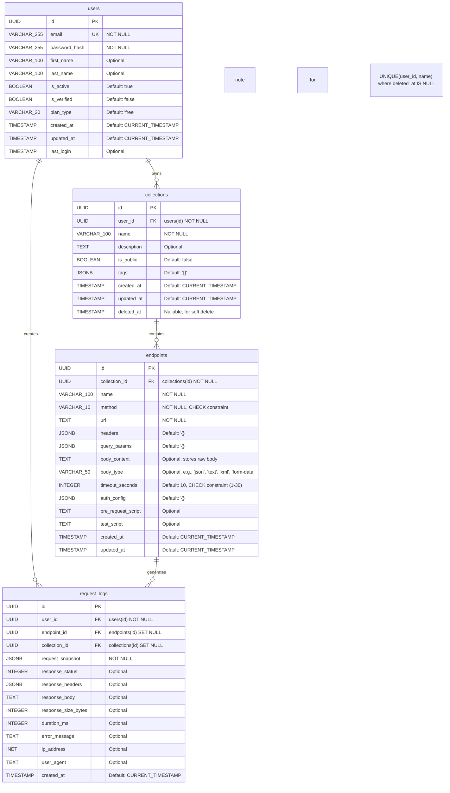

# Data Models for API Playground

This document outlines the database schema for the API Playground application. The schema is designed to be consistent across all technology stack implementations, primarily targeting a PostgreSQL database.

## Consolidated Entity-Relationship Diagram

The following diagram illustrates the relationships between the core entities:



---

## 🧑‍💻 Users

Represents registered users of the platform.

```sql
Table: users
```

| Column         | Type         | Constraints                                 | Notes                               |
| -------------- | ------------ | ------------------------------------------- |-------------------------------------|
| id             | UUID         | `PRIMARY KEY`, default: `gen_random_uuid()` |                                     |
| email          | VARCHAR(255) | `UNIQUE`, `NOT NULL`                        |                                     |
| password\_hash | VARCHAR(255) | `NOT NULL`                                  | Store hashed passwords only         |
| first\_name    | VARCHAR(100) | Optional                                    |                                     |
| last\_name     | VARCHAR(100) | Optional                                    |                                     |
| is\_active     | BOOLEAN      | Default: `true`                             | For disabling accounts              |
| is\_verified   | BOOLEAN      | Default: `false`                            | For email verification status       |
| plan\_type     | VARCHAR(20)  | Default: `'free'`                           | Future use for different tiers      |
| created\_at    | TIMESTAMP    | Default: `CURRENT_TIMESTAMP`                |                                     |
| updated\_at    | TIMESTAMP    | Default: `CURRENT_TIMESTAMP`                | Auto-updates on modification        |
| last\_login    | TIMESTAMP    | Optional                                    | Track last login time               |

---

## 📁 Collections

Collections of API endpoints grouped by users.

```sql
Table: collections
```

| Column      | Type         | Constraints                                       | Notes                               |
| ----------- | ------------ | ------------------------------------------------- |-------------------------------------|
| id          | UUID         | `PRIMARY KEY`, default: `gen_random_uuid()`       |                                     |
| user\_id    | UUID         | `NOT NULL`, `FOREIGN KEY` → `users(id)` (CASCADE) | Owner of the collection             |
| name        | VARCHAR(100) | `NOT NULL`                                        |                                     |
| description | TEXT         | Optional                                          |                                     |
| is\_public  | BOOLEAN      | Default: `false`                                  | For sharing capabilities            |
| tags        | JSONB        | Default: `'[]'`                                   | User-defined tags for organization  |
| created\_at | TIMESTAMP    | Default: `CURRENT_TIMESTAMP`                      |                                     |
| updated\_at | TIMESTAMP    | Default: `CURRENT_TIMESTAMP`                      | Auto-updates on modification        |
| deleted\_at | TIMESTAMP    | Optional, `NULL`                                  | For soft-delete functionality       |


**Constraints:**

*   Unique collection names per user for non-deleted collections: `UNIQUE(user_id, name)` (this might need to be implemented as `UNIQUE(user_id, name, deleted_at)` if the DB doesn't support partial unique indexes easily, or handled at application level if `deleted_at` is always NULL for active records). A common approach for PostgreSQL is a partial unique index: `CREATE UNIQUE INDEX unique_active_collection_name ON collections (user_id, name) WHERE deleted_at IS NULL;`

---

## 🔗 Endpoints

Describes an individual API request configuration.

```sql
Table: endpoints
```

| Column               | Type         | Constraints                                                       | Notes                                                     |
| -------------------- | ------------ | ----------------------------------------------------------------- |-----------------------------------------------------------|
| id                   | UUID         | `PRIMARY KEY`, default: `gen_random_uuid()`                       |                                                           |
| collection\_id       | UUID         | `NOT NULL`, `FOREIGN KEY` → `collections(id)` (CASCADE)           | Belongs to a collection                                   |
| name                 | VARCHAR(100) | `NOT NULL`                                                        |                                                           |
| method               | VARCHAR(10)  | `NOT NULL`, CHECK: `GET, POST, PUT, PATCH, DELETE, HEAD, OPTIONS` | HTTP method                                               |
| url                  | TEXT         | `NOT NULL`                                                        | Target URL, can contain variables like `{{base_url}}`      |
| headers              | JSONB        | Default: `'{}'`                                                   | Key-value pairs for request headers                       |
| query\_params        | JSONB        | Default: `'{}'`                                                   | Key-value pairs for URL query parameters                  |
| body\_content        | TEXT         | Optional                                                          | Raw request body content (e.g., JSON string, XML, text)   |
| body\_type           | VARCHAR(50)  | Optional                                                          | Describes the type of `body_content` (e.g., 'json', 'text', 'xml', 'form-data', 'binary'). Helps in setting `Content-Type` header. |
| timeout\_seconds     | INTEGER      | Default: `10`, CHECK: `BETWEEN 1 AND 30`                          | Request execution timeout                                 |
| auth\_config         | JSONB        | Default: `'{}'`                                                   | Configuration for request-specific authentication (e.g., Bearer token, Basic Auth) |
| pre\_request\_script | TEXT         | Optional                                                          | Script to run before request execution (future use)       |
| test\_script         | TEXT         | Optional                                                          | Script to run after request execution for assertions (future use) |
| created\_at          | TIMESTAMP    | Default: `CURRENT_TIMESTAMP`                                      |                                                           |
| updated\_at          | TIMESTAMP    | Default: `CURRENT_TIMESTAMP`                                      | Auto-updates on modification                            |

---

## 📜 Request Logs

Stores information about past requests and responses for auditing and replay.

```sql
Table: request_logs
```

| Column                | Type      | Constraints                                       | Notes                               |
| --------------------- | --------- | ------------------------------------------------- |-------------------------------------|
| id                    | UUID      | `PRIMARY KEY`, default: `gen_random_uuid()`       |                                     |
| user\_id              | UUID      | `NOT NULL`, `FOREIGN KEY` → `users(id)` (CASCADE) | User who executed the request       |
| endpoint\_id          | UUID      | `FOREIGN KEY` → `endpoints(id)` (SET NULL)        | Original endpoint, if saved         |
| collection\_id        | UUID      | `FOREIGN KEY` → `collections(id)` (SET NULL)      | Original collection, if applicable  |
| request\_snapshot     | JSONB     | `NOT NULL`                                        | Full details of the request sent    |
| response\_status      | INTEGER   | Optional                                          | HTTP status code of the response    |
| response\_headers     | JSONB     | Optional                                          | Headers of the response             |
| response\_body        | TEXT      | Optional                                          | Body of the response                |
| response\_size\_bytes | INTEGER   | Optional                                          | Size of the response body           |
| duration\_ms          | INTEGER   | Optional                                          | Time taken for request execution    |
| error\_message        | TEXT      | Optional                                          | Any errors during execution         |
| ip\_address           | INET      | Optional                                          | IP address of the user              |
| user\_agent           | TEXT      | Optional                                          | User agent of the client            |
| created\_at           | TIMESTAMP | Default: `CURRENT_TIMESTAMP`                      | When the log was created            |

**Indexes:**

*   `(user_id, created_at DESC)`: For efficiently fetching user's history.
*   `(endpoint_id, created_at DESC)`: For history related to a specific endpoint.

---
