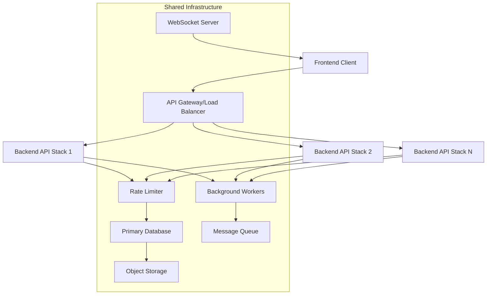
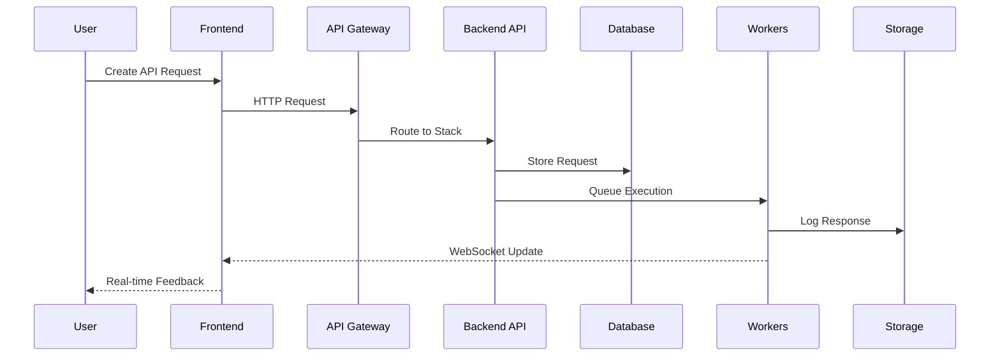
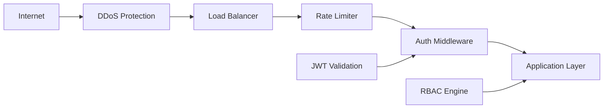
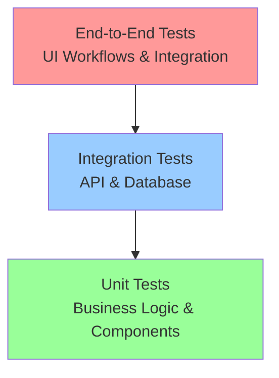
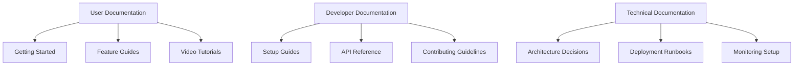

# Postkid: API Playground - Yellow Paper

**Technical Specification v1.0**

---

## 📋 Executive Summary

The API Playground is a self-hosted, multi-tenant platform designed to empower developers in defining, testing, and monitoring API endpoints through an intuitive web interface. This document serves as the definitive technical specification for building identical application instances across multiple technology stacks.

### Primary Objectives

- Ensure **consistency in usage, features, and requirements** across all implementations
- Demonstrate full-stack development expertise while maintaining rapid development cycles
- Target completion of each stack within **one week**
- Deploy all implementations through **containerization** with **subdomain-based routing**
- Validate functionality through a **unified API test suite**

---

## 🎯 Core Value Proposition

The API Playground provides a robust environment for API interaction, focusing on developer productivity and collaboration:

### Key Features

- **Visual API Testing**: Interactive HTTP request construction and execution, eliminating command-line dependency
- **Collection Management**: Organized endpoint grouping into reusable collections and projects
- **Request History**: Comprehensive logging with replay capabilities for debugging and reference
- **Multi-Stack Portfolio**: Cross-platform implementation showcasing diverse technology proficiency

---

## 🏗️ System Architecture

The API Playground's architecture is designed for scalability, maintainability, and consistent functionality across diverse technology stacks. The core components remain constant, irrespective of the backend or frontend framework used.

### High-Level Architecture



*Note: The "Background Workers," "Message Queue," and "Rate Limiter" components depicted here represent the mature architectural vision. Initial stack implementations will feature simplified, in-process versions of these capabilities as detailed in `../Tech-Stacks/Technology Stacks.md`.*

### Component Architecture

| Component              | Purpose                                                                                                                                                                                             | Technology Examples                      |
|------------------------|-------------------------------------------------------------------------------------------------------------------------------------------------------------------------------------------------------|------------------------------------------|
| **Frontend**           | Client-side application providing UI for API testing                                                                                                                                                  | React, Vue, Angular, Svelte              |
| **API Gateway**        | Single entry point with SSL termination and routing                                                                                                                                                   | Nginx, Traefik, AWS ALB                  |
| **Backend API**        | Core application logic per stack implementation                                                                                                                                                       | Django, Node.js, Go, .NET                |
| **WebSocket Server**   | Real-time communication for live logs and updates                                                                                                                                                     | Socket.io, native WebSocket                |
| **Rate Limiter**       | Request throttling and abuse prevention                                                                                                                                                               | Redis-based distributed cache              |
| **Primary Database**   | Persistent storage for application data                                                                                                                                                             | PostgreSQL                               |
| **Background Workers** | Asynchronous task processing                                                                                                                                                                        | Celery, Bull Queue, Go routines            |
| **Object Storage**     | Large file and log storage                                                                                                                                                                            | AWS S3, MinIO                            |

### Data Flow Architecture



*Note: In initial stack implementations, the "Workers" (W) component may represent in-process asynchronous tasks within the "Backend API" (B) rather than a separate distributed worker system. The data flow remains conceptually similar, with results eventually propagated to the frontend.*

---

## 🔒 Security Requirements

Security is paramount for an API testing platform that handles user data and potentially sensitive API calls.

### Security Architecture



### Authentication & Authorization

#### JWT Token Strategy

- **Access Tokens**: Short-lived (e.g., 15 minutes) for API access
- **Refresh Tokens**: Longer-lived (e.g., 7 days) for obtaining new access tokens without re-authenticating
- **Token Rotation**: Automatic refresh token rotation on use (Inferred)

#### Security Policies

| Policy Type        | Requirement                                       | Implementation                                  |
|--------------------|---------------------------------------------------|-------------------------------------------------|
| **Password**       | 8+ characters, complexity requirements            | Bcrypt hashing, strength validation             |
| **Rate Limiting**  | Tiered limits per endpoint type                   | Redis-based sliding window (Inferred)           |
| **Session Management** | Secure token storage and invalidation             | HTTP-only cookies, server-side blacklist        |

### API Security Measures

#### Input/Output Protection

- **CORS Configuration**: Restricted to known origins in production environments
- **CSRF Protection**: Implement using SameSite cookies and CSRF tokens
- **Input Validation**: Rigorous schema validation on all incoming API requests
- **Output Sanitization**: Sanitize all output to prevent XSS and data leakage

#### Network Security

- **SSRF Prevention**: Block unauthorized requests to internal networks/metadata
- **Request Limits**: Enforce limits on body/header size
- **URL Validation**: Whitelist allowed protocols (HTTP/HTTPS only) and validate format
- **Timeout Protection**: Implement configurable timeouts for outgoing requests

### Data Protection Standards

#### Encryption Requirements

- **Data in Transit**: TLS 1.3 minimum
- **Data at Rest**: AES-256 encryption for sensitive data
- **Key Management**: Industry-standard practices (HSMs, cloud KMS)

#### Privacy Controls

- **PII Minimization**: Collect only minimal essential user data
- **Audit Logging**: Comprehensive logging for security-relevant events
- **Data Retention**: Configurable policies for logs and data

---

## 📏 Acceptance Criteria

The following criteria define the functional and non-functional requirements for a successful implementation.

### Authentication System

- [ ] Users can register with unique email and password validation.
- [ ] Successful login returns valid JWT access and refresh tokens.
- [ ] The token refresh endpoint correctly issues new access tokens using a valid refresh token.
- [ ] Logout invalidates the user's tokens server-side, preventing further unauthorized access.
- [ ] Rate limiting effectively blocks brute force login attempts.
- [ ] The password reset flow functions correctly from end-to-end, including email verification.

### Collection Management

- [ ] Users can perform Create, Read, Update, and Delete (CRUD) operations on their API collections.
- [ ] Collection names are unique per user to prevent naming conflicts.
- [ ] Soft delete functionality preserves data integrity for future recovery or auditing.
- [ ] Collections can be marked as public or private, controlling their visibility and shareability.
- [ ] Pagination is correctly implemented for efficient display and navigation of large collections.

### Endpoint Builder

- [ ] Support for all standard HTTP methods (GET, POST, PUT, PATCH, DELETE, HEAD, OPTIONS).
- [ ] Users can configure request headers, query parameters, and body content (JSON, form data, plain text).
- [ ] URL validation prevents the submission of invalid or potentially dangerous URLs (e.g., internal network addresses).
- [ ] Variable interpolation (e.g., {{variable}}) within URLs, headers, and body is supported for dynamic requests.
- [ ] Users can configure a timeout for each API request execution (e.g., 1-30 seconds).

### Request Execution

- [ ] HTTP requests are executed correctly with the specified method, headers, and body.
- [ ] The response status, headers, and body are accurately captured and displayed.
- [ ] The execution time of each request is measured and logged.
- [ ] Comprehensive error handling is in place for network errors, timeouts, and invalid responses.
- [ ] Rate limiting on API execution prevents abuse (e.g., 10 requests per minute per user).

### Request History

- [ ] All API request executions are logged with their full context (request details, response, timestamps).
- [ ] Users can only access their own execution history.
- [ ] Pagination and filtering (by method, status code, date) work correctly for history logs.
- [ ] Large responses in the history are truncated appropriately to ensure efficient display and storage.
- [ ] A configurable log retention policy is enforced (e.g., logs older than 90 days are archived or deleted).

### Security & Performance

- [ ] SSRF protection successfully blocks attempts to access internal networks or restricted resources.
- [ ] All protected API endpoints require proper authentication and authorization.
- [ ] SQL injection prevention mechanisms are validated through testing.
- [ ] Average response times for CRUD operations are consistently under 200ms.
- [ ] Individual API request executions complete within the user-configured timeout (maximum 30 seconds).

---

## 🚀 Deployment Architecture

All API Playground stack implementations will be deployed and managed uniformly through a shared, container-based infrastructure on a single cloud provider.

### Infrastructure Principles

#### Containerization Strategy

- **Docker Containers**: All components packaged as containers
- **Multi-Stage Builds**: Optimized image sizes and security
- **Container Registry**: Centralized image management
- **Health Checks**: Built-in container health monitoring

#### Cloud-Native Deployment

- **Single Cloud Provider**: Unified management and billing
- **Subdomain Routing**: Stack-specific access patterns
- **Auto-Scaling**: Demand-based resource allocation
- **Blue-Green Deployment**: Zero-downtime releases (Inferred)

### Shared Infrastructure Components

| Component                  | Purpose                                                                                   | Scaling Strategy                                  |
|----------------------------|-------------------------------------------------------------------------------------------|---------------------------------------------------|
| **Load Balancer**          | Traffic distribution and SSL termination                                                  | Managed service with auto-scaling                 |
| **Container Orchestration**| Container lifecycle management                                                            | Kubernetes or managed container service           |
| **Database**               | Persistent data storage                                                                   | Read replicas and connection pooling (Inferred)   |
| **Cache**                  | Performance optimization (Rate limiting, caching)                                         | Redis cluster with failover (Inferred)            |
| **Storage**                | Object and file storage                                                                   | Multi-region replication (Inferred)               |
| **Monitoring**             | Observability and alerting (Logs, metrics)                                                | Centralized logging and metrics (Inferred)        |

### Development Environment

Local development for each stack will be containerized for consistency and ease of setup using Docker Compose.

#### Local Development Stack

```yaml
# docker-compose.yml conceptual example
version: '3.8'
services:
  app:
    build: .
    ports:
      - "8000:8000"
    environment:
      - DATABASE_URL=postgresql://user:pass@db:5432/apiplayground
      - REDIS_URL=redis://redis:6379
    depends_on:
      - db
      - redis

  db:
    image: postgres:15
    environment:
      - POSTGRES_DB=apiplayground
      - POSTGRES_USER=user
      - POSTGRES_PASSWORD=pass
    volumes:
      - postgres_data:/var/lib/postgresql/data

  redis:
    image: redis:7-alpine
    ports:
      - "6379:6379"

  frontend:
    build: ./frontend
    ports:
      - "3000:3000"
    environment:
      - REACT_APP_API_URL=http://localhost:8000
```

---

## 📈 Performance Requirements

Consistent and responsive performance is critical for a positive user experience.

### Response Time Targets

| Operation Type      | Target Response Time | Measurement Method   |
|---------------------|----------------------|----------------------|
| **Authentication**  | < 100ms              | 95th percentile      |
| **CRUD Operations** | < 200ms              | 95th percentile      |
| **Request Execution**| User-configurable (max 30s) | Per-request timeout  |
| **Log Queries**     | < 500ms              | 95th percentile      |
| **Frontend Load**   | < 2s First Contentful Paint | Web Vitals           |

### Scalability Targets

#### Concurrent Usage

- **Active Users**: 1,000+ simultaneous users
- **Request Volume**: 10,000+ API executions/hour
- **Database Size**: 100GB+ historical data with efficient indexing
- **Geographic Distribution**: Multi-region capability (future)

#### Resource Efficiency

- **Memory Usage**: < 512MB idle, < 2GB peak load per instance
- **CPU Utilization**: < 50% normal load, < 80% peak load
- **Storage Optimization**: Compression and archival strategies
- **Network Efficiency**: < 1MB average response sizes

### Performance Monitoring

#### Key Metrics

```yaml
SLI/SLO Framework:
  - API Response Time: 95% < 200ms
  - API Availability: 99.9% uptime
  - Request Success Rate: 99.5% successful executions
  - Error Rate: < 0.1% application errors
```

---

## 🧪 Testing Strategy

A comprehensive testing strategy ensures the reliability, security, and performance of all API Playground implementations.

### Testing Pyramid



### Test Coverage Requirements

#### Unit Testing (80%+ Coverage)

- **Backend**: Business logic, models, services, utilities
- **Frontend**: Components, hooks, state management, utilities
- **Tools**: Stack-specific frameworks (pytest, Jest, Go testing)
- **Mocking**: External dependencies and services

#### Integration Testing

- **API Endpoints**: Full request/response validation
- **Database Operations**: Schema validation and complex queries
- **Authentication Flows**: Complete user lifecycle testing
- **External Service Mocking**: Controlled test scenarios

#### End-to-End Testing

- **User Journeys**: Registration → Collection → Execution → History
- **Cross-Browser**: Chrome, Firefox, Safari, Edge compatibility
- **Performance Testing**: Load testing with realistic traffic
- **Security Testing**: Automated vulnerability scanning

### Unified API Test Suite

The unified test suite ensures identical behavior across all stack implementations:

#### Cross-Stack Validation

```python
# Example test structure
class APIPlaygroundTestSuite:
    def test_authentication_flow(self, base_url):
        """Test complete auth flow across all stacks"""
        # Registration
        # Login
        # Token refresh
        # Logout
        pass
    
    def test_collection_crud(self, base_url):
        """Test collection operations"""
        # Create collection
        # Read collections
        # Update collection
        # Delete collection
        pass
    
    def test_request_execution(self, base_url):
        """Test API request execution"""
        # Execute GET request
        # Execute POST request
        # Verify response handling
        # Check history logging
        pass
```

#### Test Execution Strategy

- **CI/CD Integration**: Mandatory quality gate for all deployments
- **Idempotency Testing**: Multiple execution validation
- **Data Cleanup**: Automated test data management
- **Parallel Execution**: Stack-independent test runs

---

## 📚 Documentation Requirements

Comprehensive documentation is essential for development, deployment, and user adoption.

### Documentation Architecture



### Documentation Standards

#### Technical Documentation

- [X] **API Specification**: OpenAPI/Swagger documentation with examples
- [ ] **Database Schema**: ERD diagrams with relationship documentation
- [ ] **Architecture Decision Records**: Context, options, and rationale
- [ ] **Deployment Runbooks**: Step-by-step operational procedures
- [ ] **Monitoring Playbooks**: Metrics, dashboards, and alert responses

#### User Documentation

- [ ] **Quick Start Guide**: 5-minute setup to first API call
- [ ] **Feature Documentation**: Comprehensive guides with screenshots
- [ ] **Best Practices**: API testing methodologies and tips
- [ ] **Troubleshooting**: Common issues and solutions
- [ ] **Video Tutorials**: Complex workflows and feature demonstrations

#### Developer Documentation

- [ ] **Local Development Setup**: Environment configuration per stack
- [ ] **Contributing Guidelines**: Code style, PR process, testing requirements
- [ ] **Testing Documentation**: Unit, integration, and E2E strategies
- [ ] **Release Process Documentation**: Procedures for tagging releases, versioning, and deploying new versions of the application.
- [ ] **Code Style Guides**: Language-specific formatting standards

---

## 📊 Success Metrics

### Technical KPIs

- **Code Quality**: 90%+ test coverage across all stacks
- **Performance**: Sub-200ms API response times
- **Reliability**: 99.9% uptime SLA
- **Security**: Zero critical vulnerabilities in production

### User Experience KPIs

- **Time to First Success**: < 5 minutes from registration to first API call
- **Feature Adoption**: 80%+ users create collections
- **User Retention**: 60%+ monthly active users return
- **Support Tickets**: < 5% users require assistance

### Development KPIs

- **Stack Implementation Time**: 7 days per technology stack
- **Deployment Frequency**: Daily releases with CI/CD
- **Lead Time**: < 24 hours from commit to production
- **Mean Time to Recovery**: < 1 hour for critical issues

---

*This specification serves as the foundation for building a world-class API testing platform that demonstrates technical excellence across multiple technology stacks while maintaining consistency, security, and performance.*
