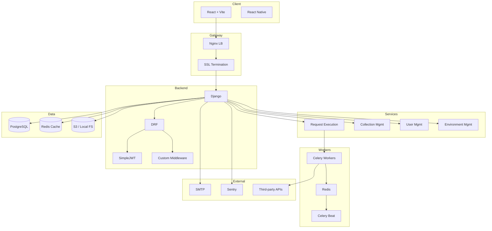
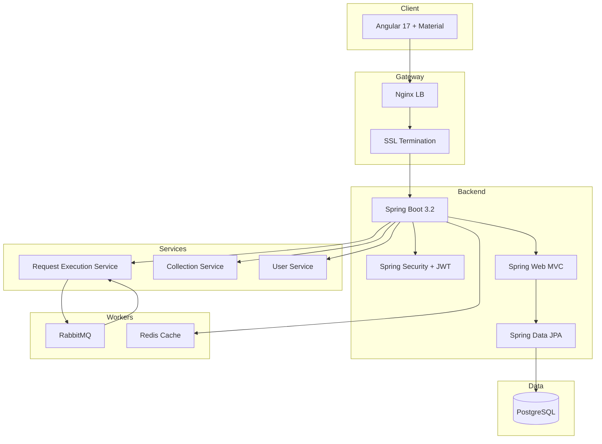
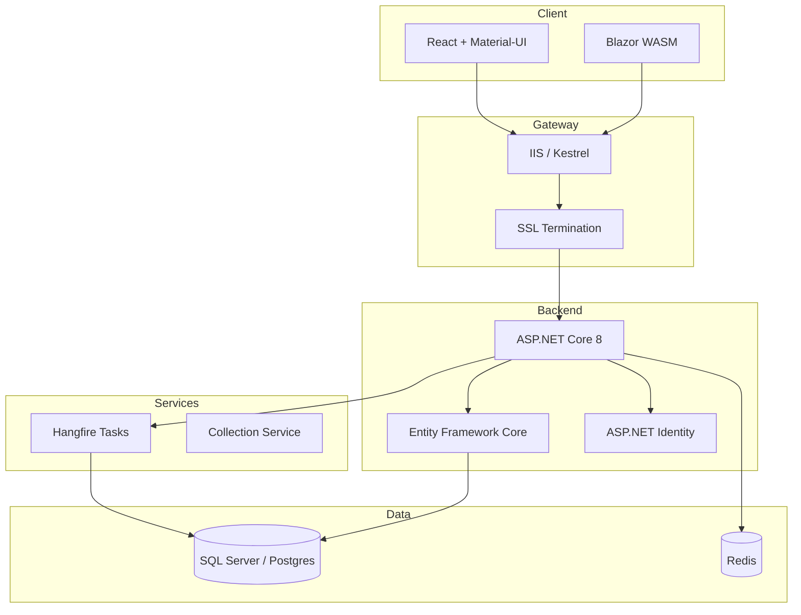

**API Playground: Multi‑Stack Architecture & Development Plan**

*This document consolidates system design, architecture, and development planning for each of the five technology stacks described in **`tracker.md`**, **`Stacks.md`**, **`YellowPaper.md`**, and **`Models.md`**. Timelines are structured around a one‑stack‑per‑week schedule. Reference **`tracker.md`** for dependency breakdowns. This guide is exhaustive for implementation, architecture, design, and deployment.*

---

## 1. Common Foundations

### 1.1 Shared API Specification

All five stacks implement identical REST endpoints under `/api/v1/*`:

```text
POST   /api/v1/auth/register
POST   /api/v1/auth/login
GET    /api/v1/collections/
POST   /api/v1/collections/{collection_id}/endpoints/
POST   /api/v1/test/{endpoint_id}/
GET    /api/v1/logs/
```

### 1.2 Data Model Reference

Refer to **`Models.md`** for detailed schema definitions of:

* **Users** (`users`)
* **Collections** (`collections`)
* **Endpoints** (`endpoints`)
* **Request Logs** (`request_logs`)
* **Teams & Shares** (`teams`, `team_members`, `collection_shares`)

### 1.3 High‑Level Architecture

```mermaid
graph LR
  subgraph Client_Layer
    WebApp[Web App]
    MobileApp[Mobile App]
  end
  subgraph API_Gateway
    LB[Nginx / Load Balancer]
    SSL[SSL Termination]
  end
  subgraph Application_Layer
    API[Stack‑specific REST API]
    WS[WebSocket Server]
    MQ[Background Workers]
  end
  subgraph Data_Layer
    DB[(PostgreSQL / SQL Server)]
    Cache[(Redis)]
    Storage[(S3 / MinIO)]
  end
  WebApp --> LB --> SSL --> API
  MobileApp --> LB --> SSL --> API
  API --> DB
  API --> Cache
  API --> MQ --> Cache
  API --> Storage
  API <-- WS
  WebApp <-- WS
  MobileApp <-- WS
```

---

## 2. Stack‑Specific Designs

Each stack section provides:

1. **System Diagram**
2. **Component Responsibilities**
3. **DDD Folder Structure**
4. **Database Schema & ER Diagram**
5. **Service & Background Task Flows**
6. **Auth & Security Patterns**
7. **API Design Conventions**
8. **Frontend Architecture**
9. **Deployment Topology**
10. **Performance & Caching Strategies**
11. **Testing Strategy**

---

### 🐍 Stack 1: Python / Django + React

#### 2.1 System Diagram



#### 2.2 Component Responsibilities

* **React/Vite**: UI for authentication, collections, endpoint creation, execution, and history. Uses Zustand for state and React Query for data fetching.
* **Django + DRF**: Implements the shared REST spec, serializers, ViewSets, and custom middleware for logging and rate‑limiting.
* **Services Layer**: Business logic encapsulated in Django apps: `authentication`, `collections`, `proxy`, `history`, `environments`.
* **Celery**: Handles asynchronous request execution, retry logic, batch processing, and scheduled cleanup tasks.
* **Redis**: Serves as both Celery broker and cache for rate limits and frequent lookups.

#### 2.3 DDD Folder Structure

```
api_playground/
├── apps/
│   ├── authentication/
│   ├── collections/
│   ├── environments/
│   ├── proxy/
│   ├── history/
│   └── codegen/
├── core/
│   ├── models/
│   ├── serializers/
│   ├── permissions/
│   ├── middleware/
│   └── utils/
├── config/
│   ├── settings/
│   ├── urls.py
│   └── celery.py
└── static/
```

#### 2.4 Database Schema & ER Diagram

See **`Models.md`** for complete ER diagrams. Key tables:

* `users` (UUID PK, email, hashed password)
* `collections` (UUID PK, owner FK)
* `endpoints` (UUID PK, collection FK, JSONB payload)
* `request_logs` (UUID PK, endpoint FK, status, timestamps)

#### 2.5 Service & Background Task Flows

* **execute\_api\_request**: Enqueued by API, processed by Celery Worker, logs to `request_logs`.
* **cleanup\_tasks**: Scheduled via Celery Beat to purge old logs and temporary data.
* **notifications**: Triggered on share events, sent via SMTP.

#### 2.6 Auth & Security Patterns

* **JWT**: Access tokens (15 min) and refresh tokens (7 days) with rotation.
* **Rate Limiting**: 10 requests/min per user via Redis; 5 auth attempts/min per IP.
* **SSRF Protection**: URL validator blocks private IP ranges.
* **CORS**: Restricted to allowed origins in production.

#### 2.7 API Design Conventions

* Versioned endpoints under `/api/v1/`.
* Standard response: `{ status, data, message, timestamp }`.
* Pagination via `PageNumberPagination` (default page size 20).
* Centralized error handling in custom middleware.

#### 2.8 Frontend Architecture

```
src/
├── components/
│   ├── common/
│   ├── auth/
│   ├── collections/
│   ├── endpoints/
│   ├── execution/
│   └── history/
├── hooks/
├── services/   # Axios wrappers
├── stores/     # Zustand
├── utils/
└── pages/
```

#### 2.9 Deployment Topology

* **Dev**: Docker Compose brings up Django, React, Redis, Postgres locally.
* **Prod**: Kubernetes (EKS/ECS) with AWS ALB → Django Gunicorn, React served via CDN.
* Services: RDS (PostgreSQL), ElastiCache (Redis), S3 (asset storage).

#### 2.10 Performance & Caching Strategies

* Multi‑layer caching (local memory + Redis).
* DB optimizations: `select_related`, `prefetch_related`, indices on FKs and timestamps.
* Celery concurrency tuning based on worker type.

#### 2.11 Testing Strategy

* **Unit**: `pytest-django` targeting 80% coverage.
* **Integration**: DRF `APITestCase` with external API mocks.
* **E2E**: Playwright scripts covering critical flows.
* **Load Testing**: Locust simulating up to 1 k users.

---

### 🟨 Stack 2: Node.js / Express + Next.js

#### 2.1 System Diagram

```mermaid
graph TB
  subgraph Client
    NextJS[Next.js (React)]
  end
  subgraph Gateway
    Nginx[Nginx]
  end
  subgraph API_Service
    Express[Express.js]
    Auth[Passport + JWT]
    Prisma[Prisma ORM]
    MQ[Bull Queue]
  end
  subgraph Workers
    Jobs[RequestJobs Processor]
    Cleanup[CleanupJobs Processor]
  end
  subgraph Data
    PG[(PostgreSQL)]
    RD[(Redis Cache)]
  end

  NextJS --> Nginx --> Express
  Express --> Auth
  Express --> Prisma --> PG
  Express --> RD
  Express --> MQ --> Jobs
  Express --> MQ --> Cleanup
  Jobs --> RD
```

#### 2.2 Component Responsibilities

* **Next.js**: UI and Server Components; handles page rendering and API routes for auth, collections, endpoints.
* **Express.js**: Dedicated microservice for heavy request execution and logging.
* **Passport.js**: JWT authentication strategy.
* **Prisma ORM**: Type-safe database client and migrations.
* **Bull**: Redis-backed job queue for asynchronous tasks and retries.

#### 2.3 DDD Folder Structure

```
node-playground/
├── src/
│   ├── pages/api/       # Next.js API routes
│   ├── components/
│   ├── lib/             # Prisma client, auth utils
│   ├── services/        # Business logic modules
│   └── jobs/            # Bull processors
├── prisma/
│   └── schema.prisma
└── public/
```

#### 2.4 Database Schema & ER Diagram

Matches **`Models.md`**; Prisma schema generates tables for users, collections, endpoints, logs, teams.

#### 2.5 Service & Background Task Flows

* **executeJob**: Queues HTTP execution job, logs response.
* **batchCleanup**: Removes outdated logs on schedule.

#### 2.6 Auth & Security Patterns

* JWT tokens managed by NextAuth or Passport credentials provider.
* Rate limiting via `express-rate-limit` backed by Redis.

#### 2.7 API Design Conventions

* Standard envelope: `{ status, result, error }`.
* Request/response validation via Zod schemas.

#### 2.8 Frontend Architecture

* App Router (Next.js), React Query for data, Zustand for state, Tailwind CSS for styling.

#### 2.9 Deployment Topology

* Next.js deployed on Vercel.
* Express microservice deployed via Docker on ECS.
* Infra: RDS Postgres, ElastiCache Redis.

#### 2.10 Performance & Caching Strategies

* ISR (Incremental Static Regeneration) for pages.
* Redis for session store and caching frequent queries.

#### 2.11 Testing Strategy

* **Unit & Integration**: Jest + Supertest.
* **E2E**: Playwright.

---

### ☕ Stack 3: Java / Spring Boot + Angular

#### 2.1 System Diagram



#### 2.2 Component Responsibilities

* **Angular**: Modular UI using NgRx for state and Angular Material for components.
* **Spring Boot**: Layered architecture (Controller → Service → Repository) with Maven/Gradle build.
* **Spring Security**: JWT authentication filter chain.
* **Hibernate/JPA**: Entity mappings, Flyway for DB migrations.
* **RabbitMQ**: Asynchronous job transport for request execution.
* **Redis**: Caching and rate‑limiting store.

#### 2.3 DDD Folder Structure

```
spring-playground/
├── src/main/java/com/postkid
│   ├── config/       # Security, DB, MQ
│   ├── controller/   # REST controllers
│   ├── domain/       # Entities
│   ├── repository/   # Spring Data JPA repos
│   ├── service/      # Business logic
│   └── websocket/    # STOMP handlers
├── src/main/resources
│   ├── application.yml
│   └── db/migration/ # Flyway scripts
└── src/test/
```

#### 2.4 Database Schema & ER Diagram

Follows **`Models.md`** with JPA annotations (`@Entity`, `@OneToMany`, `@ManyToOne`).

#### 2.5 Service & Background Task Flows

* **RequestExecutionService**: Uses `WebClient` for HTTP calls, persists logs.
* **ScheduledJobs**: Cleanup and notification using `@Scheduled`.
* **WebSocket Events**: Real-time updates via STOMP.

#### 2.6 Auth & Security Patterns

* JWT tokens via custom filter and provider.
* CSRF disabled for API; CORS restricted by origin.
* Rate limiting via Bucket4j.

#### 2.7 API Design Conventions

* DTO mapping via MapStruct.
* Global error handling with `@ControllerAdvice`.
* OpenAPI documentation via SpringDoc.

#### 2.8 Frontend Architecture

```
projects/angular-client/
├── src/app/
│   ├── modules/    # auth, collections, endpoints, history
│   ├── shared/     # components, interceptors
│   └── core/       # services, state
└── angular.json
```

#### 2.9 Deployment Topology

* Docker multi-stage build for backend and frontend.
* Kubernetes with Ingress, ConfigMaps, Secrets.
* Monitoring: Prometheus, Grafana, Zipkin.

#### 2.10 Performance & Caching Strategies

* Hibernate 2nd-level cache with Redis.
* Read replicas and DB indexing.
* Tuning RabbitMQ consumer concurrency.

#### 2.11 Testing Strategy

* **Unit**: JUnit 5, Mockito.
* **Integration**: TestContainers for Postgres & RabbitMQ.
* **E2E**: Cypress.

---

### 🟢 Stack 4: Go / Fiber + SvelteKit

#### 2.1 System Diagram

```mermaid
graph TB
  subgraph Client
    SvelteKit[SvelteKit App]
  end
  subgraph Gateway
    Nginx[Nginx LB]
    SSL[SSL Termination]
  end
  subgraph Backend
    Fiber[Fiber 2.50]
    JWT[golang-jwt]
    Validator[go-playground/validator]
  end
  subgraph Services
    ReqExec[Request Executor]
    ColMgmt[Collection Service]
  end
  subgraph Workers
    Asynq[Asynq (Redis)]
  end
  subgraph Data
    PG[(PostgreSQL)]
  end

  SvelteKit --> Nginx --> SSL --> Fiber
  Fiber --> JWT
  Fiber --> Validator
  Fiber --> ReqExec & ColMgmt
  ReqExec --> Asynq --> Redis
  Fiber --> PG
```

#### 2.2 Component Responsibilities

* **SvelteKit**: Server-side rendering, client routing, Skeleton UI for fast load.
* **Fiber**: High-performance REST handlers with middleware for logging, auth, rate-limit.
* **Asynq**: Redis-backed job queue for request execution and cleanup.
* **GORM**: Model definitions and migrations via `golang-migrate`.
* **Validator**: Struct-based input validation.

#### 2.3 DDD Folder Structure

```
go-playground/
├── cmd/            # main.go entrypoint
├── internal/
│   ├── api/        # HTTP handlers
│   ├── service/    # Business logic
│   ├── model/      # GORM models
│   ├── worker/     # Asynq tasks
│   └── config/     # Viper config
└── web/            # SvelteKit frontend
```

#### 2.4 Database Schema & ER Diagram

Mirrors **`Models.md`**, migrations stored in `migrations/`.

#### 2.5 Service & Background Task Flows

* **ExecuteTask**: Asynq worker performs HTTP calls and logs.
* **CleanupTask**: Scheduled retention policy enforcement.

#### 2.6 Auth & Security Patterns

* JWT authentication middleware with token claims.
* Rate limiting via Go's `rate.Limiter` and Redis.

#### 2.7 API Design Conventions

* JSON response envelope with versioned routes.
* Input validation via struct tags.

#### 2.8 Frontend Architecture

```
web/
├── src/routes/
├── src/lib/      # stores, services
├── src/components/
└── svelte.config.js
```

#### 2.9 Deployment Topology

* Docker scratch binary for minimal footprint.
* Kubernetes with Horizontal Pod Autoscaler.
* Metrics exported to Prometheus.

#### 2.10 Performance & Caching Strategies

* Prepared statements and connection pooling.
* LRU in-memory cache for hot data plus Redis.
* Goroutine pools for request execution.

#### 2.11 Testing Strategy

* **Unit**: Testify, GoMock.
* **Integration**: Docker Postgres for CI tests.
* **E2E**: Playwright.

---

### 🟣 Stack 5: C# / ASP.NET Core + Blazor/React

#### 2.1 System Diagram



#### 2.2 Component Responsibilities

* **Blazor / React**: SPA UIs using Fluxor or Redux for state management.
* **ASP.NET Core**: Controllers, MediatR for CQRS pattern, built-in DI container.
* **ASP.NET Identity / JWT**: User management and token issues.
* **Hangfire**: Background job scheduling and retries.
* **EF Core**: Data access layer with Fluent API configuration.

#### 2.3 DDD Folder Structure

```
dotnet-playground/
├── src/
│   ├── Api/           # Controllers, Startup configuration
│   ├── Application/   # Services, DTOs, MediatR handlers
│   ├── Domain/        # Entity definitions
│   ├── Infrastructure/# EF Core, Hangfire, Logging
│   └── WebUI/         # Blazor or React client project
└── tests/
```

#### 2.4 Database Schema & ER Diagram

Follow **`Models.md`**; EF entities configured via Fluent API and migrations.

#### 2.5 Service & Background Task Flows

* **RequestExecutor**: Uses `HttpClientFactory` for external calls, logs to DB.
* **RecurringJobs**: Cleanup and notification tasks visible in Hangfire Dashboard.

#### 2.6 Auth & Security Patterns

* JWT Bearer middleware for API protection.
* Role-based policies using ASP.NET Core Authorization.
* Rate limiting via `AspNetCoreRateLimit` middleware.

#### 2.7 API Design Conventions

* Errors returned according to RFC 7807 Problem Details.
* Versioning through URL segment (e.g., `/v1/...`).

#### 2.8 Frontend Architecture

* **Blazor**: `.razor` components with DI-provided services.
* **React**: Redux Toolkit, RTK Query for data fetching.

#### 2.9 Deployment Topology

* Azure App Service for WebUI and API.
* SQL Server on Azure SQL or AWS RDS.
* Redis Cache via Azure Cache for Redis.
* Monitoring and logging in Application Insights.

#### 2.10 Performance & Caching Strategies

* In‑memory caching with `IMemoryCache` and `IDistributedCache` backed by Redis.
* EF Core compiled queries and connection pooling.

#### 2.11 Testing Strategy

* **Unit**: xUnit + Moq.
* **Integration**: `Microsoft.AspNetCore.TestHost` for in-memory server tests.
* **E2E**: Playwright tests against deployed environments.

---

## 3. Cross‑Stack Comparison

| Aspect                | Django   | Node.js   | Java     | Go    | .NET     |
| --------------------- | -------- | --------- | -------- | ----- | -------- |
| Type Safety           | ⭐⭐⭐      | ⭐⭐⭐⭐⭐     | ⭐⭐⭐⭐⭐    | ⭐⭐⭐⭐  | ⭐⭐⭐⭐⭐    |
| Performance           | ⭐⭐⭐      | ⭐⭐⭐⭐      | ⭐⭐⭐⭐     | ⭐⭐⭐⭐⭐ | ⭐⭐⭐⭐     |
| Real‑time             | Channels | Socket.io | STOMP    | ws    | SignalR  |
| Jobs Broker           | Celery   | Bull      | RabbitMQ | Asynq | Hangfire |
| Deployment Complexity | ⭐⭐       | ⭐⭐⭐       | ⭐        | ⭐⭐⭐   | ⭐⭐⭐      |

**Next Steps:**

1. Kick off Django implementation (Week 1).
2. Parallelize UI theming and shared component library.
3. Scaffold CI/CD pipelines and IaC templates across all five stacks.
4. Begin post-implementation review and performance benchmarking.
