**API Playground: Multi‑Stack Architecture & Development Plan**

*This document consolidates system design, architecture, and development planning for each of the five technology stacks described in `tracker.md`, `Stacks.md`, `YellowPaper.md`, and `Models.md`. Timelines are structured around a one‑stack‑per‑week schedule. Reference `tracker.md` for dependency breakdowns. This guide is exhaustive for implementation, architecture, design, and deployment.*

---

## 1. Common Foundations

### 1.1 Shared API Specification

All five stacks implement identical REST endpoints under `/api/v1/*`:

```text
POST   /api/v1/auth/register
POST   /api/v1/auth/login
GET    /api/v1/collections/
POST   /api/v1/collections/{collection_id}/endpoints/
POST   /api/v1/test/{endpoint_id}/
GET    /api/v1/logs/
```

### 1.2 Data Model Reference

Refer to `Models.md` for detailed schema definitions:

* **Users** (`users`)
* **Collections** (`collections`)
* **Endpoints** (`endpoints`)
* **Request Logs** (`request_logs`)
* **Teams & Shares** (`teams`, `team_members`, `collection_shares`)

### 1.3 High‑Level Architecture

```mermaid
graph LR
  subgraph Client_Layer
    WebApp[Web App]
    MobileApp[Mobile App]
  end
  subgraph API_Gateway
    LB[Nginx / Load Balancer]
    SSL[SSL Termination]
  end
  subgraph Application_Layer
    API[Stack‑specific REST API]
    WS[WebSocket Server]
    MQ[Background Workers]
  end
  subgraph Data_Layer
    DB[(PostgreSQL / SQL Server)]
    Cache[(Redis)]
    Storage[(S3 / MinIO)]
  end

  WebApp --> LB --> SSL --> API
  MobileApp --> LB --> SSL --> API
  API --> DB
  API --> Cache
  API --> MQ --> Cache
  API --> Storage
  WS --> API
  WS --> WebApp
  WS --> MobileApp
```



---

## 2. Stack‑Specific Designs

Each stack section provides:

1. **System Diagram**
2. **Component Responsibilities**
3. **DDD Folder Structure**
4. **Database Schema & ER Diagram**
5. **Service & Background Task Flows**
6. **Auth & Security Patterns**
7. **API Design Conventions**
8. **Frontend Architecture**
9. **Deployment Topology**
10. **Performance & Caching Strategies**
11. **Testing Strategy**

---

### 🐍 Stack 1: Python / Django + React

#### 2.1 System Diagram


#### 2.2 Component Responsibilities

* **React/Vite**: UI for authentication, collections, endpoint creation, execution, and history. Uses Zustand and React Query.
* **Django + DRF**: Shared REST spec, serializers, ViewSets, custom middleware for logging and rate‑limiting.
* **Services Layer**: Django apps: `authentication`, `collections`, `proxy`, `history`, `environments`.
* **Celery**: Asynchronous execution, retry logic, batch jobs, scheduled cleanup.
* **Redis**: Broker for Celery, cache store, rate‑limiting.

#### 2.3 DDD Folder Structure

```
api_playground/
├── apps/
│   ├── authentication/
│   ├── collections/
│   ├── environments/
│   ├── proxy/
│   ├── history/
│   └── codegen/
├── core/
│   ├── models/
│   ├── serializers/
│   ├── permissions/
│   ├── middleware/
│   └── utils/
├── config/
│   ├── settings/
│   ├── urls.py
│   └── celery.py
└── static/
```

#### 2.4 Database Schema & ER Diagram

Refer to `Models.md` for full ER diagrams. Key tables:

* `users` (UUID PK, email, hashed password)
* `collections` (UUID PK, owner FK)
* `endpoints` (UUID PK, collection FK, JSONB payload)
* `request_logs` (UUID PK, endpoint FK, status, timestamps)

#### 2.5 Service & Background Task Flows

* **execute\_api\_request**: Queues HTTP calls in Celery, logs in `request_logs`.
* **cleanup\_tasks**: Celery Beat schedules data purges.
* **notifications**: Email via SMTP on share events.

#### 2.6 Auth & Security Patterns

* **JWT**: Access (15 min) & Refresh (7 days), with rotation.
* **Rate Limiting**: Redis-based per-user and per-IP limits.
* **SSRF Protection**: Block private network ranges.
* **CORS**: Enforced origin whitelist.

#### 2.7 API Design Conventions

* `/api/v1/` versioned routes.
* Response envelope: `{ status, data, message, timestamp }`.
* Pagination: `PageNumberPagination` (default 20).
* Centralized error handling.

#### 2.8 Frontend Architecture

```
src/
├── components/
│   ├── common/
│   ├── auth/
│   ├── collections/
│   ├── endpoints/
│   ├── execution/
│   └── history/
├── hooks/
├── services/  # Axios wrappers
├── stores/    # Zustand
└── pages/
```

#### 2.9 Deployment Topology

* **Dev**: Docker Compose (Django, React, Redis, Postgres).
* **Prod**: AWS EKS/ECS with ALB → Gunicorn, React CDN.
* RDS (Postgres), ElastiCache (Redis), S3 storage.

#### 2.10 Performance & Caching Strategies

* Local + Redis caching.
* DB: optimized joins, indices.
* Celery: worker concurrency tuning.

#### 2.11 Testing Strategy

* **Unit**: `pytest-django` (80% coverage).
* **Integration**: DRF `APITestCase`.
* **E2E**: Playwright.
* **Load**: Locust (1 k users).

---

### 🟨 Stack 2: Node.js / Express + Next.js

#### 2.1 System Diagram


#### 2.2 Component Responsibilities

* **Next.js**: UI + Server Components; page rendering and API routes for auth, collections, endpoints.
* **Express.js**: Microservice for request execution & logging.
* **Passport.js**: JWT auth strategy.
* **Prisma ORM**: Type-safe client, migrations.
* **Bull**: Redis-backed queue for async jobs.

#### 2.3 DDD Folder Structure

```
node-playground/
├── src/
│   ├── pages/api/
│   ├── components/
│   ├── lib/         # Prisma, auth
│   ├── services/
│   └── jobs/
├── prisma/
│   └── schema.prisma
└── public/
```

#### 2.4 Database Schema & ER Diagram

Matches `Models.md`, generated by Prisma schema.

#### 2.5 Service & Background Task Flows

* **executeJob**: Enqueue HTTP execution.
* **batchCleanup**: Scheduled log cleanup.

#### 2.6 Auth & Security Patterns

* JWT via NextAuth or Passport.
* Rate limiting with `express-rate-limit` + Redis.

#### 2.7 API Design Conventions

* Envelope: `{ status, result, error }`.
* Zod validation for inputs.

#### 2.8 Frontend Architecture

Next.js App Router, React Query, Zustand, Tailwind.

#### 2.9 Deployment Topology

* Vercel (Next.js), ECS (Express).
* RDS Postgres, ElastiCache Redis.

#### 2.10 Performance & Caching Strategies

* ISR for pages.
* Redis for sessions & cache.

#### 2.11 Testing Strategy

* Jest + Supertest (unit/integration).
* Playwright (E2E).

---

### ☕ Stack 3: Java / Spring Boot + Angular

#### 2.1 System Diagram


#### 2.2 Component Responsibilities

* **Angular**: Modular UI using NgRx for state and Angular Material for components.
* **Spring Boot**: Layered architecture (Controller → Service → Repository) with Maven/Gradle build.
* **Spring Security**: JWT authentication filter chain.
* **Hibernate/JPA**: Entity mappings, Flyway for DB migrations.
* **RabbitMQ**: Async jobs for request execution.
* **Redis**: Caching and rate‑limiting store.

#### 2.3 DDD Folder Structure

```
spring-playground/
├── src/main/java/com/postkid
│   ├── config/       # Security, DB, MQ
│   ├── controller/   # REST controllers
│   ├── domain/       # Entities
│   ├── repository/   # Spring Data JPA repos
│   ├── service/      # Business logic
│   └── websocket/    # STOMP handlers
├── src/main/resources
│   ├── application.yml
│   └── db/migration/ # Flyway scripts
└── src/test/
```

#### 2.4 Database Schema & ER Diagram

Refer to `Models.md`. Entities annotated with `@Entity`, relationships via `@OneToMany`, `@ManyToOne`.

#### 2.5 Service & Background Task Flows

* **RequestExecutionService**: Uses `WebClient` for HTTP calls, logs to DB.
* **ScheduledJobs**: Cleanup and notifications via `@Scheduled`.
* **WebSocket Events**: Real-time updates via STOMP.

#### 2.6 Auth & Security Patterns

* **JWT**: Custom filter & token provider.
* **CSRF**: Disabled for API; strict CORS.
* **Rate Limiting**: Bucket4j integration.

#### 2.7 API Design Conventions

* DTOs via MapStruct.
* Error handling with `@ControllerAdvice`.
* OpenAPI docs via SpringDoc.

#### 2.8 Frontend Architecture

```
projects/angular-client/
├── src/app/
│   ├── modules/    # auth, collections, endpoints, history
│   ├── shared/     # components, interceptors
│   └── core/       # services, state
└── angular.json
```

#### 2.9 Deployment Topology

* Docker multi-stage build for backend and frontend.
* Kubernetes with Ingress, ConfigMaps, Secrets.
* Monitoring: Prometheus, Grafana, Zipkin.

#### 2.10 Performance & Caching Strategies

* Hibernate 2nd-level cache with Redis.
* Read replicas and indices.
* RabbitMQ consumer tuning.

#### 2.11 Testing Strategy

* **Unit**: JUnit 5 + Mockito.
* **Integration**: TestContainers for Postgres & RabbitMQ.
* **E2E**: Cypress.

---

### 🟢 Stack 4: Go / Fiber + SvelteKit

#### 2.1 System Diagram


#### 2.2 Component Responsibilities

* **SvelteKit**: SSR and client routing with Skeleton UI.
* **Fiber**: REST handlers with auth, logging, rate-limit middleware.
* **Asynq**: Job queue with Redis for background execution.
* **GORM**: Data models and migrations.
* **Validator**: Request validation via struct tags.

#### 2.3 DDD Folder Structure

```
go-playground/
├── cmd/
├── internal/
│   ├── api/
│   ├── service/
│   ├── model/
│   ├── worker/
│   └── config/
└── web/
```

#### 2.4 Database Schema & ER Diagram

Matches `Models.md`; migrations in `migrations/`.

#### 2.5 Service & Background Task Flows

* **ExecuteTask**: Asynq performs HTTP requests and logs.
* **CleanupTask**: Scheduled retention enforcement.

#### 2.6 Auth & Security Patterns

* JWT via middleware.
* Rate limiting via Go's `rate.Limiter` + Redis.

#### 2.7 API Design Conventions

* Versioned JSON envelope.
* Input struct validation.

#### 2.8 Frontend Architecture

```
web/
├── src/routes/
├── src/lib/
├── src/components/
└── svelte.config.js
```

#### 2.9 Deployment Topology

* Docker scratch images.
* Kubernetes HPA.
* Metrics to Prometheus.

#### 2.10 Performance & Caching Strategies

* Connection pooling, prepared statements.
* LRU + Redis caching.
* Goroutine pool management.

#### 2.11 Testing Strategy

* **Unit**: Testify + GoMock.
* **Integration**: Docker Postgres CI tests.
* **E2E**: Playwright.

---

### 🟣 Stack 5: C# / ASP.NET Core + Blazor/React

#### 2.1 System Diagram


#### 2.2 Component Responsibilities

* **Blazor/React**: SPA UI with Fluxor or Redux.
* **ASP.NET Core**: Controllers, MediatR, DI.
* **Identity/JWT**: Authentication.
* **Hangfire**: Background jobs.
* **EF Core**: Data access.

#### 2.3 DDD Folder Structure

```
dotnet-playground/
├── src/
│   ├── Api/
│   ├── Application/
│   ├── Domain/
│   ├── Infrastructure/
│   └── WebUI/
└── tests/
```

#### 2.4 Database Schema & ER Diagram

Follow `Models.md`; EF Fluent API.

#### 2.5 Service & Background Task Flows

* **RequestExecutor**: `HttpClientFactory` calls.
* **RecurringJobs**: Hangfire tasks.

#### 2.6 Auth & Security Patterns

* JWT Bearer middleware.
* Role-based policies.
* Rate limiting via `AspNetCoreRateLimit`.

#### 2.7 API Design Conventions

* RFC 7807 Problem Details.
* URL versioning.

#### 2.8 Frontend Architecture

* Blazor `.razor` components.
* React Redux Toolkit + RTK Query.

#### 2.9 Deployment Topology

* Azure App Service + AKS.
* Azure SQL / RDS.
* Azure Cache for Redis.
* Application Insights.

#### 2.10 Performance & Caching Strategies

* In-memory + Redis cache.
* EF compiled queries.

#### 2.11 Testing Strategy

* **Unit**: xUnit + Moq.
* **Integration**: TestHost.
* **E2E**: Playwright.

---

## 3. Cross‑Stack Comparison

| Aspect                | Django   | Node.js   | Java     | Go    | .NET     |
| --------------------- | -------- | --------- | -------- | ----- | -------- |
| Type Safety           | ⭐⭐⭐      | ⭐⭐⭐⭐⭐     | ⭐⭐⭐⭐⭐    | ⭐⭐⭐⭐  | ⭐⭐⭐⭐⭐    |
| Performance           | ⭐⭐⭐      | ⭐⭐⭐⭐      | ⭐⭐⭐⭐     | ⭐⭐⭐⭐⭐ | ⭐⭐⭐⭐     |
| Real‑time             | Channels | Socket.io | STOMP    | ws    | SignalR  |
| Jobs Broker           | Celery   | Bull      | RabbitMQ | Asynq | Hangfire |
| Deployment Complexity | ⭐⭐       | ⭐⭐⭐       | ⭐        | ⭐⭐⭐   | ⭐⭐⭐      |

**Next Steps:**

1. Kick off Django implementation (Week 1).
2. Parallelize UI theming and shared component library.
3. Scaffold CI/CD pipelines and IaC templates across all five stacks.
4. Begin post-implementation review and performance benchmarking.
