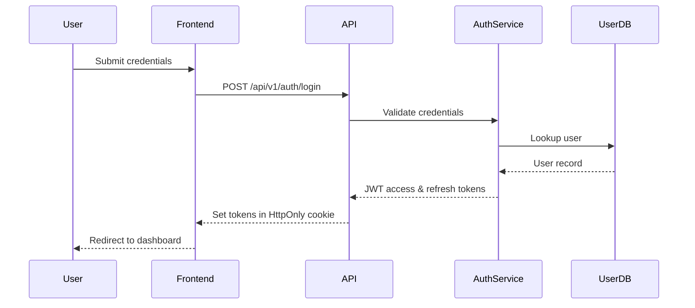
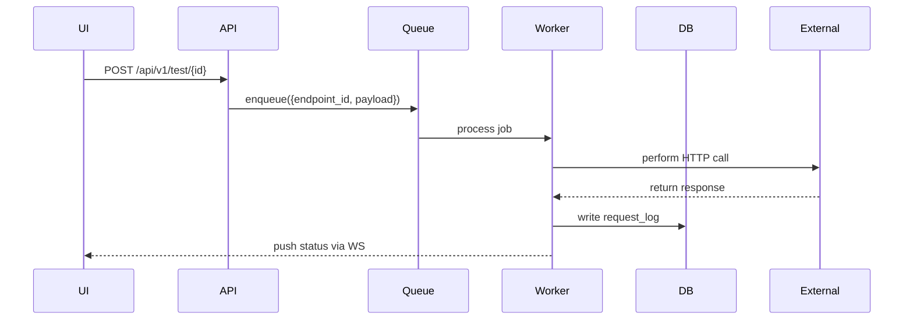
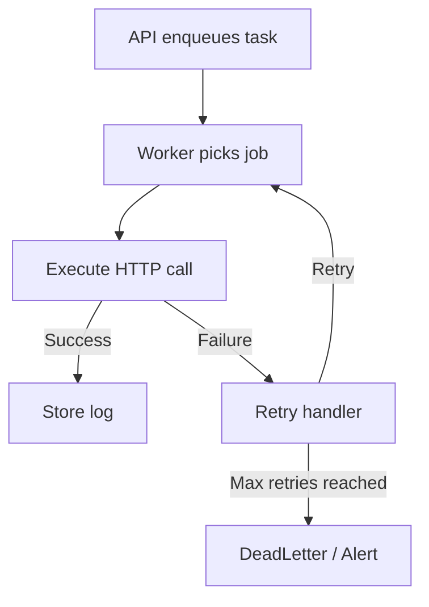
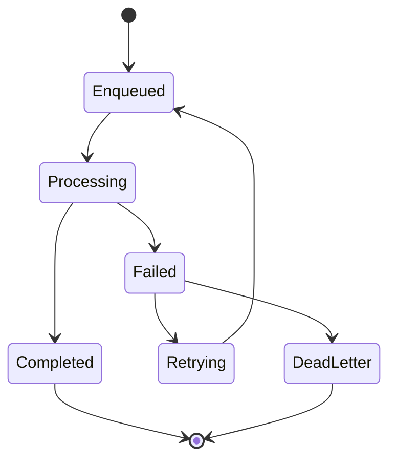
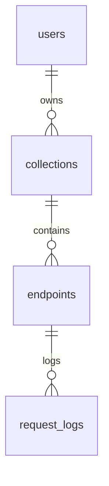

# API Playground: Multi‑Stack Architecture & Development Plan

This document consolidates system design, architecture, and development planning for each of the five technology stacks described in `tracker.md`, `Stacks.md`, `YellowPaper.md`, and `Models.md`. Timelines follow a one‑stack‑per‑week schedule. Reference `tracker.md` for dependency breakdowns. This guide is exhaustive for implementation, architecture, design, deployment, and maintenance.

---

## Table of Contents

1.  **Common Foundations**
    1.1 Shared API Specification
    1.2 Data Model Reference
    1.3 High‑Level Architecture
    1.4 Visualizations & Sequence Diagrams
2.  **Stack‑Specific Designs**
    2.1 🐍 Stack 1: Python / Django + React
    2.2 🟨 Stack 2: Node.js / Express + Next.js
    2.3 ☕ Stack 3: Java / Spring Boot + Angular
    2.4 🟢 Stack 4: Go / Fiber + SvelteKit
    2.5 🟣 Stack 5: C# / ASP.NET Core + Blazor/React
3.  **Cross‑Stack Comparison**


---

## 1. Common Foundations

### 1.1 Shared API Specification

All five stacks implement identical, versioned REST endpoints under `/api/v1/*`:

| Method | Route | Description |
| --- | --- | --- |
| POST | `/api/v1/auth/register` | User registration |
| POST | `/api/v1/auth/login` | User authentication |
| GET | `/api/v1/collections/` | List all collections |
| POST | `/api/v1/collections/{collection_id}/endpoints/` | Create an endpoint within a collection |
| POST | `/api/v1/test/{endpoint_id}/` | Execute a test call |
| GET | `/api/v1/logs/` | Retrieve execution logs |

**Justification:** Uniform interface simplifies SDKs and CLI tooling, enables safe version upgrades, and guarantees identical behavior across stacks.

---

### 1.2 Data Model Reference

Refer to `Models.md` for full schema definitions. Core entities and relations:

| Entity | Table | Key Fields / Relations |
| --- | --- | --- |
| Users | `users` | `id` (UUID PK), `email`, `password_hash`, timestamps |
| Collections | `collections` | `id` (UUID PK), `owner_id` FK → `users.id`, `name`, `created_at` |
| Endpoints | `endpoints` | `id` (UUID PK), `collection_id` FK → `collections.id`, `schema` (JSONB) |
| Request Logs | `request_logs` | `id` (UUID PK), `endpoint_id` FK → `endpoints.id`, `status`, `timestamp` |
| Teams & Shares | `teams`,`team_members`,`collection_shares` | Collaboration tables linking users and collections |

#### Data Model Class Diagram

```mermaid
classDiagram
    class User {
      +UUID id
      +String email
      +String password_hash
      +DateTime created_at
    }
    class Collection {
      +UUID id
      +UUID owner_id
      +String name
      +DateTime created_at
    }
    class Endpoint {
      +UUID id
      +UUID collection_id
      +Object schema
    }
    class RequestLog {
      +UUID id
      +UUID endpoint_id
      +String status
      +DateTime timestamp
    }
    User "1" -- "*" Collection : owns
    Collection "1" -- "*" Endpoint : contains
    Endpoint "1" -- "*" RequestLog : logs
````

-----

### 1.3 High‑Level Architecture

```mermaid
flowchart LR
  subgraph Client_Layer
    WebApp["Web App"]
    MobileApp["Mobile App"]
  end
  subgraph API_Gateway
    LB["Nginx / Load Balancer"]
    SSL["SSL Termination"]
  end
  subgraph Application_Layer
    API["REST API"]
    WS["WebSocket Server"]
    MQ["Background Workers"]
  end
  subgraph Data_Layer
    DB["PostgreSQL / SQL Server"]
    Cache["Redis"]
    Storage["S3 / MinIO"]
  end
  WebApp --> LB --> SSL --> API
  MobileApp --> LB --> SSL --> API
  API --> DB & Cache & MQ & Storage
  MQ --> Cache
  WS --> API --> WebApp
  WS --> MobileApp
```

-----

### 1.4 Visualizations & Sequence Diagrams

#### 1.4.1 Authentication Handshake



#### 1.4.2 Request Execution Flow



#### 1.4.3 Background Task Retry Flow



#### 1.4.4 Job Lifecycle State Diagram



-----

## 2\. Stack‑Specific Designs

### 2.1 🐍 Stack 1: Python / Django + React

#### 2.1.1 System Diagram


#### 2.1.2 Component Responsibilities

  * **React/Vite & React Native**: SPA & mobile UI, Zustand, React Query, react-hook-form, zod.
  * **Django & DRF**: REST endpoints, serializers, viewsets, custom middleware (logging, rate-limiting).
  * **SimpleJWT**: Access (15 min) & rotating refresh tokens.
  * **Celery & Redis**: Task queue, exponential retry, scheduled cleanup.
  * **PostgreSQL**: JSONB schemas, relational data.
  * **S3 / MinIO**: File storage.

#### 2.1.3 Dependencies

| Package | Version | Purpose | Justification |
| --- | --- | --- | --- |
| django | 4.x | Web framework | Batteries-included, mature community |
| djangorestframework | 3.x | REST toolkit | Serializers, ViewSets |
| djangorestframework-simplejwt | latest | JWT auth | Blacklist, rotation |
| celery | 5.x | Async task queue | Scheduling, retries |
| redis | 4.x | Broker & cache | In-memory store |
| psycopg2-binary | latest | PostgreSQL adapter | Stable, performant |
| boto3 | latest | AWS S3 SDK | Official SDK, MinIO-compatible |
| react | 18.x | Frontend UI | Hooks, concurrency |
| vite | latest | Dev server & bundler | Fast HMR |
| zustand | latest | State management | Minimal API |
| react-query | latest | Data fetching | Caching, invalidation |
| react-router-dom | latest | Routing | Standard SPA nav |
| react-hook-form | latest | Form handling | Performance |
| zod | latest | Schema validation | TS-first |
| axios | latest | HTTP client | Interceptors |
| eslint | latest | Linting | Code quality |
| prettier | latest | Formatting | Consistency |
| jest | latest | Unit testing | React ecosystem |
| @testing-library/react | latest | Component testing | Accessibility focus |

#### 2.1.4 DDD Folder Structure

```text
api_playground/
├── apps/
│   ├── authentication/
│   ├── collections/
│   ├── environments/
│   ├── history/
│   ├── proxy/
│   └── codegen/
├── core/
│   ├── models/
│   ├── serializers/
│   ├── permissions/
│   ├── middleware/
│   └── utils/
├── config/
│   ├── settings/
│   ├── urls.py
│   └── celery.py
└── static/
```

#### 2.1.5 ER Diagram



#### 2.1.6 Service & Background Task Flows

  * **execute\_api\_request**: Celery queues HTTP call; on failure, retry with backoff.
  * **cleanup\_tasks**: Beat schedules retention purge.
  * **notifications**: SMTP email on share events.

#### 2.1.7 Auth & Security Patterns

  * **JWT**: 15 min access, 7 day refresh.
  * **Rate Limiting**: Redis-based per-IP/user.
  * **CSRF**: Exempt API, enforced on forms.
  * **SSRF Prevention**: Block private net ranges.
  * **Audit Logging**: All auth and exec events.

#### 2.1.8 API Design Conventions

  * Envelope: `{ status, data, message, timestamp }`.
  * Versioned `/api/v1/`.
  * Pagination: PageNumberPagination (20).

#### 2.1.9 Frontend Architecture

  * `components/`, `hooks/`, `services/`, `stores/` (Zustand), `pages/` (Vite).

#### 2.1.10 Deployment Topology

  * **Dev:** Docker Compose (Django, React, Redis, Postgres)
  * **Prod:** AWS EKS/ECS, ALB → Gunicorn, React CDN; RDS, ElastiCache, S3.

#### 2.1.11 Performance & Caching

  * Redis/LRU, DB indices.
  * Celery concurrency tuning.

#### 2.1.12 Testing Strategy

  * **Unit:** pytest‑django (80% coverage)
  * **Integration:** DRF `APITestCase`
  * **E2E:** Playwright
  * **Load:** Locust (1k users)

-----

### 2.2 🟨 Stack 2: Node.js / Express + Next.js

#### 2.2.1 System Diagram

```mermaid
flowchart TB
  classDef client fill:#e6f7ff,stroke:#0094ff,stroke-width:1px,color:#003c7a;
  classDef gateway fill:#fff7e6,stroke:#ffa500,stroke-width:1px,color:#7a4f00;
  classDef backend fill:#f0f5ff,stroke:#3366cc,stroke-width:1px,color:#1a3366;
  classDef service fill:#f9f0ff,stroke:#9933ff,stroke-width:1px,color:#4d0080;
  classDef data fill:#f6ffed,stroke:#389e0d,stroke-width:1px,color:#1e4f07;
  classDef external fill:#fff1f0,stroke:#ff4d4f,stroke-width:1px,color:#800000;

  subgraph Client_Layer
    NextJS["Next.js (SSR/CSR)"]:::client
  end
  subgraph Gateway_Layer
    Vercel["Vercel Edge / Nginx"]:::gateway
  end
  subgraph Backend_Layer
    Express["Express.js API"]:::backend
    NextAuth["NextAuth.js / Passport"]:::backend
    Prisma["Prisma ORM"]:::backend
  end
  subgraph Worker_Layer
    Bull["Bull Workers"]:::service
    subgraph RetryFlow
        Bull-->|retry on error|Bull
    end
  end
  subgraph Data_Layer
    Postgres["PostgreSQL"]:::data
    Redis["Redis Queue & Cache"]:::data
  end
  subgraph External_APIs
    APIs["Third‑party APIs"]:::external
  end

  NextJS --> Vercel
  Vercel --> Express
  Express --> NextAuth
  Express --> Prisma
  Express --> Bull
  Bull --> Redis
  Prisma --> Postgres
  Express --> Redis
  Bull --> APIs
```



#### 2.2.2 Component Responsibilities

  * **Next.js 14+**: SSR/CSR, API routes (`/api/*`), React Query/SWR, Tailwind.
  * **Express.js**: Request exec microservice, logging, proxy.
  * **NextAuth.js + Passport + JWT**: Auth strategies (OAuth, JWT).
  * **Prisma ORM**: Type-safe DB client, migrations.
  * **Bull**: Redis-backed queue, repeatable jobs, backoff retry.
  * **PostgreSQL**: Relational store.
  * **Redis**: Cache, rate limiter, queue broker.

#### 2.2.3 Dependencies

| Package | Version | Purpose | Justification |
| --- | --- | --- | --- |
| next | 14.x | React framework | Hybrid SSR/CSR |
| react | 18.x | UI library | Concurrent features |
| next-auth | latest | Auth in Next.js | Simplifies session, OAuth |
| express | 4.18.x | Backend API | Middleware ecosystem |
| passport | 0.6.x | Auth middleware | Strategy plug-ins |
| jsonwebtoken | latest | JWT handling | Lightweight |
| prisma | 5.x | ORM & migrations | TS-first, schema-driven |
| @prisma/client | 5.x | Runtime DB client | Generated |
| bull | 4.x | Job queue | Retry, concurrency |
| pg | latest | Postgres driver | Standard adapter |
| redis | latest | Redis client | High performance |
| express-rate-limit | latest | Rate limiting | Throttling |
| zod | latest | Input validation | TS-first |
| react-hook-form | latest | Form handling | Performance |
| axios | latest | HTTP client | Interceptors |
| eslint | latest | Linting | Code quality |
| prettier | latest | Formatting | Consistency |
| jest | latest | Unit testing | Ecosystem |
| supertest | latest | HTTP integration tests | Express-friendly |
| @testing-library/react | latest | Component testing | Accessibility focus |

#### 2.2.4 DDD Folder Structure

```text
node-playground/
├── src/
│   ├── pages/           # Next.js pages & API routes
│   ├── components/
│   ├── lib/             # Prisma, auth utils
│   ├── services/        # Business logic
│   └── jobs/            # Bull processors
├── prisma/
│   └── schema.prisma    # DB models & migrations
└── public/              # Static assets
```

#### 2.2.5 ER Diagram


#### 2.2.6 Service & Background Task Flows

  * **executeJob**: API → Bull enqueue → Worker HTTP exec → DB log → WS notify.
  * **batchCleanup**: Bull repeatable job cleans logs & temp data.

#### 2.2.7 Auth & Security Patterns

  * **JWT & OAuth**: NextAuth for frontend sessions, JWT bearer for API.
  * **CSRF**: NextAuth double-submit; API stateless.
  * **Rate Limiting**: express‐rate‐limit + Redis store.
  * **SSRF Prevention**: URL whitelist / host validation.
  * **Audit Logging**: Log login, endpoint exec, share events.

#### 2.2.8 API Design Conventions

  * Envelope: `{ status, data, error, timestamp }`.
  * Versioned `/api/v1/`.
  * Swagger via JSDoc.

#### 2.2.9 Frontend Architecture

  * **App Router**: Modular pages & server components.
  * **React Query / SWR**: Data layer.
  * **Zustand**: Client state.
  * **Tailwind CSS**.

#### 2.2.10 Deployment Topology

  * **Frontend:** Vercel.
  * **Backend:** AWS ECS Fargate + ALB.
  * **DB:** RDS Postgres.
  * **Cache/Queue:** ElastiCache Redis.

#### 2.2.11 Performance & Caching

  * ISR, SSG for pages.
  * Redis cache for frequent queries.
  * PG pooling.

#### 2.2.12 Testing Strategy

  * **Unit:** Jest.
  * **Integration:** Supertest.
  * **E2E:** Playwright.

-----

### 2.3 ☕ Stack 3: Java / Spring Boot + Angular

#### 2.3.1 System Diagram

```mermaid
flowchart TB
  classDef client fill:#e6f7ff,stroke:#0094ff,stroke-width:1px,color:#003c7a;
  classDef gateway fill:#fff7e6,stroke:#ffa500,stroke-width:1px,color:#7a4f00;
  classDef backend fill:#f0f5ff,stroke:#3366cc,stroke-width:1px,color:#1a3366;
  classDef service fill:#f9f0ff,stroke:#9933ff,stroke-width:1px,color:#4d0080;
  classDef data fill:#f6ffed,stroke:#389e0d,stroke-width:1px,color:#1e4f07;
  classDef external fill:#fff1f0,stroke:#ff4d4f,stroke-width:1px,color:#800000;

  subgraph Client_Layer
    Angular["Angular 17"]:::client
  end
  subgraph Gateway_Layer
    Nginx["Nginx / Ingress"]:::gateway
    SSL["SSL Termination"]:::gateway
  end
  subgraph Backend_Layer
    SpringBoot["Spring Boot App"]:::backend
    Security["Spring Security / JWT"]:::backend
    MVC["Spring MVC"]:::backend
    JPA["Spring Data JPA"]:::backend
  end
  subgraph Worker_Layer
    AMQP["AMQP Listener"]:::service
    subgraph RetryFlow
        AMQP-->|@Retryable|AMQP
    end
  end
  subgraph Data_Layer
    Postgres["PostgreSQL"]:::data
    RabbitMQ["RabbitMQ"]:::data
    Redis["Redis Cache"]:::data
  end
  subgraph External_APIs
    APIs["Third‑party APIs"]:::external
  end

  Angular --> Nginx
  Nginx --> SSL
  SSL --> SpringBoot
  SpringBoot --> Security & MVC & JPA
  SpringBoot -- "enqueue job" --> RabbitMQ
  RabbitMQ -- "message" --> AMQP
  AMQP --> APIs
  SpringBoot --> Postgres
  SpringBoot --> Redis
```

#### 2.3.2 Component Responsibilities

  * **Angular 17 + Material**: SPA UI, NgRx for state, Angular Router, Reactive Forms.
  * **Spring Boot 3.2**: Embedded Tomcat, layered architecture (Controller → Service → Repository).
  * **Spring Security + JWT**: Authentication & authorization filters, CSRF settings.
  * **Spring MVC & Data JPA**: REST controllers, Hibernate ORM, Flyway migrations.
  * **RabbitMQ & Asynchronous Workers**: Message broker for request execution and retry.
  * **Redis**: Cache responses, support rate limiting.

#### 2.3.3 Dependencies

| Artifact | Version | Purpose | Justification |
| --- | --- | --- | --- |
| spring-boot-starter-web | 3.2.x | REST API framework | Convention-over-configuration |
| spring-boot-starter-security | 3.2.x | Security module | Comprehensive security filters |
| spring-boot-starter-data-jpa | 3.2.x | JPA & Hibernate support | Repository pattern |
| google-auth-library-oauth2-http | latest | OAuth support | Google strategy for third-party login |
| flyway-core | latest | Database migrations | Versioned, repeatable migrations |
| spring-boot-starter-amqp | latest | RabbitMQ integration | Auto-configured listener containers |
| postgresql | latest | JDBC driver | Official adapter |
| spring-boot-starter-test | latest | Testing (JUnit, MockMvc) | Spring TestContext, Mockito |
| angular/core | 17.x | Frontend framework | CLI, AoT compilation |
| @ngrx/store | latest | State management | Redux-like container |
| @angular/material | latest | UI component library | Material Design compliance |
| @angular/router | 17.x | Client routing | Standard Angular navigation |
| @angular/forms | 17.x | Reactive & template forms | Robust form handling |

#### 2.3.4 DDD Folder Structure

```text
spring-playground/
├── src/
│   ├── main/
│   │   ├── java/com/example/
│   │   │   ├── config/        # Security, DB, MQ configs
│   │   │   ├── controller/    # REST controllers
│   │   │   ├── domain/        # Entities
│   │   │   ├── repository/    # JPA repositories
│   │   │   ├── service/       # Business logic
│   │   │   └── websocket/     # STOMP handlers
│   │   └── resources/
│   │       ├── application.yml
│   │       └── db/migration/  # Flyway scripts
│   └── test/                  # Unit & integration tests
```

#### 2.3.5 ER Diagram


#### 2.3.6 Service & Background Task Flows

  * **RequestExecutionService**: Uses `WebClient`; decorated with `@Retryable` for transient errors.
  * **ScheduledTasks**: `@Scheduled` methods for cleanup and audit notifications.
  * **STOMP WebSocket**: Real-time updates to Angular clients.

#### 2.3.7 Auth & Security Patterns

  * **JWT Tokens**: Custom filter and provider (`JwtAuthenticationFilter`).
  * **CSRF**: Disabled for API; Angular double-submit-cookie pattern.
  * **SSRF Prevention**: Host whitelist in `WebClient` configuration
  * **Audit Logging**: AOP-based logging of user actions (timestamp, user, IP)
  * **Rate Limiting**: Bucket4j per-user/IP.
  * **CORS**: Configured via `application.yml` whitelist.

#### 2.3.8 API Design Conventions

  * **DTOs**: MapStruct for mapping.
  * **Error Handling**: `@ControllerAdvice` with `@ExceptionHandler`.
  * **OpenAPI**: SpringDoc auto-generated docs.

#### 2.3.9 Frontend Architecture

  * **Modules**: Auth, Collections, Endpoints, History.
  * **Shared**: Components, interceptors.
  * **Core**: Services, global state.

#### 2.3.10 Deployment Topology

  * **Docker** multi-stage for API & Angular.
  * **Kubernetes**: Ingress, ConfigMaps, Secrets.
  * **Monitoring**: Prometheus, Grafana.

#### 2.3.11 Performance & Caching

  * **Hibernate 2nd-level** cache via Redis.
  * **Read replicas** for heavy read.
  * **RabbitMQ** consumer concurrency tuning.

#### 2.3.12 Testing Strategy

  * **Unit**: JUnit 5, Mockito.
  * **Integration**: TestContainers (Postgres, RabbitMQ).
  * **E2E**: Cypress.

-----

### 2.4 🟢 Stack 4: Go / Fiber + SvelteKit

#### 2.4.1 System Diagram

```mermaid
graph TB
  classDef client fill:#e6f7ff,stroke:#0094ff,stroke-width:1px,color:#003c7a;
  classDef gateway fill:#fff7e6,stroke:#ffa500,stroke-width:1px,color:#7a4f00;
  classDef backend fill:#f0f5ff,stroke:#3366cc,stroke-width:1px,color:#1a3366;
  classDef service fill:#f9f0ff,stroke:#9933ff,stroke-width:1px,color:#4d0080;
  classDef data fill:#f6ffed,stroke:#389e0d,stroke-width:1px,color:#1e4f07;
  classDef external fill:#fff1f0,stroke:#ff4d4f,stroke-width:1px,color:#800000;

  subgraph Client_Layer
    SvelteKit["SvelteKit"]:::client
  end
  subgraph Gateway_Layer
    Nginx["Nginx / Ingress"]:::gateway
    SSL["SSL Termination"]:::gateway
  end
  subgraph Backend_Layer
    Fiber["Fiber API"]:::backend
    JWT["golang-jwt"]:::backend
    Validator["validator"]:::backend
    PGX["pgx driver"]:::backend
  end
  subgraph Worker_Layer
    Asynq["Asynq Workers"]:::service
    subgraph RetryFlow
        Asynq-->|configured retry|Asynq
    end
  end
  subgraph Data_Layer
    Postgres["PostgreSQL"]:::data
    Redis["Redis (Asynq + Cache)"]:::data
  end
  subgraph External_APIs
    APIs["Third‑party APIs"]:::external
  end

  SvelteKit --> Nginx
  Nginx --> SSL
  SSL --> Fiber
  Fiber --> JWT & Validator & PGX
  Fiber -- "enqueue" --> Asynq
  Asynq --> Redis
  PGX --> Postgres
  Fiber --> Redis
  Asynq --> APIs
```



#### 2.4.2 Component Responsibilities

  * **SvelteKit**: SSR & client routing, Skeleton UI, Tailwind.
  * **Fiber v2.x**: Fast HTTP server, middleware for auth, logging, rate limit.
  * **golang-jwt**: JWT creation & validation.
  * **validator**: Struct-based request validation.
  * **Asynq**: Redis-backed task queue with retry and scheduling.

#### 2.4.3 Dependencies

| Module | Version | Purpose | Justification |
| --- | --- | --- | --- |
| github.com/gofiber/fiber/v2 | v2.x | HTTP framework | Express-like API, performance |
| github.com/golang-jwt/jwt/v4 | v4.x | JWT handling | RFC-compliant |
| github.com/go-playground/validator | latest | Request validation | Tag-based |
| github.com/hibiken/asynq | latest | Task queue | Reliable retries |
| github.com/jackc/pgx/v4 | v4.x | Postgres driver | Native Go, performant |
| github.com/gofiber/template | latest | HTML templating (optional) | Server-side render |
| github.com/sveltejs/kit | latest | Frontend framework | Hybrid SSR/CSR |
| tailwindcss | latest | Utility-first CSS | Rapid UI |

#### 2.4.4 DDD Folder Structure

```text
go-playground/
├── cmd/           # entry points
├── internal/
│   ├── api/       # Fiber handlers
│   ├── service/   # Business logic
│   ├── model/     # DB models & migrations
│   ├── worker/    # Asynq jobs
│   └── config/    # Config loader
└── web/           # SvelteKit app
```

#### 2.4.5 ER Diagram


#### 2.4.6 Service & Background Task Flows

  * **ExecuteTask**: Asynq worker calls external API, logs to DB; retries per policy.
  * **CleanupTask**: Scheduled retention enforcement.

#### 2.4.7 Auth & Security Patterns

  * **JWT**: Fiber JWT middleware.
  * **Rate Limiting**: Fiber limiter + Redis.
  * **CORS**: Configured via middleware.
  * **Audit Logging**: Middleware logs critical events.

#### 2.4.8 API Design Conventions

  * Envelope: `{ status, data, error }`.
  * Versioned `/api/v1/`.
  * Input binding to structs.

#### 2.4.9 Frontend Architecture

  * **Routes**: File-based.
  * **Stores**: Svelte writable stores.
  * **UI**: Skeleton & Tailwind.

#### 2.4.10 Deployment Topology

  * **Docker** scratch images.
  * **Kubernetes** with HPA & metrics.
  * **Ingress** for TLS.

#### 2.4.11 Performance & Caching

  * **pgx** pooling.
  * **LRU** in-memory + Redis.
  * **Goroutine** pool management.

#### 2.4.12 Testing Strategy

  * **Unit**: Testify, GoMock.
  * **Integration**: Dockerized Postgres CI.
  * **E2E**: Playwright.

-----

### 2.5 🟣 Stack 5: C\# / ASP.NET Core + Blazor/React

#### 2.5.1 System Diagram

```mermaid
graph TB
  classDef client fill:#e6f7ff,stroke:#0094ff,stroke-width:1px,color:#003c7a;
  classDef gateway fill:#fff7e6,stroke:#ffa500,stroke-width:1px,color:#7a4f00;
  classDef backend fill:#f0f5ff,stroke:#3366cc,stroke-width:1px,color:#1a3366;
  classDef service fill:#f9f0ff,stroke:#9933ff,stroke-width:1px,color:#4d0080;
  classDef data fill:#f6ffed,stroke:#389e0d,stroke-width:1px,color:#1e4f07;
  classDef external fill:#fff1f0,stroke:#ff4d4f,stroke-width:1px,color:#800000;

  subgraph Client_Layer
    Blazor["Blazor WASM"]:::client
    React["React"]:::client
  end
  subgraph Gateway_Layer
    IIS["IIS / Azure Gateway"]:::gateway
    SSL["SSL Termination"]:::gateway
  end
  subgraph Backend_Layer
    ASPNET["ASP.NET Core API"]:::backend
    Identity["ASP.NET Identity"]:::backend
    EFCore["Entity Framework Core"]:::backend
    MediatR["MediatR"]:::backend
  end
  subgraph Worker_Layer
    Hangfire["Hangfire Jobs"]:::service
    subgraph RetryFlow
        Hangfire-->|Automatic retry|Hangfire
    end
  end
  subgraph Data_Layer
    SQLServer["SQL Server / PostgreSQL"]:::data
    Redis["Redis Cache"]:::data
  end
  subgraph External_APIs
    APIs["Third‑party APIs"]:::external
  end

  Blazor & React --> IIS
  IIS --> SSL
  SSL --> ASPNET
  ASPNET --> Identity & EFCore & MediatR
  ASPNET -- "Enqueue" --> Hangfire
  Hangfire --> SQLServer
  EFCore --> SQLServer
  ASPNET --> Redis
  Hangfire --> APIs
```



#### 2.5.2 Component Responsibilities

  * **Blazor WASM & React + Material-UI**: Dual SPA frontends.
  * **ASP.NET Core 8**: Middleware pipeline, controllers, DI.
  * **Entity Framework Core**: DbContext, migrations.
  * **ASP.NET Identity & JWT**: Identity users, JWT bearer.
  * **Hangfire**: Background jobs, retries, dashboard.
  * **SQL Server / PostgreSQL & Redis**: Data store + cache.

#### 2.5.3 Dependencies

| Package | Version | Purpose | Justification |
| --- | --- | --- | --- |
| Microsoft.AspNetCore.App | 8.x | Core ASP.NET libraries | Bundled |
| Microsoft.EntityFrameworkCore | 8.x | ORM framework | LINQ-based, tooling |
| AspNetCore.Identity.EntityFramework | latest | Identity store | Secure defaults |
| Hangfire.AspNetCore | latest | Background job processing | Dashboard, retry |
| Swashbuckle.AspNetCore | latest | OpenAPI/Swagger | Automatic docs |
| Microsoft.Data.SqlClient | latest | SQL Server driver | Official Microsoft |
| Npgsql.EntityFrameworkCore | latest | PostgreSQL provider | Alternative DB |
| StackExchange.Redis | latest | Redis client | Performance |
| Blazor.WebAssembly | latest | Blazor client framework | WebAssembly |
| React | 18.x | Alternative SPA | Material-UI |
| MediatR | latest | In-process messaging | CQRS patterns |

#### 2.5.4 DDD Folder Structure

```text
dotnet-playground/
├── src/
│   ├── Api/            # Controllers, endpoints
│   ├── Application/    # MediatR handlers
│   ├── Domain/         # Entities, value objects
│   ├── Infrastructure/ # EF, Identity, Hangfire
│   └── WebUI/          # Blazor & React projects
└── tests/              # Unit & integration tests
```

#### 2.5.5 ER Diagram


#### 2.5.6 Service & Background Task Flows

  * **RequestExecutor**: `HttpClientFactory` calls; Hangfire retries exceptions.
  * **RecurringJobs**: Cleanup & notifications via Hangfire scheduler.

#### 2.5.7 Auth & Security Patterns

  * **JWT Bearer**: Middleware.
  * **Role Policies**: `[Authorize]` attributes.
  * **Rate Limiting**: AspNetCoreRateLimit.
  * **Audit Logging**: Middleware logs key actions.

#### 2.5.8 API Design Conventions

  * RFC 7807 Problem Details.
  * URL & header versioning.
  * Data Annotations & FluentValidation.

#### 2.5.9 Frontend Architecture

  * Blazor components with DI.
  * React with Redux Toolkit & RTK Query.

#### 2.5.10 Deployment Topology

  * **Azure App Service**: WebUI
  * **AKS**: API & workers
  * **Azure SQL / AWS RDS**
  * **Azure Cache for Redis**

#### 2.5.11 Performance & Caching

  * In-memory + Redis cache
  * EF compiled queries
  * Health checks & metrics

#### 2.5.12 Testing Strategy

  * **Unit**: xUnit & Moq
  * **Integration**: TestHost & EF In-Memory
  * **E2E**: Playwright

-----

## 3\. Cross‑Stack Comparison

| Aspect | Django (🐍) | Node.js (🟨) | Java (☕) | Go (🟢) | .NET (🟣) |
| --- | --- | --- | --- | --- | --- |
| Retry Mechanism | Celery | Bull | Spring Retry | Asynq | Hangfire |
| Auth Flow | Sequence 1.4.1 applies across | | | | |
| Background Flow | Flowchart 1.4.3 applies generically | | | | |
| Type Safety | ⭐⭐⭐ | ⭐⭐⭐⭐⭐ | ⭐⭐⭐⭐⭐ | ⭐⭐⭐⭐ | ⭐⭐⭐⭐⭐ |
| Performance | ⭐⭐⭐ | ⭐⭐⭐⭐ | ⭐⭐⭐⭐ | ⭐⭐⭐⭐⭐ | ⭐⭐⭐⭐ |
| Real‑time Support | Channels | WebSockets | STOMP | WebSockets | SignalR |
| Jobs Broker | Celery | Bull | RabbitMQ | Asynq | Hangfire |
| Deployment Complexity | ⭐⭐ | ⭐⭐⭐ | ⭐ | ⭐⭐⭐ | ⭐⭐⭐ |
