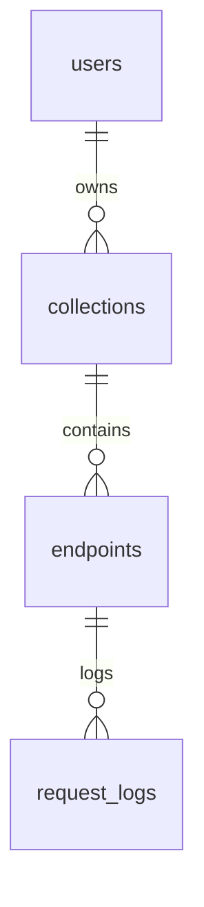

# API Playground - Stack 1: Python / Django + React 🐍

This document provides a detailed technical reference for the implementation of the API Playground application using the Python / Django backend with a React frontend. As part of a multi-stack development plan to demonstrate architectural versatility, this stack leverages Django's robust web framework capabilities and React's dynamic UI rendering to create a scalable, maintainable, and user-friendly API testing platform. This guide covers system architecture, component responsibilities, dependencies, folder structure, security patterns, deployment strategies, and testing approaches, serving as an exhaustive resource for developers.

---

## 1. Overview of Stack 1

The Python / Django + React stack combines the strengths of Django—a high-level, batteries-included web framework with a mature ecosystem—and React, a powerful JavaScript library for building interactive user interfaces. This stack is chosen for its ease of development, extensive community support, and suitability for rapid prototyping and production-grade applications. Key features include Django's built-in ORM for data management, Django REST Framework (DRF) for API development, and React's component-based architecture for creating responsive single-page applications (SPAs) and mobile interfaces via React Native.

**Stack Highlights:**
- **Backend:** Python with Django for robust server-side logic, RESTful API endpoints via DRF, and asynchronous task processing with Celery.
- **Frontend:** React with Vite for fast development and build times, supporting both web and mobile (via React Native) interfaces.
- **Use Case:** Ideal for developers familiar with Python ecosystems, needing a full-featured framework with out-of-the-box tools for authentication, database management, and API creation, paired with a modern frontend for rich user experiences.

**Objective:** Implement the API Playground with identical functionality to other stacks, adhering to the shared API specification and data model outlined in `common_foundations.md`, while leveraging stack-specific optimizations for performance and developer productivity.

---

## 2. System Architecture Diagram

The following flowchart illustrates the high-level architecture of the Django + React implementation, detailing the interaction between client, gateway, backend, services, data, workers, and external services layers. This modular design ensures scalability, maintainability, and clear separation of concerns.

```mermaid
%%{init: {
  'theme': 'base',
  'themeVariables': {
    'primaryColor': '#7aa2f7',
    'primaryTextColor': '#1a1b26',
    'primaryBorderColor': '#3b4261',
    'lineColor': '#bb9af7',
    'background': '#1a1b26',
    'mainBkg': '#1a1b26',
    'secondBkg': '#24283b',
    'tertiaryBkg': '#292e42',
    'fontFamily': '"Segoe UI", sans-serif',
    'fontSize': '14px',
    'fontWeight': '600',
    'labelBackground': '#24283b',
    'edgeLabelBackground': '#24283b',
    'clusterBkg': '#24283b',
    'clusterBorder': '#3b4261',
    'defaultLinkColor': '#bb9af7',
    'titleColor': '#c0caf5'
  },
  'flowchart': {
    'nodeSpacing': 30,
    'rankSpacing': 50,
    'curve': 'basis'
  }
}}%%

flowchart TB
    subgraph Stack_1_System_Diagram["🐍 Stack 1 - Django System"]
        subgraph Client["Client Layer"]
            direction LR
            React["⚛️ React + Vite"] ~~~ RN["📱 React Native"]
        end
        
        subgraph Gateway["Gateway Layer"]
            direction LR
            Nginx["⚖️ Nginx LB"] ~~~ SSL1["🔒 SSL Termination"]
        end
        
        subgraph Backend["Backend Layer"]
            direction LR
            Dj["🐍 Django"] ~~~ DRF["🔌 DRF"] ~~~ Auth["🔑 SimpleJWT"] ~~~ Mw["🛡️ Custom Middleware"]
        end
        
        subgraph Services["Services Layer"]
            direction LR
            ReqSvc["📡 Request Execution"] ~~~ ColSvc["📁 Collection Mgmt"] ~~~ UserSvc["👤 User Mgmt"] ~~~ EnvSvc["🌍 Environment Mgmt"]
        end
        
        subgraph Data["Data Layer"]
            direction LR
            PG["🐘 PostgreSQL"] ~~~ RD["⚡ Redis Cache"] ~~~ FS["☁️ S3 / Local FS"]
        end
        
        subgraph Workers["Workers Layer"]
            direction LR
            Celery["🌿 Celery Workers"] ~~~ Beat["🥁 Celery Beat"] ~~~ Queue["📋 Redis Queue"]
        end
        
        subgraph External["External Services"]
            direction LR
            SMTP["📧 SMTP"] ~~~ Sentry["🐛 Sentry"] ~~~ APIs["🔌 Third-party APIs"]
        end
    end

    %% Connections
    React --> Nginx
    RN --> Nginx
    Nginx --> SSL1
    SSL1 --> Dj
    Dj --> DRF
    DRF --> Auth
    DRF --> Mw
    Dj --> ReqSvc & ColSvc & UserSvc & EnvSvc
    ReqSvc --> Celery
    Celery --> Queue
    Celery --> APIs
    Queue --> Beat
    Dj --> PG & RD & FS
    Dj --> SMTP & Sentry

    %% Node styling
    classDef clientNode fill:#ff9e64,stroke:#ff7043,stroke-width:2px,color:#1a1b26,font-weight:600
    classDef gatewayNode fill:#73daca,stroke:#41a6b5,stroke-width:2px,color:#1a1b26,font-weight:600
    classDef backendNode fill:#e0af68,stroke:#d19a66,stroke-width:2px,color:#1a1b26,font-weight:600
    classDef serviceNode fill:#bb9af7,stroke:#9d7cd8,stroke-width:2px,color:#1a1b26,font-weight:600
    classDef databaseNode fill:#9ece6a,stroke:#73b25a,stroke-width:2px,color:#1a1b26,font-weight:600
    classDef workerNode fill:#7aa2f7,stroke:#5a7ec5,stroke-width:2px,color:#1a1b26,font-weight:600
    classDef externalNode fill:#f7768e,stroke:#db5a6b,stroke-width:2px,color:#1a1b26,font-weight:600

    %% Apply styles
    class React,RN clientNode
    class Nginx,SSL1 gatewayNode
    class Dj,DRF,Auth,Mw backendNode
    class ReqSvc,ColSvc,UserSvc,EnvSvc serviceNode
    class PG,RD,FS databaseNode
    class Celery,Beat,Queue workerNode
    class SMTP,Sentry,APIs externalNode

    %% Subgraph styling
    style Stack_1_System_Diagram fill:#1a1b26,stroke:#3b4261,stroke-width:2px,color:#c0caf5
    style Client fill:#24283b,stroke:#3b4261,stroke-width:1px,color:#c0caf5
    style Gateway fill:#24283b,stroke:#3b4261,stroke-width:1px,color:#c0caf5
    style Backend fill:#24283b,stroke:#3b4261,stroke-width:1px,color:#c0caf5
    style Services fill:#24283b,stroke:#3b4261,stroke-width:1px,color:#c0caf5
    style Data fill:#24283b,stroke:#3b4261,stroke-width:1px,color:#c0caf5
    style Workers fill:#24283b,stroke:#3b4261,stroke-width:1px,color:#c0caf5
    style External fill:#24283b,stroke:#3b4261,stroke-width:1px,color:#c0caf5
```



**Explanation:** The architecture is layered to separate concerns effectively. The client layer (React and React Native) handles user interaction, the gateway layer (Nginx) manages load balancing and security, the backend layer (Django and DRF) processes API requests, the services layer encapsulates business logic, the data layer persists and caches information, and the workers layer (Celery) handles asynchronous tasks. External services integrate for monitoring, notifications, and third-party API interactions.

---

## 3. Component Responsibilities

Each component in the Django + React stack is assigned specific roles to ensure modularity and maintainability. Below is a detailed breakdown of the responsibilities of each major component:

- **React/Vite & React Native:** 
  - Single-Page Application (SPA) for web and mobile UI development.
  - Uses Zustand for lightweight state management, React Query for data fetching and caching, `react-hook-form` for efficient form handling, and Zod for schema validation.
  - Focuses on delivering a responsive and interactive user experience for API testing and management.
- **Django & Django REST Framework (DRF):**
  - Core backend framework providing RESTful API endpoints.
  - Utilizes serializers for data validation and transformation, viewsets for endpoint logic, and custom middleware for request logging and rate-limiting.
  - Manages authentication, routing, and business logic execution.
- **SimpleJWT (Django REST Framework Extension):**
  - Handles JSON Web Token (JWT) authentication.
  - Issues short-lived access tokens (15 minutes) and rotating refresh tokens (7 days) for secure session management.
  - Implements token blacklisting to prevent unauthorized access after logout.
- **Celery & Redis:**
  - Celery serves as an asynchronous task queue for executing background jobs such as API request testing.
  - Redis acts as both the message broker for Celery and an in-memory cache for rate-limiting and temporary data storage.
  - Supports exponential backoff for retries on failed tasks and scheduled tasks via Celery Beat for periodic cleanup.
- **PostgreSQL:**
  - Primary relational database for storing structured data like users, collections, endpoints, and logs.
  - Leverages JSONB fields for flexible storage of API schemas and request/response data.
  - Ensures data integrity through foreign key constraints and indexing for performance.
- **S3 / MinIO:**
  - Object storage solution for static files, exported data, or large payloads.
  - Compatible with AWS S3 or self-hosted MinIO for cost-effective scalability.

**Note:** Components are chosen to balance Django's full-featured framework with React's modern frontend capabilities, ensuring both developer productivity and application performance.

---

## 4. Dependencies

The following table lists the key dependencies for both backend and frontend components, including version constraints, purposes, and justifications for their selection. These dependencies are critical for building, running, and testing the application.

| Package                         | Version | Purpose                       | Justification                                    |
|---------------------------------|---------|-------------------------------|-------------------------------------------------|
| **django**                     | 4.x     | Web framework                | Batteries-included, mature community support    |
| **djangorestframework**        | 3.x     | REST toolkit                 | Simplifies API creation with serializers and viewsets |
| **djangorestframework-simplejwt** | latest | JWT authentication          | Supports token blacklisting and rotation        |
| **celery**                     | 5.x     | Async task queue             | Handles scheduling and retries for background tasks |
| **redis**                      | 4.x     | Broker & cache               | High-performance in-memory store for queues and caching |
| **psycopg2-binary**            | latest  | PostgreSQL adapter           | Stable and performant database connection       |
| **boto3**                      | latest  | AWS S3 SDK                   | Official SDK, compatible with MinIO for storage |
| **react**                      | 18.x    | Frontend UI library          | Modern features like hooks and concurrent mode  |
| **vite**                       | latest  | Dev server & bundler         | Fast hot module replacement (HMR) and builds    |
| **zustand**                    | latest  | State management             | Lightweight API for managing React state        |
| **react-query**                | latest  | Data fetching                | Efficient caching and invalidation mechanisms   |
| **react-router-dom**           | latest  | Routing                      | Standard navigation for SPA development         |
| **react-hook-form**            | latest  | Form handling                | High-performance form validation and management |
| **zod**                        | latest  | Schema validation            | TypeScript-first validation library             |
| **axios**                      | latest  | HTTP client                  | Supports interceptors for auth and logging      |
| **eslint**                     | latest  | Linting                      | Ensures code quality and consistency            |
| **prettier**                   | latest  | Code formatting              | Maintains consistent code style across team     |
| **jest**                       | latest  | Unit testing                 | Robust testing framework for React ecosystem    |
| **@testing-library/react**     | latest  | Component testing            | Focuses on accessibility and user behavior      |

**Best Practice:** Pin exact versions in production to avoid breaking changes, and use dependency management tools like `pip` for Python and `npm` or `yarn` for JavaScript to handle updates and compatibility.

---

## 5. Domain-Driven Design (DDD) Folder Structure

The project follows a Domain-Driven Design (DDD) approach to organize code into meaningful domains, enhancing modularity and maintainability. Below is the folder structure for the Django backend and React frontend:

### Backend (Django)
```text
Postkid/
├── Postkid/           # Main project package
│   ├── __init__.py
│   ├── settings/              # Project settings
│   │   ├── __init__.py
│   │   ├── base.py            # Common settings
│   │   ├── development.py     # Development-specific settings
│   │   ├── production.py      # Production-specific settings
│   │   └── test.py            # Test-specific settings
│   ├── urls.py                # Root URL configuration
│   ├── asgi.py                # ASGI configuration
│   └── wsgi.py                # WSGI configuration
├── apps/                      # Django applications
│   ├── authentication/        # User authentication app
│   │   ├── __init__.py
│   │   ├── models.py          # Models
│   │   ├── views.py           # Views
│   │   ├── serializers.py     # DRF serializers
│   │   ├── urls.py            # App-specific URLs
│   │   ├── admin.py           # Admin configuration
│   │   ├── forms.py           # Forms (if needed)
│   │   ├── tests.py           # Tests
│   │   └── apps.py            # App configuration
│   ├── collections/           # Collection management app
│   │   └── ...                # (Similar structure to authentication)
│   ├── environments/          # Environment variables app
│   │   └── ...
│   ├── history/               # Request logs and history tracking app
│   │   └── ...
│   ├── proxy/                 # API proxying logic app
│   │   └── ...
│   └── codegen/               # Client SDK generation app
│       └── ...
├── core/                      # Reusable components and utilities
│   ├── models/                # Abstract base models
│   │   ├── __init__.py
│   │   └── base_model.py      # Example: TimeStampedModel
│   ├── serializers/           # Custom serializers
│   │   ├── __init__.py
│   │   └── base_serializer.py # Example: BaseSerializer
│   ├── permissions/           # Custom permissions
│   │   ├── __init__.py
│   │   └── custom_permissions.py
│   ├── middleware/            # Custom middleware
│   │   ├── __init__.py
│   │   └── request_logging.py
│   └── utils/                 # Utility functions
│       ├── __init__.py
│       └── helpers.py         # Example: utility functions
├── config/                    # Project-level configuration
│   └── celery.py              # Celery configuration
├── static/                    # Static files
└── manage.py                  # Django management script
```

### Frontend (React)
```text
frontend/
├── src/                       # Source code for React application
│   ├── components/            # Reusable UI components
│   ├── hooks/                 # Custom React hooks
│   ├── services/              # API interaction services
│   ├── stores/                # Zustand state stores
│   ├── pages/                 # Page components for routing (via Vite)
│   └── utils/                 # Utility functions and helpers
├── public/                    # Static assets
└── tests/                     # Test files for components and services
```

**Rationale:** The DDD structure separates concerns by domain (e.g., authentication, collections), making it easier to navigate and extend the codebase. Shared utilities in `core/` prevent duplication, while the React structure aligns with modern frontend practices for scalability.

---

## 6. Entity-Relationship (ER) Diagram

The ER diagram below represents the core data relationships for the API Playground application, consistent across all stacks. This diagram is implemented in Django using its ORM to map to PostgreSQL tables.



**Explanation:** The diagram illustrates a hierarchical relationship where users own multiple collections, each collection contains multiple endpoints, and each endpoint is linked to multiple request logs. This structure ensures traceability of API interactions and aligns with the shared data model described in `data_model_reference.md`.

---

## 7. Service & Background Task Flows

The following key workflows are implemented to handle asynchronous tasks and service interactions, leveraging Celery for background processing:

- **execute_api_request:**
  - Initiated when a user triggers a test API call via the `/api/v1/test/{id}` endpoint.
  - The request is queued via Celery for asynchronous execution of the HTTP call to the external API.
  - On failure, retries are attempted with an exponential backoff strategy to handle transient errors.
  - Results are logged to the database, and status updates are pushed to the client via WebSocket (using Django Channels if implemented).
- **cleanup_tasks:**
  - Scheduled via Celery Beat to periodically purge outdated logs or temporary data based on retention policies.
  - Ensures database size remains manageable and complies with data retention requirements.
- **notifications:**
  - Triggered on events like collection sharing or critical errors.
  - Sends emails via SMTP integration for user notifications or alerts.

**Best Practice:** Configure Celery with appropriate worker concurrency levels and retry policies to balance throughput and resource usage. Use monitoring tools like Flower to track task execution and troubleshoot failures.

---

## 8. Authentication & Security Patterns

Security is paramount for the API Playground application. The following patterns and configurations are implemented in this stack to protect against common vulnerabilities:

- **JWT Authentication:**
  - Uses `djangorestframework-simplejwt` for token-based auth.
  - Access tokens expire after 15 minutes; refresh tokens last 7 days and rotate on use for enhanced security.
  - Tokens are stored in HttpOnly cookies to prevent XSS attacks.
- **Rate Limiting:**
  - Implemented via Redis-backed custom middleware to limit requests per IP or user (e.g., 100 requests per minute).
  - Prevents abuse and ensures fair usage of resources.
- **CSRF Protection:**
  - Exempted for stateless API endpoints but enforced for any form submissions or state-changing web views.
  - Aligns with Django's built-in security mechanisms.
- **SSRF Prevention:**
  - Custom middleware or validation logic blocks requests to private IP ranges (e.g., 10.0.0.0/8, 192.168.0.0/16) during API testing.
  - Protects against server-side request forgery attacks.
- **Audit Logging:**
  - Logs all authentication events (login, logout, token refresh) and execution events (API test calls) with timestamps, user IDs, and IP addresses.
  - Stored in the database for security audits and debugging.

**Note:** Regularly review Django security advisories and apply updates to mitigate emerging threats. Use environment variables for sensitive configurations like secret keys and database credentials.

---

## 9. API Design Conventions

The API follows consistent design conventions to ensure predictability and ease of use for developers and client applications:

- **Response Envelope:**
  - All responses are wrapped in a standard format: `{ status, data, message, timestamp }`.
  - Example: `{"status": "success", "data": {...}, "message": "Operation completed", "timestamp": "2023-10-01T12:00:00Z"}`.
- **Versioning:**
  - Endpoints are versioned under `/api/v1/` to support future updates without breaking existing clients.
- **Pagination:**
  - Uses Django's `PageNumberPagination` with a default page size of 20 items.
  - Provides links to next/previous pages in response metadata for easy navigation.

**Best Practice:** Document API endpoints using Django REST Framework's built-in tools or integrate with Swagger/OpenAPI for interactive documentation. Ensure error messages are descriptive to aid debugging.

---

## 10. Frontend Architecture

The React frontend is structured for modularity and scalability, following modern React best practices. Key directories include:

- **`components/`:** Reusable UI elements like buttons, modals, and API request forms.
- **`hooks/`:** Custom hooks for data fetching (with React Query), form management, or authentication state.
- **`services/`:** Encapsulates API calls and business logic, abstracting backend interactions.
- **`stores/`:** Zustand-based state management for global app state (e.g., user auth status, active collection).
- **`pages/`:** Route-specific components rendered via React Router, built and bundled with Vite for optimal performance.
- **`utils/`:** Utility functions for formatting, validation, or common operations shared across the app.

**Key Features:**
- **Routing:** Implemented with `react-router-dom` for seamless navigation in the SPA.
- **State Management:** Zustand provides a minimal, centralized store for managing authentication tokens, user preferences, and app-wide data.
- **Data Fetching:** React Query handles server-side data with caching and automatic refetching to minimize redundant requests.
- **Form Handling:** `react-hook-form` paired with Zod ensures performant and validated form inputs for API endpoint configurations.

**Best Practice:** Use React's functional components and hooks to maintain a clean, maintainable codebase. Leverage Vite's fast development server and hot module replacement (HMR) for efficient iteration during development.

---

## 11. Deployment Topology

The deployment strategy for the Django + React stack is designed to support both development and production environments, ensuring scalability, reliability, and ease of setup. Below are the configurations for each environment:

- **Development Environment:**
  - **Tools:** Docker Compose orchestrates local containers for Django, React, Redis, and PostgreSQL.
  - **Setup:** A single `docker-compose.yml` file defines services, volumes, and networks for quick setup and testing.
  - **Purpose:** Facilitates rapid development with hot reloading (via Vite for React) and easy database migrations (via Django commands).
  - **Configuration:** Environment variables are managed via `.env` files for simplicity and security.

- **Production Environment:**
  - **Infrastructure:** Hosted on AWS using Elastic Kubernetes Service (EKS) or Elastic Container Service (ECS) for container orchestration.
  - **Web Server:** Gunicorn serves Django behind an Application Load Balancer (ALB) for traffic distribution and SSL termination.
  - **Frontend Deployment:** React builds are hosted on a CDN (e.g., CloudFront) for low-latency static asset delivery.
  - **Database & Cache:** AWS RDS for PostgreSQL ensures managed
