# API Playground - C# / .NET Stack Architecture 🟣

This document provides a detailed technical reference for the C# / .NET implementation of the API Playground application, featuring an ASP.NET Core backend and a Blazor WebAssembly (WASM) frontend. It aligns with the specifications in `docs/YellowPaper.md` and the simplified technology stack defined in `docs/Stacks.md`. This guide covers the precise system architecture, component responsibilities, dependencies, folder structure, security patterns, deployment, and testing for this stack.

---

## 1. Overview

This implementation utilizes .NET 8 for both the backend (ASP.NET Core Web API) and frontend (Blazor WASM). The backend leverages Entity Framework Core 8.0 for data access to a PostgreSQL 15 database. Authentication is handled by ASP.NET Core Identity coupled with JWT Bearer tokens. The focus is on a cohesive .NET ecosystem, delivering a type-safe, performant, and maintainable solution.

**Stack Highlights (as per `docs/Stacks.md`):**
- **Backend:** .NET 8 Web API (ASP.NET Core) for core logic, Entity Framework Core 8.0 for ORM against PostgreSQL 15, ASP.NET Core Identity for user management, JWT Bearer tokens for API security, and `AspNetCoreRateLimit` for rate limiting. API documentation is via Swashbuckle. Task processing will initially use ASP.NET Core `BackgroundService`.
- **Frontend:** Blazor WebAssembly, leveraging .NET runtime in the browser. UI will be built using Blazor Bootstrap or a similar component library. State management and HTTP client interactions are handled using Blazor's built-in features.
- **Objective:** To deliver a fully functional API Playground instance using the .NET stack, adhering to project core requirements and the streamlined technology choices in `docs/Stacks.md`. The reference to `common_foundations.md` is incorrect; `YellowPaper.md` and `Stacks.md` are the primary sources.

---

## 2. System Architecture Diagram

The following diagram illustrates the architecture for the .NET stack, emphasizing ASP.NET Core, Blazor WASM, and simplified background task processing.

```mermaid
%%{init: {
  'theme': 'base',
  'themeVariables': {
    'primaryColor': '#7aa2f7',
    'primaryTextColor': '#1a1b26',
    'primaryBorderColor': '#3b4261',
    'lineColor': '#bb9af7',
    'background': '#1a1b26',
    'mainBkg': '#1a1b26',
    'secondBkg': '#24283b',
    'tertiaryBkg': '#292e42',
    'fontFamily': '"Segoe UI", sans-serif',
    'fontSize': '14px',
    'fontWeight': '600',
    'labelBackground': '#24283b',
    'edgeLabelBackground': '#24283b',
    'clusterBkg': '#24283b',
    'clusterBorder': '#3b4261',
    'defaultLinkColor': '#bb9af7',
    'titleColor': '#c0caf5'
  },
  'flowchart': {
    'nodeSpacing': 40,
    'rankSpacing': 60,
    'curve': 'basis'
  }
}}%%

flowchart TB
    subgraph DotNet_System["🟣 .NET Stack System (ASP.NET Core + Blazor WASM)"]
        subgraph Client_Layer["Client Layer (Blazor WASM)"]
            direction LR
            BlazorWASM["🔥 Blazor WebAssembly (.NET 8)"]
        end
        
        subgraph Gateway_Layer["Gateway Layer (Conceptual)"]
            direction LR
            ReverseProxy["⚖️ Nginx / YARP / Azure Gateway (Gateway)"]
        end
        
        subgraph Backend_Layer["Backend Layer (ASP.NET Core API)"]
            direction LR
            ASPNETCoreAPI["🌐 ASP.NET Core 8 Web API (Kestrel)"] -- Served By --> ReverseProxy
            ASPNETCoreAPI --> Identity["👤 ASP.NET Core Identity"]
            ASPNETCoreAPI --> JwtAuth["🔑 JWT Bearer Auth"]
            ASPNETCoreAPI --> EFC["💎 Entity Framework Core 8.0 (Npgsql)"]
            ASPNETCoreAPI --> RateLimit["🚫 AspNetCoreRateLimit"]
            ASPNETCoreAPI --> BackgroundSvc["⚙️ ASP.NET Core BackgroundService"]
        end
        
        subgraph Data_Store["Data Layer"]
            direction LR
            PostgresDB["🐘 PostgreSQL 15 (Shared)"]
            RedisCache["⚡ Redis (Optional, for Rate Limiting if distributed)"]
        end

        subgraph External_Services["External Services (Conceptual)"]
            direction LR
            ThirdPartyAPIs["🔌 Third-party APIs (for testing)"]
            EmailSvc["📧 SMTP (for notifications)"]
        end
    end

    %% Connections
    BlazorWASM --> ReverseProxy

    ASPNETCoreAPI --> BackgroundSvc
    BackgroundSvc --> ThirdPartyAPIs
    ASPNETCoreAPI --> EmailSvc

    EFC --> PostgresDB
    RateLimit -.-> RedisCache

    subgraph SharedInfrastructure["Shared Infrastructure"]
      PostgresDB
      RedisCache
    end

    %% Node styling
    classDef clientNode fill:#ff9e64,stroke:#ff7043,stroke-width:2px,color:#1a1b26,font-weight:600
    classDef gatewayNode fill:#73daca,stroke:#41a6b5,stroke-width:2px,color:#1a1b26,font-weight:600
    classDef backendNode fill:#e0af68,stroke:#d19a66,stroke-width:2px,color:#1a1b26,font-weight:600
    classDef dataNode fill:#9ece6a,stroke:#73b25a,stroke-width:2px,color:#1a1b26,font-weight:600
    classDef taskNode fill:#7aa2f7,stroke:#5a7ec5,stroke-width:2px,color:#1a1b26,font-weight:600
    classDef externalNode fill:#f7768e,stroke:#db5a6b,stroke-width:2px,color:#1a1b26,font-weight:600
    classDef sharedInfra fill:#3b4261,stroke:#bb9af7,stroke-width:1px,color:#c0caf5

    %% Apply styles
    class BlazorWASM clientNode
    class ReverseProxy gatewayNode
    class ASPNETCoreAPI,Identity,JwtAuth,EFC,RateLimit,BackgroundSvc backendNode
    class PostgresDB,RedisCache dataNode
    class ThirdPartyAPIs,EmailSvc externalNode
    class SharedInfrastructure sharedInfra

    %% Subgraph styling
    style DotNet_System fill:#1a1b26,stroke:#3b4261,stroke-width:2px,color:#c0caf5
    style Client_Layer fill:#24283b,stroke:#3b4261,stroke-width:1px,color:#c0caf5
    style Gateway_Layer fill:#24283b,stroke:#3b4261,stroke-width:1px,color:#c0caf5
    style Backend_Layer fill:#24283b,stroke:#3b4261,stroke-width:1px,color:#c0caf5
    style Data_Store fill:#24283b,stroke:#3b4261,stroke-width:1px,color:#c0caf5
    style External_Services fill:#24283b,stroke:#3b4261,stroke-width:1px,color:#c0caf5
    style SharedInfrastructure fill:#1f2335,stroke:#3b4261,stroke-width:1px,color:#c0caf5
```



**Explanation:** The Blazor WASM client application interacts with the ASP.NET Core backend API, typically via a reverse proxy (Nginx, YARP, or a cloud provider's gateway like Azure Gateway) which also serves the Blazor static assets. The backend, running on Kestrel, handles API logic, identity, JWT authentication, data access via EF Core to PostgreSQL, rate limiting, and simplified background tasks using `BackgroundService`. Redis is optional for distributed rate limiting.

---

## 3. Component Responsibilities

Component responsibilities are defined by `docs/Stacks.md` and `docs/YellowPaper.md`:

- **Blazor WebAssembly Frontend (.NET 8):**
  - Builds the client-side Single-Page Application (SPA) that runs directly in the user's browser using WebAssembly.
  - **UI Library:** Blazor Bootstrap or a similar Blazor component library.
  - **State Management:** Blazor's built-in state management features (e.g., cascaded parameters, component state, potentially simple service-based state).
  - **HTTP Client:** `HttpClient` (configured for Blazor WASM) for API communication with the ASP.NET Core backend.
- **ASP.NET Core Backend (.NET 8 Web API):**
  - Develops the core RESTful API, running on the Kestrel web server.
  - **ORM:** Entity Framework Core 8.0 with Npgsql provider for PostgreSQL 15.
  - **Authentication:** ASP.NET Core Identity for user registration and management, combined with JWT Bearer tokens for securing API endpoints.
  - **Rate Limiting:** `AspNetCoreRateLimit`, with Redis as an optional distributed cache.
  - **API Documentation:** Swashbuckle for OpenAPI/Swagger schema generation.
  - **Task Processing:** Initially, `ASP.NET Core BackgroundService` for simple, in-process background tasks. Hangfire is deferred.
- **PostgreSQL 15 (Shared):**
  - Primary relational database for all persistent data.
- **Redis (Shared, Optional):**
  - Primarily for caching to support `AspNetCoreRateLimit` in a distributed setup.
- **Reverse Proxy (Nginx/YARP/Azure Gateway - Conceptual):**
  - Manages incoming traffic, SSL termination, and routing to Kestrel. Serves Blazor WASM static files. (Note: Kestrel can also serve static files directly, but a reverse proxy is common in production).

---

## 4. Dependencies

Key dependencies are specified in `docs/Stacks.md`. Versions should be pinned in the `.csproj` files.

**Backend (.NET 8 Web API):**
| Package                                   | Version      | Purpose                                         |
|-------------------------------------------|--------------|-------------------------------------------------|
| `Microsoft.AspNetCore.OpenApi`            | `8.0.x`      | Built-in OpenAPI support (Swashbuckle often preferred for more features) |
| `Swashbuckle.AspNetCore`                  | Latest       | OpenAPI/Swagger tools                           |
| `Microsoft.EntityFrameworkCore.Design`    | `8.0.x`      | EF Core design-time tools (migrations)          |
| `Microsoft.EntityFrameworkCore.Tools`     | `8.0.x`      | EF Core command-line tools                      |
| `Npgsql.EntityFrameworkCore.PostgreSQL`   | `8.0.x`      | PostgreSQL provider for EF Core                 |
| `Microsoft.AspNetCore.Identity.EntityFrameworkCore` | `8.0.x` | EF Core provider for ASP.NET Core Identity    |
| `Microsoft.AspNetCore.Authentication.JwtBearer` | `8.0.x` | JWT Bearer authentication middleware            |
| `AspNetCoreRateLimit`                     | Latest       | Rate limiting middleware                        |
| `Moq`                                     | Latest       | Mocking library for testing                     |
| `FluentAssertions`                        | Latest       | Fluent assertion library for testing            |
| `xunit`                                   | Latest       | Testing framework                               |
| `xunit.runner.visualstudio`               | Latest       | xUnit test runner for Visual Studio             |
| `Testcontainers.PostgreSql`               | Latest       | For PostgreSQL integration testing via TestContainers |

**Frontend (Blazor WASM .NET 8):**
| Package                                   | Version      | Purpose                                         |
|-------------------------------------------|--------------|-------------------------------------------------|
| `Microsoft.AspNetCore.Components.WebAssembly` | `8.0.x`  | Blazor WebAssembly framework                    |
| `Microsoft.AspNetCore.Components.WebAssembly.DevServer` | `8.0.x` | Development server for Blazor WASM          |
| `Microsoft.Extensions.Http`               | `8.0.x`      | `HttpClientFactory` and related extensions      |
| `Blazor.Bootstrap` (example)              | Latest       | UI Component library for Blazor                 |
| `bUnit`                                   | Latest       | Blazor component testing library                |

**Code Quality:**
- Roslyn Analyzers (built-in with .NET SDK) and StyleCop.Analyzers (NuGet package) for code style and quality checks.

---

## 5. Project Structure

A recommended project structure for the .NET solution, separating concerns and accommodating the Blazor WASM frontend.

### Solution Structure (`.sln`)
```
ApiPlayground.sln
├── src/
│   ├── ApiPlayground.Api/                   # ASP.NET Core Web API project
│   │   ├── Controllers/                     # API Controllers
│   │   ├── Features/                        # Feature-sliced a la Vertical Slice Architecture (optional)
│   │   │   ├── Auth/
│   │   │   ├── Collections/
│   │   │   └── RequestExecution/
│   │   ├── Infrastructure/                  # Data access, external services
│   │   │   ├── Persistence/                 # EF Core DbContext, Migrations, Repositories
│   │   │   │   └── ApplicationDbContext.cs
│   │   │   ├── Identity/                    # ASP.NET Core Identity configurations
│   │   │   └── Services/                    # External service clients (e.g., email)
│   │   ├── Domain/                          # Core domain models/entities (POCOs)
│   │   ├── Application/                     # Application services, DTOs, CQRS handlers (if used)
│   │   ├── Core/                            # Shared kernel/cross-cutting concerns (optional)
│   │   ├── BackgroundTasks/                 # Implementations of BackgroundService
│   │   ├── appsettings.json
│   │   └── Program.cs                       # Startup and configuration
│   ├── ApiPlayground.Client/                # Blazor WASM project
│   │   ├── wwwroot/                         # Static assets for Blazor (index.html, css)
│   │   ├── Pages/                           # Routable Blazor components (pages)
│   │   ├── Shared/                          # Shared Blazor components (layouts, navmenu)
│   │   ├── Components/                      # Reusable Blazor UI components
│   │   ├── Services/                        # Frontend services (HTTP clients, state management helpers)
│   │   ├── ViewModels/                      # ViewModels or DTOs for Blazor UI
│   │   ├── Program.cs                       # Blazor WASM startup
│   │   └── _Imports.razor
│   └── ApiPlayground.Shared/                # Shared project (DTOs, constants between API and Client) - Optional
├── tests/
│   ├── ApiPlayground.Api.Tests/             # Unit/Integration tests for the API
│   └── ApiPlayground.Client.Tests/          # Unit tests for Blazor components (using bUnit)
└── ApiPlayground.sln
```

**Rationale:**
-   **`ApiPlayground.Api`**: Contains all backend logic. A feature-sliced approach within this project can further organize code by vertical concerns (e.g., Authentication, CollectionManagement).
    -   `Infrastructure` handles data persistence (EF Core, Identity) and external service interactions.
    -   `Domain` holds the core business entities.
    -   `Application` can house DTOs, application-specific logic, or CQRS handlers if that pattern is adopted.
    -   `BackgroundTasks` contains `BackgroundService` implementations.
-   **`ApiPlayground.Client`**: The Blazor WASM project, structured with standard Blazor conventions.
-   **`ApiPlayground.Shared` (Optional)**: Useful for sharing DTOs or model classes between the server and client to avoid duplication, especially if Blazor WASM directly consumes models defined here.
-   **`tests/`**: Separate projects for backend and frontend tests.

---

## 6. Entity-Relationship (ER) Diagram

The core data model is defined by `YellowPaper.md` and implemented using Entity Framework Core with code-first migrations, targeting PostgreSQL.

```mermaid
%%{init: {
  'theme': 'base',
  'themeVariables': {
    'primaryColor': '#7aa2f7',
    'primaryTextColor': '#1a1b26',
    'primaryBorderColor': '#3b4261',
    'lineColor': '#bb9af7',
    'background': '#1a1b26',
    'mainBkg': '#1a1b26',
    'secondBkg': '#24283b',
    'tertiaryBkg': '#292e42',
    'fontFamily': '"Segoe UI", sans-serif',
    'fontSize': '14px',
    'fontWeight': '600',
    'labelBackground': '#24283b',
    'edgeLabelBackground': '#24283b',
    'clusterBkg': '#24283b',
    'clusterBorder': '#3b4261',
    'defaultLinkColor': '#bb9af7',
    'titleColor': '#c0caf5'
  }
}}%%

erDiagram
    User {
        string Id PK "typically GUID/string for ASP.NET Core Identity"
        string UserName
        string NormalizedUserName
        string Email
        string NormalizedEmail
        boolean EmailConfirmed
        string PasswordHash
        string SecurityStamp
        string ConcurrencyStamp
        string PhoneNumber
        boolean PhoneNumberConfirmed
        boolean TwoFactorEnabled
        datetimeoffset LockoutEnd
        boolean LockoutEnabled
        int AccessFailedCount
        string FirstName "Custom Field"
        string LastName "Custom Field"
    }

    Collection {
        Guid Id PK
        string UserId FK
        string Name
        string Description
        bool IsPublic
        string TagsJson "Store as JSON string or use related table"
        DateTime CreatedAt
        DateTime UpdatedAt
    }

    Endpoint {
        Guid Id PK
        Guid CollectionId FK
        string Name
        string Method
        string Url
        string HeadersJson
        string QueryParamsJson
        string BodyType
        string BodyContent
        int TimeoutSeconds
        string AuthConfigJson
        string PreRequestScript
        string PostRequestScript
        DateTime CreatedAt
        DateTime UpdatedAt
    }

    RequestLog {
        Guid Id PK
        string UserId FK
        Guid EndpointId FK "nullable"
        string Method
        string Url
        string RequestHeadersJson
        string RequestBody
        int StatusCode
        string ResponseHeadersJson
        string ResponseBody
        int DurationMs
        long ResponseSizeBytes
        DateTime ExecutedAt
    }

    User ||--o{ Collection : "owns"
    Collection ||--o{ Endpoint : "contains"
    User ||--o{ RequestLog : "logs"
    Endpoint ||--o{ RequestLog : "has logs (optional)"

    %% ASP.NET Core Identity Tables (Conceptual relationships)
    UserRole {
        string UserId PK FK
        string RoleId PK FK
    }
    Role {
        string Id PK
        string Name
        string NormalizedName
        string ConcurrencyStamp
    }
    User ||--|{ UserRole : "has"
    Role ||--|{ UserRole : "belongs to"
```

**Explanation:**
-   ASP.NET Core Identity tables (`User`, `Role`, `UserRole`, etc.) manage users and roles. `User` is extended with `FirstName` and `LastName`.
-   `Collection`, `Endpoint`, and `RequestLog` follow the structure defined in `YellowPaper.md` and `docs/Endpoints.md`. JSON fields (e.g., `TagsJson`, `HeadersJson`) are used for simplicity; for complex querying on these, separate related tables might be considered in a more mature version.
-   Relationships are established: User to Collections, Collection to Endpoints, User/Endpoint to RequestLogs.

---

## 7. Service & Background Task Flows (Simplified)

As per `docs/Stacks.md`, complex asynchronous processing (like Hangfire) is deferred. Core API request execution will be handled by ASP.NET Core controllers, potentially using `IHttpClientFactory` for outgoing HTTP calls. Background tasks will use `BackgroundService`.

-   **API Request Execution Flow (`POST /api/test/{endpoint_id}/` or ad-hoc):**
    1.  **Client Request (Blazor WASM):** The Blazor frontend sends an API execution request to the ASP.NET Core backend.
    2.  **ASP.NET Core Controller:** An API controller receives the request, validates input.
    3.  **Authentication & Authorization:** JWT Bearer token is validated. ASP.NET Core Identity and authorization policies are checked.
    4.  **Request Preparation:** The backend service prepares the HTTP request to the target external API (interpolates variables, sets headers, body).
    5.  **HTTP Execution (using `HttpClient` from `IHttpClientFactory`):**
        *   The ASP.NET Core application makes the HTTP call to the external API. This is an async operation (`await httpClient.SendAsync(...)`).
        *   Timeout handling is applied.
    6.  **Response Processing:** Capture status, headers, body, duration from the external API.
    7.  **Logging:** Save details to `RequestLog` in PostgreSQL via EF Core.
    8.  **Backend Response to Client:** Send response back to Blazor client.

-   **Background Tasks (using `BackgroundService`):**
    *   **Implementation:** Create classes inheriting from `Microsoft.Extensions.Hosting.BackgroundService`. These are registered as hosted services.
    *   **Use Cases:**
        *   **Periodic Cleanup:** A `BackgroundService` could run periodically (e.g., using a timer within its `ExecuteAsync` loop) to purge old `RequestLog` entries.
        *   **Non-critical Notifications:** If email sending for certain events (not password reset, which is usually synchronous) can be slightly delayed.
    *   **Limitations:** `BackgroundService` tasks run within the same process as the web application. For heavy or long-running tasks that need more resilience or out-of-process execution, Hangfire or Azure Functions would be the next step, but this is deferred.

**Simplification Note:** The removal of Hangfire means no separate dashboard for job monitoring and no built-in distributed job execution/retries beyond what `BackgroundService` offers. Scheduling relies on in-process timers or external triggers if needed.

---

## 8. Authentication & Security Patterns

Security measures align with `YellowPaper.md` and are implemented using ASP.NET Core features and libraries specified in `docs/Stacks.md`.

-   **ASP.NET Core Identity:**
    *   Manages user accounts (registration, login, password hashing, email confirmation, etc.).
    *   User information is stored in PostgreSQL via EF Core.
-   **JWT Bearer Authentication (`Microsoft.AspNetCore.Authentication.JwtBearer`):**
    *   Secures API endpoints. After successful login via Identity, JWT (access and refresh) tokens are issued.
    *   Subsequent API requests from Blazor WASM client must include the access token in the `Authorization` header.
    *   Token validation (issuer, audience, lifetime, signature) is handled by the middleware.
-   **Rate Limiting (`AspNetCoreRateLimit`):**
    *   Applied to critical endpoints (auth, request execution) to prevent abuse.
    *   Configured using `appsettings.json` and can leverage an IP-based or client ID-based strategy. Redis can be used as a distributed counter store if needed.
-   **CORS:**
    *   Configured in ASP.NET Core to allow requests specifically from the Blazor WASM application's origin.
-   **HTTPS:**
    *   Enforced in production. Kestrel can be configured for HTTPS, or a reverse proxy can handle SSL termination.
-   **SSRF Prevention:**
    *   Validate and sanitize any user-supplied URLs for external API calls. Disallow requests to private/internal IP ranges.
-   **Input Validation:**
    *   ASP.NET Core uses data annotations on DTOs/models and controller action parameters. FluentValidation is an option for more complex rules.
    *   Blazor WASM uses data annotations on its models, and its `EditForm` component integrates with this for client-side validation.
-   **Secret Management:**
    *   Use `appsettings.json` for non-sensitive configuration.
    *   Sensitive data (connection strings, JWT keys) via User Secrets during development, and environment variables or Azure Key Vault (or similar) in production.
-   **Audit Logging:**
    *   Key actions (logins, API executions) are logged to the `RequestLog` table or a dedicated audit mechanism, including user ID, IP address, timestamp, and action.

---

## 9. API Design Conventions & Documentation

-   **API Specification:** Adheres to `docs/Endpoints.md`.
-   **Documentation Generation (`Swashbuckle.AspNetCore`):**
    *   Generates OpenAPI 3.0 schema and Swagger UI for interactive API documentation.
-   **Versioning:** API versioning (e.g., `/api/v1/`) will be implemented.
-   **Response Format:** Standard ASP.NET Core Web API responses. ProblemDetails (RFC 7807) for error responses.
-   **Error Handling:** ASP.NET Core's exception handling middleware, potentially customized to return standardized error responses.
-   **Pagination:** Standard patterns for paginating list results from API endpoints.

---

## 10. Frontend Architecture (Blazor WASM)

The Blazor WebAssembly frontend architecture is detailed in section 5 ("Project Structure"). Key aspects include:

-   **Framework:** .NET 8, running C# code in the browser via WebAssembly.
-   **UI Components:** Built using Razor syntax. A component library like Blazor Bootstrap will be used for pre-styled components.
-   **Layouts & Routing:** Blazor's built-in layout system and routing mechanism (`@page` directive).
-   **State Management:**
    *   Component parameters and state (`@code` block).
    *   Cascading values for sharing data down the component hierarchy.
    *   Scoped services injected via DI for managing application-wide or feature-specific state if needed (e.g., an `AppState` service).
-   **HTTP Client (`HttpClient`):**
    *   Injected via DI, pre-configured for making requests to the backend API.
    *   Interceptors (e.g., using a custom `DelegatingHandler`) can be added to automatically attach JWT tokens to outgoing requests and handle token refresh logic.
-   **Forms & Validation (`EditForm`):**
    *   Blazor's `EditForm` component, along with data annotation attributes on view models, for form handling and validation.
-   **JavaScript Interop:** Used sparingly if direct browser API access or third-party JavaScript library integration is needed.
-   **Testing (`bUnit`):** Component testing framework for Blazor, allowing tests to be written in C#.

---

## 11. Deployment Topology

Deployment strategy aligns with `YellowPaper.md` and `docs/Stacks.md`.

**Development Environment (Visual Studio / .NET CLI + Docker Compose):**
-   **ASP.NET Core API:** Run using Kestrel, often launched from Visual Studio or `dotnet run`.
-   **Blazor WASM Client:** Served by the ASP.NET Core Dev Server during development, enabling hot reload.
-   **Database:** Local PostgreSQL instance or Dockerized PostgreSQL.
-   **Docker Compose (Optional for full stack):** Can orchestrate the API, database, and a reverse proxy if desired for a more production-like local setup.

**Production Environment (Container-Based):**
-   **Containerization:**
    *   The ASP.NET Core API is published as a self-contained application and packaged into a Docker container.
    *   The Blazor WASM application is published as a set of static files.
-   **Serving Strategy:**
    1.  **ASP.NET Core Hosted:** The Blazor WASM static files can be served directly by the ASP.NET Core application. This is simpler for smaller deployments. The `UseBlazorFrameworkFiles()` and `MapFallbackToFile("index.html")` are used in `Program.cs`.
    2.  **Static File Server/CDN (Recommended for Scalability):** Blazor WASM files are hosted on a static file server (like Nginx) or a CDN. The ASP.NET Core API runs separately. This is generally preferred for scalability and performance.
-   **Web Server/Gateway (if API and Blazor static files are separate):**
    *   A reverse proxy like Nginx or YARP (Yet Another Reverse Proxy - .NET based) is placed in front.
    *   It serves Blazor static files.
    *   It proxies API requests to the Kestrel-based ASP.NET Core application containers.
    *   Handles SSL termination, load balancing.
-   **Database:** Managed PostgreSQL service (e.g., AWS RDS, Azure Database for PostgreSQL).
-   **Cache:** Managed Redis service (if used for `AspNetCoreRateLimit`).
-   **CI/CD:** GitHub Actions for building, testing, and deploying containers and Blazor static assets.

**Diagram: Production Deployment (ASP.NET Core Serving Blazor Files)**
```mermaid
graph TD
    User[End User] --> Internet[Internet]
    Internet --> ReverseProxy[Nginx / Cloud Load Balancer]

    subgraph "Cloud Environment (e.g., Azure App Service, AWS ECS)"
        ReverseProxy --> AppService[ASP.NET Core App Container (Kestrel)]
        AppService -- Serves --> BlazorFiles[Blazor WASM Static Files]
        AppService -- Handles API --> Logic[API Logic]

        Logic --> DB[Managed PostgreSQL Database]
        Logic -.-> Cache[(Optional) Managed Redis Cache]
    end
    style AppService fill:#d2a8ff,stroke:#b083f0
```
**Diagram: Production Deployment (Separate API and Blazor CDN Hosting)**
```mermaid
graph TD
    User[End User] --> Internet[Internet]

    subgraph "Client-Side"
        Internet -- Loads Blazor App --> CDN[CDN / Static Web Host for Blazor WASM files]
    end

    subgraph "Server-Side Infrastructure"
        Internet -- API Calls --> ApiGateway[API Gateway / Load Balancer]
        ApiGateway --> AspNetApiContainer1[ASP.NET Core API Container 1 (Kestrel)]
        ApiGateway --> AspNetApiContainer2[ASP.NET Core API Container 2 (Kestrel)]

        AspNetApiContainer1 --> DB[Managed PostgreSQL Database]
        AspNetApiContainer2 --> DB
        AspNetApiContainer1 -.-> Cache[(Optional) Managed Redis Cache]
        AspNetApiContainer2 -.-> Cache
    end
    style CDN fill:#7ee787,stroke:#56d364
    style ApiGateway fill:#ffab70,stroke:#e69963
```

---

## 12. Testing Strategy

Testing adheres to `YellowPaper.md` and uses .NET stack-specific tools from `docs/Stacks.md`.

**Backend (ASP.NET Core API):**
-   **Unit Tests (`xUnit`, `Moq`):**
    *   Test individual classes, methods, services in isolation.
    *   `Moq` is used for creating mock objects for dependencies.
    *   `FluentAssertions` for more readable assertion syntax.
-   **Integration Tests (`xUnit`, `WebApplicationFactory`, `Testcontainers`):**
    *   Test interactions between components, including API endpoint testing.
    *   `WebApplicationFactory` from `Microsoft.AspNetCore.Mvc.Testing` to host the API in-memory or against a test server.
    *   `Testcontainers.PostgreSql` to spin up a real PostgreSQL instance in a Docker container for database-dependent tests, ensuring tests run against a clean, isolated database.
-   **Code Coverage:** Tools like Coverlet integrated with `dotnet test`. Aim for 80%+.

**Frontend (Blazor WASM):**
-   **Component Tests (`bUnit`):**
    *   `bUnit` is a testing library for Blazor components that allows rendering components, interacting with them (e.g., button clicks, form inputs), and verifying outcomes (rendered markup, state changes).
    *   Tests are written in C#.
    *   Can mock services injected into components.

**CI/CD (`GitHub Actions`):**
-   Automated execution of all backend and frontend tests on pushes and pull requests.
-   Static analysis using Roslyn Analyzers and StyleCop to enforce code quality.
-   Build and containerization steps.
