# API Playground - Stack 5: C# / ASP.NET Core + Blazor/React 🟣

This document provides a detailed technical reference for the implementation of the API Playground application using a C# / ASP.NET Core backend with dual Blazor WASM and React frontends. As part of a multi-stack development plan to demonstrate architectural versatility, this stack leverages ASP.NET Core's high-performance, cross-platform framework and the flexibility of Blazor and React for modern web development. This guide covers system architecture, component responsibilities, dependencies, folder structure, security patterns, deployment strategies, and testing approaches, serving as an exhaustive resource for developers.

---

## 1. Overview of Stack 5

The C# / ASP.NET Core + Blazor/React stack combines the strengths of ASP.NET Core—a powerful, cross-platform framework for building scalable web applications—with the unique capabilities of Blazor WebAssembly (WASM) for .NET-based web apps and React for a JavaScript-based frontend alternative. This stack is chosen for its performance, type safety, and seamless integration with Microsoft ecosystems, making it ideal for enterprise-grade applications. Key features include ASP.NET Core's middleware pipeline, Entity Framework Core for ORM, and dual frontend options to cater to different developer preferences and use cases.

**Stack Highlights:**
- **Backend:** C# with ASP.NET Core for a robust, high-performance API layer, integrated with Hangfire for background tasks.
- **Frontend:** Dual options with Blazor WASM for .NET-driven SPAs and React with Material-UI for a JavaScript-based alternative.
- **Use Case:** Ideal for developers familiar with the .NET ecosystem, seeking a strongly-typed backend with comprehensive tooling, paired with flexible frontend choices for modern web interfaces.

**Objective:** Implement the API Playground with identical functionality to other stacks, adhering to the shared API specification and data model outlined in `common_foundations.md`, while leveraging stack-specific optimizations for performance and developer productivity in a Microsoft-centric environment.

---

## 2. System Architecture Diagram

The following flowchart illustrates the high-level architecture of the C# / ASP.NET Core + Blazor/React implementation, detailing the interaction between client, gateway, backend, worker, data, and external API layers. This modular design ensures scalability, maintainability, and clear separation of concerns.

```mermaid
%%{init: {
  'theme': 'base',
  'themeVariables': {
    'primaryColor': '#7aa2f7',
    'primaryTextColor': '#1a1b26',
    'primaryBorderColor': '#3b4261',
    'lineColor': '#bb9af7',
    'background': '#1a1b26',
    'mainBkg': '#1a1b26',
    'secondBkg': '#24283b',
    'tertiaryBkg': '#292e42',
    'fontFamily': '"Segoe UI", sans-serif',
    'fontSize': '14px',
    'fontWeight': '600',
    'labelBackground': '#24283b',
    'edgeLabelBackground': '#24283b',
    'clusterBkg': '#24283b',
    'clusterBorder': '#3b4261',
    'defaultLinkColor': '#bb9af7',
    'titleColor': '#c0caf5'
  },
  'flowchart': {
    'nodeSpacing': 30,
    'rankSpacing': 50,
    'curve': 'basis'
  }
}}%%

flowchart TB
    subgraph Stack_5_System_Diagram["🟣 Stack 5 - .NET System"]
        subgraph Client_Layer5["Client Layer"]
            direction LR
            Blazor["🔥 Blazor WASM"] ~~~ React5["⚛️ React"]
        end
        
        subgraph Gateway_Layer5["Gateway Layer"]
            direction LR
            IIS["🏢 IIS / Azure Gateway"] ~~~ SSL5["🔒 SSL Termination"]
        end
        
        subgraph Backend_Layer5["Backend Layer"]
            direction LR
            ASPNET["🌐 ASP.NET Core API"] ~~~ Identity["👤 ASP.NET Identity"]
            EFCore["💎 Entity Framework Core"] ~~~ MediatR["📡 MediatR"]
        end
        
        subgraph Worker_Layer5["Worker Layer"]
            direction LR
            Hangfire["🔥 Hangfire Jobs"] ~~~ RetryFlow5["🔁 Automatic Retry"]
        end
        
        subgraph Data_Layer5["Data Layer"]
            direction LR
            SQLServer["🗄️ SQL Server / PostgreSQL"] ~~~ Redis5["⚡ Redis Cache"]
        end
        
        subgraph External_APIs5["External APIs"]
            APIs5["🔌 Third-party APIs"]
        end
    end

    %% Connections
    Blazor --> IIS
    React5 --> IIS
    IIS --> SSL5
    SSL5 --> ASPNET
    ASPNET --> Identity & EFCore & MediatR
    ASPNET -->|Enqueue| Hangfire
    Hangfire --> SQLServer
    Hangfire --> RetryFlow5
    RetryFlow5 --> Hangfire
    Hangfire --> APIs5
    EFCore --> SQLServer
    ASPNET --> Redis5

    %% Node styling
    classDef clientNode fill:#ff9e64,stroke:#ff7043,stroke-width:2px,color:#1a1b26,font-weight:600
    classDef gatewayNode fill:#73daca,stroke:#41a6b5,stroke-width:2px,color:#1a1b26,font-weight:600
    classDef backendNode fill:#e0af68,stroke:#d19a66,stroke-width:2px,color:#1a1b26,font-weight:600
    classDef workerNode fill:#7aa2f7,stroke:#5a7ec5,stroke-width:2px,color:#1a1b26,font-weight:600
    classDef databaseNode fill:#9ece6a,stroke:#73b25a,stroke-width:2px,color:#1a1b26,font-weight:600
    classDef externalNode fill:#f7768e,stroke:#db5a6b,stroke-width:2px,color:#1a1b26,font-weight:600

    %% Apply styles
    class Blazor,React5 clientNode
    class IIS,SSL5 gatewayNode
    class ASPNET,Identity,EFCore,MediatR backendNode
    class Hangfire,RetryFlow5 workerNode
    class SQLServer,Redis5 databaseNode
    class APIs5 externalNode

    %% Subgraph styling
    style Stack_5_System_Diagram fill:#1a1b26,stroke:#3b4261,stroke-width:2px,color:#c0caf5
    style Client_Layer5 fill:#24283b,stroke:#3b4261,stroke-width:1px,color:#c0caf5
    style Gateway_Layer5 fill:#24283b,stroke:#3b4261,stroke-width:1px,color:#c0caf5
    style Backend_Layer5 fill:#24283b,stroke:#3b4261,stroke-width:1px,color:#c0caf5
    style Worker_Layer5 fill:#24283b,stroke:#3b4261,stroke-width:1px,color:#c0caf5
    style Data_Layer5 fill:#24283b,stroke:#3b4261,stroke-width:1px,color:#c0caf5
    style External_APIs5 fill:#24283b,stroke:#3b4261,stroke-width:1px,color:#c0caf5
```



**Explanation:** The architecture is designed with distinct layers for separation of concerns. The client layer supports dual frontends (Blazor WASM and React) for user interaction, the gateway layer (IIS/Azure Gateway) manages load balancing and security, the backend layer (ASP.NET Core) processes API requests, the worker layer (Hangfire) handles background tasks, and the data layer (SQL Server/PostgreSQL and Redis) manages persistence and caching. External APIs are integrated for third-party interactions during testing.

---

## 3. Component Responsibilities

Each component in the C# / ASP.NET Core + Blazor/React stack is assigned specific roles to ensure modularity and maintainability. Below is a detailed breakdown of the responsibilities of each major component:

- **Blazor WASM & React + Material-UI:**
  - Dual Single-Page Application (SPA) frontends providing flexibility for developers.
  - Blazor WASM runs .NET code in the browser for a seamless C# experience with WebAssembly.
  - React, enhanced with Material-UI, offers a JavaScript-based alternative with a polished UI component library.
  - Both focus on delivering responsive interfaces for API testing and management.
- **ASP.NET Core 8:**
  - Core backend framework providing a high-performance, cross-platform environment for building APIs.
  - Utilizes a middleware pipeline for request processing, controllers for endpoint logic, and dependency injection (DI) for service management.
  - Handles routing, authentication, and business logic execution.
- **Entity Framework Core (EF Core):**
  - Object-Relational Mapping (ORM) framework for database interactions.
  - Manages `DbContext` for data access and schema migrations to ensure consistency across environments.
- **ASP.NET Identity & JWT:**
  - ASP.NET Identity manages user authentication with a secure store for credentials and roles.
  - JWT bearer authentication secures API endpoints with token-based stateless sessions.
- **Hangfire:**
  - Background job processing library for executing asynchronous tasks like API request testing.
  - Supports retries on exceptions, recurring jobs, and provides a dashboard for monitoring task status.
- **SQL Server / PostgreSQL & Redis:**
  - SQL Server or PostgreSQL serves as the primary relational database for structured data storage (users, collections, endpoints, logs).
  - Redis acts as an in-memory cache to reduce database load and speed up frequent queries.

**Note:** Components are selected to leverage the .NET ecosystem's type safety and performance, offering dual frontend options to cater to different development preferences while ensuring a robust, enterprise-ready backend.

---

## 4. Dependencies

The following table lists the key dependencies for both backend and frontend components, including version constraints, purposes, and justifications for their selection. These dependencies are critical for building, running, and testing the application.

| Package                              | Version | Purpose                         | Justification                                      |
|--------------------------------------|---------|---------------------------------|---------------------------------------------------|
| **Microsoft.AspNetCore.App**        | 8.x     | Core ASP.NET libraries          | Bundled framework for ASP.NET Core functionality  |
| **Microsoft.EntityFrameworkCore**   | 8.x     | ORM framework                   | LINQ-based data access with robust tooling       |
| **AspNetCore.Identity.EntityFramework** | latest | Identity store                | Secure defaults for user authentication          |
| **Hangfire.AspNetCore**             | latest  | Background job processing       | Includes dashboard and retry mechanisms          |
| **Swashbuckle.AspNetCore**          | latest  | OpenAPI/Swagger                 | Automatic API documentation generation           |
| **Microsoft.Data.SqlClient**        | latest  | SQL Server driver               | Official Microsoft adapter for SQL Server        |
| **Npgsql.EntityFrameworkCore**      | latest  | PostgreSQL provider             | Alternative database support for flexibility     |
| **StackExchange.Redis**             | latest  | Redis client                    | High-performance caching solution                |
| **Blazor.WebAssembly**              | latest  | Blazor client framework         | WebAssembly for .NET in the browser              |
| **React**                           | 18.x    | Alternative SPA framework       | Paired with Material-UI for rich UI components   |
| **MediatR**                         | latest  | In-process messaging            | Supports CQRS patterns for command/query separation |

**Best Practice:** Use `dotnet` CLI or Visual Studio for dependency management, pinning versions in `.csproj` files for stability in production. For React, leverage `npm` or `yarn` with a `package.json` to manage frontend dependencies, ensuring compatibility with build tools.

---

## 5. Domain-Driven Design (DDD) Folder Structure

The project follows a Domain-Driven Design (DDD) approach to organize code into meaningful domains, enhancing modularity and maintainability. Below is the folder structure for the ASP.NET Core backend and Blazor/React frontend:

### Backend (ASP.NET Core)
```text
dotnet-playground/
├── src/
│   ├── Api/            # REST controllers and API endpoints
│   ├── Application/    # MediatR handlers for command/query logic
│   ├── Domain/         # Business entities and value objects
│   ├── Infrastructure/ # Data access (EF Core), identity, and Hangfire configurations
│   └── WebUI/          # Frontend projects for Blazor and React
└── tests/              # Unit and integration test projects
```

### Frontend (Blazor WASM)
```text
dotnet-playground/src/WebUI/Blazor/
├── Components/         # Reusable UI components for Blazor
├── Pages/              # Page components for routing
├── Services/           # API client services and business logic
├── Models/             # Data models for UI binding
└── App.razor           # Main app entry point with routing setup
```

### Frontend (React)
```text
dotnet-playground/src/WebUI/React/
├── src/
│   ├── components/     # Reusable UI components
│   ├── pages/          # Page components for routing
│   ├── services/       # API interaction services
│   ├── store/          # Redux Toolkit state management
│   └── utils/          # Utility functions and helpers
├── public/             # Static assets
└── tests/              # Test files for components and services
```

**Rationale:** The DDD structure separates concerns by domain (e.g., API, Application, Domain) in the backend, ensuring clear responsibility distribution. The dual frontend setup isolates Blazor and React projects under `WebUI/`, allowing independent development while sharing the same backend. This organization supports scalability and maintainability across diverse frontend preferences.

---

## 6. Entity-Relationship (ER) Diagram

The ER diagram below represents the core data relationships for the API Playground application, consistent across all stacks. This diagram is implemented in ASP.NET Core using Entity Framework Core to map to SQL Server or PostgreSQL tables.


**Explanation:** The diagram illustrates a hierarchical relationship where users own multiple collections, each collection contains multiple endpoints, and each endpoint is linked to multiple request logs. This structure ensures traceability of API interactions and aligns with the shared data model described in `data_model_reference.md`.

---

## 7. Service & Background Task Flows

The following key workflows are implemented to handle asynchronous tasks and service interactions, leveraging Hangfire for background processing:

- **RequestExecutor:**
  - Initiated when a user triggers a test API call via the `/api/v1/test/{id}` endpoint.
  - Uses `HttpClientFactory` to create HTTP clients for non-blocking external API calls.
  - Hangfire enqueues tasks and retries on exceptions with configurable policies to handle transient failures.
  - Logs results to the database and updates clients via real-time mechanisms if implemented.
- **RecurringJobs:**
  - Scheduled via Hangfire to perform periodic cleanup of logs and temporary data based on retention policies.
  - Handles recurring notifications or system maintenance tasks to ensure operational health.

**Best Practice:** Configure Hangfire with appropriate retry policies and concurrency limits to balance throughput and resource usage. Use the Hangfire Dashboard to monitor job status and troubleshoot failures. Ensure transactions are used for data consistency during background task processing.

---

## 8. Authentication & Security Patterns

Security is a critical aspect of the API Playground application, especially in enterprise contexts. The following patterns and configurations are implemented in this stack to protect against common vulnerabilities:

- **JWT Bearer Authentication:**
  - Implemented via middleware to validate JWT tokens for stateless API security.
  - Ensures secure access to endpoints with token-based authentication.
- **Role Policies:**
  - Uses `[Authorize]` attributes with role-based policies to restrict access to specific API operations.
  - Manages user permissions through ASP.NET Identity roles.
- **Rate Limiting:**
  - Implements `AspNetCoreRateLimit` to limit requests per IP or user (e.g., 100 requests per minute).
  - Prevents abuse and ensures fair usage of resources with configurable policies.
- **Audit Logging:**
  - Custom middleware logs key actions (e.g., logins, API executions) with timestamps, user IDs, and IP addresses.
  - Stored in the database for security audits and compliance purposes.

**Note:** Regularly update .NET and dependencies to address security vulnerabilities using tools like `dotnet outdated`. Store sensitive configurations (e.g., JWT secrets, connection strings) in environment variables or Azure Key Vault for secure management.

---

## 9. API Design Conventions

The API follows consistent design conventions to ensure predictability and ease of use for developers and client applications:

- **Problem Details (RFC 7807):**
  - Adheres to RFC 7807 for standardized error responses, including `type`, `title`, `status`, and `detail` fields.
  - Example: `{ "type": "https://example.com/errors/not-found", "title": "Not Found", "status": 404, "detail": "Resource not found" }`.
- **Versioning:**
  - Supports URL and header-based API versioning to allow for future updates without breaking existing clients.
  - Example: `/api/v1/resource` or `Accept: application/vnd.api.v1+json`.
- **Validation:**
  - Uses Data Annotations and FluentValidation for input validation, ensuring robust request data checks.
  - Returns validation errors in a consistent format for client-side handling.

**Best Practice:** Use Swashbuckle for OpenAPI/Swagger documentation to provide interactive API exploration for developers. Ensure endpoint responses include hypermedia links (HATEOAS) if applicable, to improve API discoverability.

---

## 10. Frontend Architecture

The dual frontend setup with Blazor WASM and React is structured for modularity, performance, and scalability, leveraging best practices for each framework. Key architectural elements are outlined below for both options:

### Blazor WASM Architecture
- **Components:** Organized into reusable UI elements (e.g., forms, cards) and page-specific components for routing.
- **Dependency Injection (DI):** Uses .NET's built-in DI to inject services like HTTP clients for API calls and authentication state providers.
