# API Playground - Stack 2: Node.js / Express + Next.js 🟨

This document provides a detailed technical reference for the implementation of the API Playground application using a Node.js / Express backend with a Next.js frontend. As part of a multi-stack development plan to showcase architectural versatility, this stack leverages Node.js's event-driven, non-blocking I/O model and Next.js's hybrid rendering capabilities to build a performant and modern API testing platform. This guide covers system architecture, component responsibilities, dependencies, folder structure, security patterns, deployment strategies, and testing approaches, serving as an exhaustive resource for developers.

---

## 1. Overview of Stack 2

The Node.js / Express + Next.js stack combines the strengths of Express—a lightweight and flexible web framework for building APIs—and Next.js, a powerful React framework that supports both server-side rendering (SSR) and client-side rendering (CSR). This stack is chosen for its performance, scalability, and developer-friendly ecosystem, making it ideal for building full-stack JavaScript applications. Key features include Express's middleware system for API logic, Prisma ORM for database interactions, and Next.js's built-in optimizations for SEO and performance with hybrid rendering capabilities.

**Stack Highlights:**
- **Backend:** Node.js with Express for fast, modular API development, paired with Bull for background task processing.
- **Frontend:** Next.js for hybrid rendering, API routes, and modern React-based UI development with Tailwind CSS for styling.
- **Use Case:** Perfect for developers comfortable with JavaScript/TypeScript ecosystems, seeking a unified language across frontend and backend for rapid development and high performance.

**Objective:** Implement the API Playground with identical functionality to other stacks, adhering to the shared API specification and data model outlined in `common_foundations.md`, while leveraging stack-specific optimizations for speed and developer productivity.

---

## 2. System Architecture Diagram

The following flowchart illustrates the high-level architecture of the Node.js / Express + Next.js implementation, detailing the interaction between client, gateway, backend, worker, data, and external API layers. This modular design ensures scalability, maintainability, and clear separation of concerns.

```mermaid
%%{init: {
  'theme': 'base',
  'themeVariables': {
    'primaryColor': '#7aa2f7',
    'primaryTextColor': '#1a1b26',
    'primaryBorderColor': '#3b4261',
    'lineColor': '#bb9af7',
    'background': '#1a1b26',
    'mainBkg': '#1a1b26',
    'secondBkg': '#24283b',
    'tertiaryBkg': '#292e42',
    'fontFamily': '"Segoe UI", sans-serif',
    'fontSize': '14px',
    'fontWeight': '600',
    'labelBackground': '#24283b',
    'edgeLabelBackground': '#24283b',
    'clusterBkg': '#24283b',
    'clusterBorder': '#3b4261',
    'defaultLinkColor': '#bb9af7',
    'titleColor': '#c0caf5'
  },
  'flowchart': {
    'nodeSpacing': 30,
    'rankSpacing': 50,
    'curve': 'basis'
  }
}}%%

flowchart TB
    subgraph Stack_2_System_Diagram["🟨 Stack 2 - Node.js System"]
        subgraph Client_Layer2["Client Layer"]
            NextJS["⚡ Next.js (SSR/CSR)"]
        end
        
        subgraph Gateway_Layer2["Gateway Layer"]
            Vercel["▲ Vercel Edge / Nginx"]
        end
        
        subgraph Backend_Layer2["Backend Layer"]
            direction LR
            Express["🚀 Express.js API"] ~~~ NextAuth["🔐 NextAuth.js / Passport"] ~~~ Prisma["💎 Prisma ORM"]
        end
        
        subgraph Worker_Layer2["Worker Layer"]
            direction LR
            Bull["🐂 Bull Workers"] ~~~ RetryFlow2["🔁 Retry on Error"]
        end
        
        subgraph Data_Layer2["Data Layer"]
            direction LR
            Postgres["🐘 PostgreSQL"] ~~~ Redis2["⚡ Redis Queue & Cache"]
        end
        
        subgraph External_APIs2["External APIs"]
            APIs2["🔌 Third-party APIs"]
        end
    end

    %% Connections
    NextJS --> Vercel
    Vercel --> Express
    Express --> NextAuth
    Express --> Prisma
    Express --> Bull
    Bull --> Redis2
    Bull --> RetryFlow2
    RetryFlow2 --> Bull
    Prisma --> Postgres
    Express --> Redis2
    Bull --> APIs2

    %% Node styling
    classDef clientNode fill:#ff9e64,stroke:#ff7043,stroke-width:2px,color:#1a1b26,font-weight:600
    classDef gatewayNode fill:#73daca,stroke:#41a6b5,stroke-width:2px,color:#1a1b26,font-weight:600
    classDef backendNode fill:#e0af68,stroke:#d19a66,stroke-width:2px,color:#1a1b26,font-weight:600
    classDef workerNode fill:#7aa2f7,stroke:#5a7ec5,stroke-width:2px,color:#1a1b26,font-weight:600
    classDef databaseNode fill:#9ece6a,stroke:#73b25a,stroke-width:2px,color:#1a1b26,font-weight:600
    classDef externalNode fill:#f7768e,stroke:#db5a6b,stroke-width:2px,color:#1a1b26,font-weight:600

    %% Apply styles
    class NextJS clientNode
    class Vercel gatewayNode
    class Express,NextAuth,Prisma backendNode
    class Bull,RetryFlow2 workerNode
    class Postgres,Redis2 databaseNode
    class APIs2 externalNode

    %% Subgraph styling
    style Stack_2_System_Diagram fill:#1a1b26,stroke:#3b4261,stroke-width:2px,color:#c0caf5
    style Client_Layer2 fill:#24283b,stroke:#3b4261,stroke-width:1px,color:#c0caf5
    style Gateway_Layer2 fill:#24283b,stroke:#3b4261,stroke-width:1px,color:#c0caf5
    style Backend_Layer2 fill:#24283b,stroke:#3b4261,stroke-width:1px,color:#c0caf5
    style Worker_Layer2 fill:#24283b,stroke:#3b4261,stroke-width:1px,color:#c0caf5
    style Data_Layer2 fill:#24283b,stroke:#3b4261,stroke-width:1px,color:#c0caf5
    style External_APIs2 fill:#24283b,stroke:#3b4261,stroke-width:1px,color:#c0caf5
```



**Explanation:** The architecture is designed with distinct layers for separation of concerns. The client layer (Next.js) handles user interaction with hybrid rendering, the gateway layer (Vercel or Nginx) manages edge caching and load balancing, the backend layer (Express.js) processes API requests, the worker layer (Bull) handles background tasks, and the data layer (PostgreSQL and Redis) manages persistence and caching. External APIs are integrated for third-party interactions during testing.

---

## 3. Component Responsibilities

Each component in the Node.js / Express + Next.js stack is assigned specific roles to ensure modularity and maintainability. Below is a detailed breakdown of the responsibilities of each major component:

- **Next.js 14+:**
  - Hybrid frontend framework supporting Server-Side Rendering (SSR) and Client-Side Rendering (CSR).
  - Provides built-in API routes (`/api/*`) for lightweight server endpoints, React Query or SWR for data fetching, and Tailwind CSS for utility-first styling.
  - Focuses on delivering optimized, SEO-friendly web experiences for API testing and management.
- **Express.js:**
  - Core backend framework for building a dedicated API microservice.
  - Handles request execution, logging, and proxying for external API calls during testing.
  - Leverages middleware for routing, authentication, and rate-limiting.
- **NextAuth.js + Passport + JWT:**
  - NextAuth.js manages authentication for frontend sessions, supporting OAuth and JWT strategies.
  - Passport complements Express with additional authentication middleware for flexibility.
  - JWT handles secure token-based authentication for API access.
- **Prisma ORM:**
  - Type-safe database client for interacting with PostgreSQL.
  - Manages schema migrations and provides a generated, type-safe query builder for robust data operations.
- **Bull:**
  - Redis-backed job queue for handling background tasks such as API request execution.
  - Supports repeatable jobs, configurable retries with backoff, and concurrency control.
- **PostgreSQL:**
  - Primary relational database for structured data storage (users, collections, endpoints, logs).
  - Supports JSONB fields for flexible storage of API schemas and request/response data.
- **Redis:**
  - In-memory data store serving as a cache for frequent queries, rate-limiting storage, and Bull's job queue broker.
  - Enhances performance by reducing database load and speeding up task queuing.

**Note:** Components are selected to maximize JavaScript ecosystem synergy, enabling full-stack development with a single language while ensuring high performance through asynchronous, event-driven design.

---

## 4. Dependencies

The following table lists the key dependencies for both backend and frontend components, including version constraints, purposes, and justifications for their selection. These dependencies are critical for building, running, and testing the application.

| Package                   | Version | Purpose                       | Justification                                    |
|---------------------------|---------|-------------------------------|-------------------------------------------------|
| **next**                 | 14.x    | React framework              | Supports hybrid SSR/CSR for performance and SEO |
| **react**                | 18.x    | UI library                   | Concurrent features for modern UI development   |
| **next-auth**            | latest  | Auth in Next.js              | Simplifies session management and OAuth         |
| **express**              | 4.18.x  | Backend API framework        | Flexible middleware ecosystem for APIs          |
| **passport**             | 0.6.x   | Auth middleware              | Supports multiple auth strategies               |
| **jsonwebtoken**         | latest  | JWT handling                 | Lightweight library for token creation/validation |
| **prisma**               | 5.x     | ORM & migrations             | TypeScript-first, schema-driven database access |
| **@prisma/client**       | 5.x     | Runtime DB client            | Generated client for type-safe queries          |
| **bull**                 | 4.x     | Job queue                    | Reliable retry and concurrency for background tasks |
| **pg**                   | latest  | Postgres driver              | Standard adapter for PostgreSQL connectivity    |
| **redis**                | latest  | Redis client                 | High-performance client for caching and queuing |
| **express-rate-limit**   | latest  | Rate limiting                | Simple throttling to prevent API abuse          |
| **zod**                  | latest  | Input validation             | TypeScript-first schema validation              |
| **react-hook-form**      | latest  | Form handling                | High-performance form validation and management |
| **axios**                | latest  | HTTP client                  | Supports interceptors for auth and logging      |
| **eslint**               | latest  | Linting                      | Ensures code quality and consistency            |
| **prettier**             | latest  | Formatting                   | Maintains consistent code style across team     |
| **jest**                 | latest  | Unit testing                 | Robust testing framework for JS ecosystem       |
| **supertest**            | latest  | HTTP integration tests       | Express-friendly API testing                    |
| **@testing-library/react** | latest | Component testing            | Focuses on accessibility and user behavior      |

**Best Practice:** Use `package.json` with exact version pinning in production to avoid dependency conflicts. Leverage `npm` or `yarn` for dependency management, and consider `pnpm` for faster installs and disk efficiency.

---

## 5. Domain-Driven Design (DDD) Folder Structure

The project follows a Domain-Driven Design (DDD) approach to organize code into meaningful domains, enhancing modularity and maintainability. Below is the folder structure for the Node.js / Express backend and Next.js frontend:

### Full-Stack (Node.js + Next.js)
```text
node-playground/
├── src/                       # Source code for Next.js frontend and shared logic
│   ├── pages/                # Next.js pages & API routes for frontend and lightweight endpoints
│   ├── components/           # Reusable UI components for Next.js
│   ├── lib/                  # Shared utilities, Prisma setup, auth helpers
│   ├── services/             # Business logic for API interactions and data processing
│   └── jobs/                 # Bull job processors for background tasks
├── prisma/                    # Database schema and migrations
│   └── schema.prisma         # DB models & migration definitions for Prisma
└── public/                    # Static assets for Next.js frontend
```

**Rationale:** The structure integrates Next.js's file-system-based routing with DDD principles by separating business logic into `services/` and background tasks into `jobs/`. Prisma schemas are isolated for maintainability, while shared utilities in `lib/` reduce duplication. This setup supports both frontend and backend development within a single repository, aligning with full-stack JavaScript practices.

---

## 6. Entity-Relationship (ER) Diagram

The ER diagram below represents the core data relationships for the API Playground application, consistent across all stacks. This diagram is implemented in Node.js using Prisma ORM to map to PostgreSQL tables.


**Explanation:** The diagram illustrates a hierarchical relationship where users own multiple collections, each collection contains multiple endpoints, and each endpoint is linked to multiple request logs. This structure ensures traceability of API interactions and aligns with the shared data model described in `data_model_reference.md`.

---

## 7. Service & Background Task Flows

The following key workflows are implemented to handle asynchronous tasks and service interactions, leveraging Bull for background processing:

- **executeJob:**
  - Initiated when a user triggers a test API call via the `/api/v1/test/{id}` endpoint.
  - The API enqueues the task using Bull, which a worker then picks up for HTTP execution to the external API.
  - Results are logged to the database (via Prisma), and status updates are pushed to the client via WebSocket for real-time feedback.
- **batchCleanup:**
  - A repeatable Bull job scheduled to periodically clean up logs and temporary data based on retention policies.
  - Ensures database size remains manageable and maintains performance.

**Best Practice:** Monitor Bull queues using tools like Bull Board to track job status and troubleshoot failures. Configure retry policies with exponential backoff to handle transient errors gracefully, and set appropriate concurrency limits to optimize resource usage.

---

## 8. Authentication & Security Patterns

Security is a critical aspect of the API Playground application. The following patterns and configurations are implemented in this stack to protect against common vulnerabilities:

- **JWT & OAuth Authentication:**
  - NextAuth.js manages frontend sessions, supporting OAuth for third-party logins and JWT for secure access.
  - JWT bearer tokens are used for API authentication, ensuring stateless security for backend interactions.
- **CSRF Protection:**
  - NextAuth implements a double-submit cookie pattern for CSRF protection in frontend interactions.
  - API endpoints are stateless, mitigating CSRF risks by relying on token-based auth.
- **Rate Limiting:**
  - Uses `express-rate-limit` with Redis as the store to limit requests per IP or user (e.g., 100 requests per minute).
  - Prevents abuse and ensures fair usage of resources.
- **SSRF Prevention:**
  - Implements URL whitelisting or host validation to block requests to private IP ranges or unauthorized domains during API testing.
  - Protects against server-side request forgery attacks.
- **Audit Logging:**
  - Logs critical events such as logins, endpoint executions, and sharing actions with timestamps, user IDs, and IP addresses.
  - Stored in the database for security audits and debugging.

**Note:** Regularly update dependencies to patch known vulnerabilities using tools like `npm audit`. Use environment variables for sensitive configurations (e.g., JWT secrets, database credentials) and store them securely with tools like `dotenv`.

---

## 9. API Design Conventions

The API follows consistent design conventions to ensure predictability and ease of use for developers and client applications:

- **Response Envelope:**
  - All responses are wrapped in a standard format: `{ status, data, error, timestamp }`.
  - Example: `{"status": "success", "data": {...}, "error": null, "timestamp": "2023-10-01T12:00:00Z"}`.
- **Versioning:**
  - Endpoints are versioned under `/api/v1/` to support future updates without breaking existing clients.
- **Documentation:**
  - Swagger documentation is generated via JSDoc comments or tools like `swagger-jsdoc` for interactive API exploration.

**Best Practice:** Use consistent error codes and messages to aid client-side debugging. Integrate Swagger UI or similar tools for developer-friendly documentation, ensuring all endpoints are well-documented with request/response examples.

---

## 10. Frontend Architecture

The Next.js frontend is structured for modularity, performance, and scalability, leveraging its App Router and modern React best practices. Key architectural elements include:

- **App Router:**
  - Utilizes Next.js's file-system-based routing with modular pages and server components for optimal performance.
  - Supports both SSR and CSR, allowing dynamic rendering decisions per page.
- **Data Layer:**
  - Uses React Query or SWR for efficient data fetching, caching, and synchronization with the backend API.
  - Minimizes redundant requests and ensures real-time updates for API test results.
- **State Management:**
  - Zustand provides lightweight client-side state management for user authentication, preferences, and app-wide data.
- **Styling:**
  - Tailwind CSS offers utility-first styling for rapid UI development with consistent design across components.

**Key Features:**
- **Server Components:** Leverage Next.js server components for SEO and initial load performance where applicable.
- **API Routes:** Next.js API routes can be used for lightweight endpoints or proxying if needed, though primary API logic resides in Express.
- **Dynamic Imports:** Use dynamic imports for code splitting to reduce bundle size and improve load times.

**Best Practice:** Optimize Next.js builds with `next.config.js` settings for image optimization, lazy
