# Common Foundations for API Playground

This document outlines the shared architectural foundations, data models, and design principles that underpin the API Playground application across all five technology stacks. These common elements ensure consistency in functionality, user experience, and API behavior, regardless of the underlying technology.

---

## 1. Shared API Specification

All five technology stacks implement identical, versioned REST endpoints under the `/api/v1/*` namespace to guarantee a uniform interface. This consistency simplifies the development of SDKs, CLI tools, and enables safe version upgrades while maintaining identical behavior across implementations.

| Method | Route                                   | Description                       |
|--------|-----------------------------------------|-----------------------------------|
| POST   | `/api/v1/auth/register`                | User registration                 |
| POST   | `/api/v1/auth/login`                   | User authentication               |
| GET    | `/api/v1/collections/`                 | List all collections              |
| POST   | `/api/v1/collections/{collection_id}/endpoints/` | Create an endpoint within a collection |
| POST   | `/api/v1/test/{endpoint_id}/`          | Execute a test call               |
| GET    | `/api/v1/logs/`                        | Retrieve execution logs           |

**Justification:** A uniform API interface across stacks ensures that client applications can interact with any backend implementation without modification. This approach also facilitates cross-stack testing and interoperability.

---

## 2. Data Model Reference

The core data model is consistent across all stacks to maintain functional parity. For full schema definitions, refer to the supplementary `Models.md` document. Below is an overview of the core entities and their relationships:

| Entity            | Table               | Key Fields / Relations                              |
|-------------------|---------------------|----------------------------------------------------|
| Users             | `users`            | `id` (UUID PK), `email`, `password_hash`, timestamps |
| Collections       | `collections`      | `id` (UUID PK), `owner_id` FK → `users.id`, `name`, `created_at` |
| Endpoints         | `endpoints`        | `id` (UUID PK), `collection_id` FK → `collections.id`, `schema` (JSONB) |
| Request Logs      | `request_logs`     | `id` (UUID PK), `endpoint_id` FK → `endpoints.id`, `status`, `timestamp` |
| Teams & Shares    | `teams`, `team_members`, `collection_shares` | Collaboration tables linking users and collections |

### Data Model Class Diagram


**Note:** The use of UUIDs as primary keys ensures uniqueness across distributed systems, while JSONB for endpoint schemas provides flexibility for storing dynamic API configurations.

---

## 3. High-Level Architecture

The overarching architecture is designed to be modular and scalable, with clear separation of concerns across client, gateway, application, and data layers. This high-level design is implemented consistently across all stacks, with specific tools and technologies adapted to each stack's ecosystem.

```mermaid
%%{init: {
  'theme': 'base',
  'themeVariables': {
    'primaryColor': '#7aa2f7',
    'primaryTextColor': '#1a1b26',
    'primaryBorderColor': '#3b4261',
    'lineColor': '#bb9af7',
    'background': '#1a1b26',
    'mainBkg': '#1a1b26',
    'secondBkg': '#24283b',
    'tertiaryBkg': '#292e42',
    'fontFamily': '"Segoe UI", sans-serif',
    'fontSize': '14px',
    'fontWeight': '600',
    'labelBackground': '#24283b',
    'edgeLabelBackground': '#24283b',
    'clusterBkg': '#24283b',
    'clusterBorder': '#3b4261',
    'defaultLinkColor': '#bb9af7',
    'titleColor': '#c0caf5'
  },
  'flowchart': {
    'nodeSpacing': 30,
    'rankSpacing': 50,
    'curve': 'basis'
  }
}}%%

flowchart TB
    subgraph High_Level_Architecture["High-Level Architecture"]
        subgraph Client_Layer["Client Layer"]
            direction LR
            WebApp["🌐 Web App"] ~~~ MobileApp["📱 Mobile App"]
        end
        
        subgraph API_Gateway["API Gateway"]
            direction LR
            LB["⚖️ Nginx / Load Balancer"] ~~~ SSL["🔒 SSL Termination"]
        end
        
        subgraph Application_Layer["Application Layer"]
            direction LR
            API["🔌 REST API"] ~~~ WS["🔄 WebSocket Server"] ~~~ MQ["📤 Background Workers"]
        end
        
        subgraph Data_Layer["Data Layer"]
            direction LR
            DB["🗄️ PostgreSQL / SQL Server"] ~~~ Cache["⚡ Redis"] ~~~ Storage["☁️ S3 / MinIO"]
        end
    end

    %% Connections
    WebApp --> LB
    MobileApp --> LB
    LB --> SSL
    SSL --> API
    API --> DB
    API --> Cache
    API --> MQ
    API --> Storage
    MQ --> Cache
    WS --> API
    WS --> WebApp
    WS --> MobileApp

    %% Node styling
    classDef clientNode fill:#ff9e64,stroke:#ff7043,stroke-width:2px,color:#1a1b26,font-weight:600
    classDef gatewayNode fill:#73daca,stroke:#41a6b5,stroke-width:2px,color:#1a1b26,font-weight:600
    classDef appNode fill:#bb9af7,stroke:#9d7cd8,stroke-width:2px,color:#1a1b26,font-weight:600
    classDef dataNode fill:#9ece6a,stroke:#73b25a,stroke-width:2px,color:#1a1b26,font-weight:600

    %% Apply styles
    class WebApp,MobileApp clientNode
    class LB,SSL gatewayNode
    class API,WS,MQ appNode
    class DB,Cache,Storage dataNode

    %% Subgraph styling
    style High_Level_Architecture fill:#1a1b26,stroke:#3b4261,stroke-width:2px,color:#c0caf5
    style Client_Layer fill:#24283b,stroke:#3b4261,stroke-width:1px,color:#c0caf5
    style API_Gateway fill:#24283b,stroke:#3b4261,stroke-width:1px,color:#c0caf5
    style Application_Layer fill:#24283b,stroke:#3b4261,stroke-width:1px,color:#c0caf5
    style Data_Layer fill:#24283b,stroke:#3b4261,stroke-width:1px,color:#c0caf5
```



**Explanation:** The architecture follows a layered approach to ensure scalability and maintainability. The client layer supports web and mobile interfaces, the API gateway handles load balancing and security, the application layer processes business logic and background tasks, and the data layer manages persistence and caching.

---

## 4. Visualizations & Sequence Diagrams

The following diagrams illustrate key workflows and state transitions that are common to all stacks. These visualizations provide a clear understanding of system behavior for authentication, request execution, background tasks, and job lifecycles.

### 4.1 Authentication Handshake


**Context:** The authentication process uses JWT tokens for secure session management, with access and refresh tokens stored in HttpOnly cookies to prevent XSS attacks.

### 4.2 Request Execution Flow


**Context:** Request execution is offloaded to background workers to ensure the API remains responsive. Real-time updates are pushed to the client via WebSocket connections.

### 4.3 Background Task Retry Flow

```mermaid
%%{init: {
  'theme': 'base',
  'themeVariables': {
    'primaryColor': '#7aa2f7',
    'primaryTextColor': '#1a1b26',
    'primaryBorderColor': '#3b4261',
    'lineColor': '#bb9af7',
    'background': '#1a1b26',
    'mainBkg': '#1a1b26',
    'secondBkg': '#24283b',
    'tertiaryBkg': '#292e42',
    'fontFamily': '"Segoe UI", sans-serif',
    'fontSize': '14px',
    'fontWeight': '600',
    'labelBackground': '#24283b',
    'edgeLabelBackground': '#24283b',
    'clusterBkg': '#24283b',
    'clusterBorder': '#3b4261',
    'defaultLinkColor': '#bb9af7',
    'titleColor': '#c0caf5'
  },
  'flowchart': {
    'nodeSpacing': 30,
    'rankSpacing': 50,
    'curve': 'basis'
  }
}}%%

flowchart TB
    subgraph Background_Task_Retry_Flow["Background Task Retry Flow"]
        A["📨 API enqueues task"]
        B["🤖 Worker picks job"]
        C["📡 Execute HTTP call"]
        D["💾 Store log"]
        E["🔁 Retry handler"]
        F["💀 DeadLetter / Alert"]
    end

    A --> B
    B --> C
    C -->|Success| D
    C -->|Failure| E
    E -->|Retry| B
    E -->|Max retries reached| F

    %% Node styling
    classDef primaryNode fill:#7aa2f7,stroke:#5a7ec5,stroke-width:2px,color:#1a1b26,font-weight:600
    class A,B,C,D,E,F primaryNode

    %% Subgraph styling
    style Background_Task_Retry_Flow fill:#1a1b26,stroke:#3b4261,stroke-width:2px,color:#c0caf5
```



**Context:** The retry flow ensures robustness by handling transient failures in HTTP calls through configurable retry policies. Failed tasks beyond retry limits are sent to a dead-letter queue or trigger alerts for manual intervention.

### 4.4 Job Lifecycle State Diagram


**Context:** This state diagram tracks the lifecycle of a background job from enqueuing to completion or failure, providing clarity on how tasks are managed across different states and transitions.

---

## 5. Cross-Stack Design Principles

To maintain consistency and ensure a cohesive user experience, the following design principles are enforced across all technology stacks:

- **Modularity:** Codebase organization follows Domain-Driven Design (DDD) principles to separate concerns and improve maintainability.
- **Scalability:** Background tasks and workers are implemented to handle large volumes of API requests without blocking the main application thread.
- **Security:** Authentication, rate limiting, and input validation are mandatory to protect against common vulnerabilities such as XSS, CSRF, and SSRF.
- **Real-Time Feedback:** WebSocket or equivalent technologies are used to provide immediate updates on task status to users.
- **Documentation:** API endpoints are documented with OpenAPI/Swagger specifications for developer convenience and automated testing.

**Note:** While the tools and frameworks may vary, the functional outcomes (e.g., API responses, error handling, user workflows) must remain identical across all stacks to ensure a seamless experience for end users and developers.
```

