# API Playground - Stack 3: Java / Spring Boot + Angular ☕

This document provides a detailed technical reference for the implementation of the API Playground application using a Java / Spring Boot backend with an Angular frontend. As part of a multi-stack development plan to demonstrate architectural versatility, this stack leverages Spring Boot's robust enterprise-grade framework and Angular's powerful client-side capabilities to build a secure, scalable, and maintainable API testing platform. This guide covers system architecture, component responsibilities, dependencies, folder structure, security patterns, deployment strategies, and testing approaches, serving as an exhaustive resource for developers.

---

## 1. Overview of Stack 3

The Java / Spring Boot + Angular stack combines the strengths of Spring Boot—a convention-over-configuration framework for building production-ready Java applications—and Angular, a comprehensive framework for creating dynamic, single-page applications (SPAs). This stack is chosen for its robustness, extensive tooling, and suitability for enterprise environments requiring strict security and scalability. Key features include Spring Boot's embedded server, dependency injection, and ORM capabilities, paired with Angular's component-based architecture and strong TypeScript support for rich, interactive user interfaces.

**Stack Highlights:**
- **Backend:** Java with Spring Boot for a structured, layered architecture, integrated with Spring Security for authentication and RabbitMQ for asynchronous processing.
- **Frontend:** Angular 17 for a modular, component-driven SPA with Material Design components for a polished UI.
- **Use Case:** Ideal for developers familiar with Java ecosystems, seeking a strongly-typed, enterprise-ready backend with comprehensive security features, paired with a mature frontend framework for complex user interfaces.

**Objective:** Implement the API Playground with identical functionality to other stacks, adhering to the shared API specification and data model outlined in `common_foundations.md`, while leveraging stack-specific optimizations for reliability and enterprise-grade performance.

---

## 2. System Architecture Diagram

The following flowchart illustrates the high-level architecture of the Java / Spring Boot + Angular implementation, detailing the interaction between client, gateway, backend, worker, data, and external API layers. This modular design ensures scalability, maintainability, and clear separation of concerns.

```mermaid
%%{init: {
  'theme': 'base',
  'themeVariables': {
    'primaryColor': '#7aa2f7',
    'primaryTextColor': '#1a1b26',
    'primaryBorderColor': '#3b4261',
    'lineColor': '#bb9af7',
    'background': '#1a1b26',
    'mainBkg': '#1a1b26',
    'secondBkg': '#24283b',
    'tertiaryBkg': '#292e42',
    'fontFamily': '"Segoe UI", sans-serif',
    'fontSize': '14px',
    'fontWeight': '600',
    'labelBackground': '#24283b',
    'edgeLabelBackground': '#24283b',
    'clusterBkg': '#24283b',
    'clusterBorder': '#3b4261',
    'defaultLinkColor': '#bb9af7',
    'titleColor': '#c0caf5'
  },
  'flowchart': {
    'nodeSpacing': 30,
    'rankSpacing': 50,
    'curve': 'basis'
  }
}}%%

flowchart TB
    subgraph Stack_3_System_Diagram["☕ Stack 3 - Spring Boot System"]
        subgraph Client_Layer3["Client Layer"]
            Angular["🅰️ Angular 17"]
        end
        
        subgraph Gateway_Layer3["Gateway Layer"]
            direction LR
            Nginx3["⚖️ Nginx / Ingress"] ~~~ SSL3["🔒 SSL Termination"]
        end
        
        subgraph Backend_Layer3["Backend Layer"]
            direction LR
            SpringBoot["🍃 Spring Boot App"] ~~~ Security["🛡️ Spring Security / JWT"]
            MVC["🏗️ Spring MVC"] ~~~ JPA["💾 Spring Data JPA"]
        end
        
        subgraph Worker_Layer3["Worker Layer"]
            direction LR
            AMQP["📨 AMQP Listener"] ~~~ RetryFlow3["🔁 @Retryable"]
        end
        
        subgraph Data_Layer3["Data Layer"]
            direction LR
            Postgres3["🐘 PostgreSQL"] ~~~ RabbitMQ["🐰 RabbitMQ"] ~~~ Redis3["⚡ Redis Cache"]
        end
        
        subgraph External_APIs3["External APIs"]
            APIs3["🔌 Third-party APIs"]
        end
    end

    %% Connections
    Angular --> Nginx3
    Nginx3 --> SSL3
    SSL3 --> SpringBoot
    SpringBoot --> Security & MVC & JPA
    SpringBoot -->|enqueue job| RabbitMQ
    RabbitMQ -->|message| AMQP
    AMQP --> APIs3
    AMQP --> RetryFlow3
    RetryFlow3 --> AMQP
    SpringBoot --> Postgres3
    SpringBoot --> Redis3

    %% Node styling
    classDef clientNode fill:#ff9e64,stroke:#ff7043,stroke-width:2px,color:#1a1b26,font-weight:600
    classDef gatewayNode fill:#73daca,stroke:#41a6b5,stroke-width:2px,color:#1a1b26,font-weight:600
    classDef backendNode fill:#e0af68,stroke:#d19a66,stroke-width:2px,color:#1a1b26,font-weight:600
    classDef workerNode fill:#7aa2f7,stroke:#5a7ec5,stroke-width:2px,color:#1a1b26,font-weight:600
    classDef databaseNode fill:#9ece6a,stroke:#73b25a,stroke-width:2px,color:#1a1b26,font-weight:600
    classDef externalNode fill:#f7768e,stroke:#db5a6b,stroke-width:2px,color:#1a1b26,font-weight:600

    %% Apply styles
    class Angular clientNode
    class Nginx3,SSL3 gatewayNode
    class SpringBoot,Security,MVC,JPA backendNode
    class AMQP,RetryFlow3 workerNode
    class Postgres3,RabbitMQ,Redis3 databaseNode
    class APIs3 externalNode

    %% Subgraph styling
    style Stack_3_System_Diagram fill:#1a1b26,stroke:#3b4261,stroke-width:2px,color:#c0caf5
    style Client_Layer3 fill:#24283b,stroke:#3b4261,stroke-width:1px,color:#c0caf5
    style Gateway_Layer3 fill:#24283b,stroke:#3b4261,stroke-width:1px,color:#c0caf5
    style Backend_Layer3 fill:#24283b,stroke:#3b4261,stroke-width:1px,color:#c0caf5
    style Worker_Layer3 fill:#24283b,stroke:#3b4261,stroke-width:1px,color:#c0caf5
    style Data_Layer3 fill:#24283b,stroke:#3b4261,stroke-width:1px,color:#c0caf5
    style External_APIs3 fill:#24283b,stroke:#3b4261,stroke-width:1px,color:#c0caf5
```



**Explanation:** The architecture is designed with distinct layers for separation of concerns. The client layer (Angular) handles user interaction, the gateway layer (Nginx/Ingress) manages load balancing and security, the backend layer (Spring Boot) processes API requests with MVC and JPA, the worker layer uses AMQP for asynchronous tasks, and the data layer (PostgreSQL, RabbitMQ, Redis) manages persistence, messaging, and caching. External APIs are integrated for third-party interactions during testing.

---

## 3. Component Responsibilities

Each component in the Java / Spring Boot + Angular stack is assigned specific roles to ensure modularity and maintainability. Below is a detailed breakdown of the responsibilities of each major component:

- **Angular 17 + Material:**
  - Single-Page Application (SPA) framework for building a dynamic and responsive user interface.
  - Utilizes Angular Material for pre-built UI components adhering to Material Design principles.
  - Employs NgRx for state management (Redux-like store), Angular Router for navigation, and Reactive Forms for form handling with validation.
- **Spring Boot 3.2:**
  - Core backend framework with an embedded Tomcat server for simplified deployment.
  - Follows a layered architecture (Controller → Service → Repository) for clear separation of concerns.
  - Provides dependency injection, configuration management, and auto-configuration for rapid development.
- **Spring Security + JWT:**
  - Manages authentication and authorization with JWT-based security filters.
  - Configures CSRF protection settings and role-based access control for API endpoints.
  - Ensures secure session management and protection against common vulnerabilities.
- **Spring MVC & Spring Data JPA:**
  - Spring MVC handles RESTful API requests with annotated controllers for routing and response handling.
  - Spring Data JPA integrates Hibernate ORM for database interactions, providing repository interfaces for data access.
  - Uses Flyway for database migrations to ensure schema consistency across environments.
- **RabbitMQ & Asynchronous Workers:**
  - RabbitMQ serves as a message broker for queuing background tasks like API request execution.
  - Asynchronous workers listen for messages via AMQP and process tasks with retry capabilities using Spring's `@Retryable` annotation.
- **Redis:**
  - In-memory data store used for caching frequent API responses to reduce database load.
  - Supports rate-limiting mechanisms to prevent abuse and ensure fair resource usage.

**Note:** Components are selected to leverage Java's enterprise-grade reliability and Angular's robust frontend framework, ensuring a secure, scalable solution suitable for complex, production-ready applications.

---

## 4. Dependencies

The following table lists the key dependencies for both backend and frontend components, including version constraints, purposes, and justifications for their selection. These dependencies are critical for building, running, and testing the application.

| Artifact                          | Version | Purpose                         | Justification                                      |
|-----------------------------------|---------|---------------------------------|---------------------------------------------------|
| **spring-boot-starter-web**      | 3.2.x   | REST API framework             | Convention-over-configuration for API development |
| **spring-boot-starter-security** | 3.2.x   | Security module                | Comprehensive filters for authentication/authorization |
| **spring-boot-starter-data-jpa** | 3.2.x   | JPA & Hibernate support        | Simplifies database access with repository pattern |
| **google-auth-library-oauth2-http** | latest | OAuth support                 | Enables Google strategy for third-party login     |
| **flyway-core**                  | latest  | Database migrations            | Versioned, repeatable migrations for schema control |
| **spring-boot-starter-amqp**     | latest  | RabbitMQ integration           | Auto-configured listener containers for messaging |
| **postgresql**                   | latest  | JDBC driver                    | Official adapter for PostgreSQL connectivity      |
| **spring-boot-starter-test**     | latest  | Testing (JUnit, MockMvc)       | Provides Spring TestContext and Mockito support   |
| **angular/core**                 | 17.x    | Frontend framework             | CLI and Ahead-of-Time (AoT) compilation for performance |
| **@ngrx/store**                 | latest  | State management               | Redux-like container for managing app state       |
| **@angular/material**            | latest  | UI component library           | Material Design compliance for consistent UI      |
| **@angular/router**              | 17.x    | Client routing                 | Standard navigation for Angular SPA               |
| **@angular/forms**               | 17.x    | Reactive & template forms      | Robust form handling with validation              |

**Best Practice:** Use Maven or Gradle for dependency management in Spring Boot, pinning versions for stability in production. For Angular, leverage `npm` or `yarn` with a `package.json` to manage frontend dependencies, ensuring compatibility with Angular CLI tools.

---

## 5. Domain-Driven Design (DDD) Folder Structure

The project follows a Domain-Driven Design (DDD) approach to organize code into meaningful domains, enhancing modularity and maintainability. Below is the folder structure for the Spring Boot backend and Angular frontend:

### Backend (Spring Boot)
```text
spring-playground/
├── src/
│   ├── main/
│   │   ├── java/com/example/
│   │   │   ├── config/        # Security, database, and message queue configurations
│   │   │   ├── controller/    # REST controllers for API endpoints
│   │   │   ├── domain/        # Entity classes representing business objects
│   │   │   ├── repository/    # JPA repositories for database access
│   │   │   ├── service/       # Business logic and service layer implementations
│   │   │   └── websocket/     # STOMP handlers for real-time WebSocket communication
│   │   └── resources/
│   │       ├── application.yml # Configuration properties for environments
│   │       └── db/migration/  # Flyway migration scripts for database schema
│   └── test/                  # Unit and integration test classes
```

### Frontend (Angular)
```text
angular-playground/
├── src/
│   ├── app/                   # Core application modules and components
│   │   ├── auth/             # Authentication module and components
│   │   ├── collections/       # Collection management module
│   │   ├── endpoints/         # Endpoint configuration module
│   │   ├── history/           # Request logs and history module
│   │   ├── shared/            # Shared components, pipes, and directives
│   │   └── core/              # Core services, state management (NgRx), and global state
│   ├── assets/                # Static assets like images and icons
│   └── environments/          # Environment-specific configuration files
└── tests/                     # Test files for unit and end-to-end testing
```

**Rationale:** The DDD structure separates concerns by domain (e.g., authentication, collections) in both backend and frontend, making the codebase easier to navigate and extend. The Spring Boot backend uses a layered architecture for clear responsibility distribution, while the Angular frontend modularizes features into distinct modules for maintainability and scalability.

---

## 6. Entity-Relationship (ER) Diagram

The ER diagram below represents the core data relationships for the API Playground application, consistent across all stacks. This diagram is implemented in Spring Boot using Spring Data JPA to map to PostgreSQL tables.


**Explanation:** The diagram illustrates a hierarchical relationship where users own multiple collections, each collection contains multiple endpoints, and each endpoint is linked to multiple request logs. This structure ensures traceability of API interactions and aligns with the shared data model described in `data_model_reference.md`.

---

## 7. Service & Background Task Flows

The following key workflows are implemented to handle asynchronous tasks and service interactions, leveraging RabbitMQ and Spring's asynchronous capabilities for background processing:

- **RequestExecutionService:**
  - Initiated when a user triggers a test API call via the `/api/v1/test/{id}` endpoint.
  - Uses Spring's `WebClient` for non-blocking HTTP calls to external APIs.
  - Decorated with `@Retryable` to handle transient errors with configurable retry policies (e.g., exponential backoff).
  - Logs results to the database and updates clients via WebSocket.
- **ScheduledTasks:**
  - Uses Spring's `@Scheduled` annotation to execute periodic cleanup of logs and temporary data based on retention policies.
  - Sends audit notifications or alerts for critical system events.
- **STOMP WebSocket:**
  - Implements real-time updates to Angular clients using the STOMP protocol over WebSocket.
  - Pushes status updates for API test executions or system events to ensure immediate user feedback.

**Best Practice:** Configure RabbitMQ with appropriate queue durability and consumer concurrency to handle task volume. Use Spring's transaction management to ensure data consistency during background task processing, and monitor WebSocket connections for scalability under high load.

---

## 8. Authentication & Security Patterns

Security is paramount for the API Playground application, especially in an enterprise context. The following patterns and configurations are implemented in this stack to protect against common vulnerabilities:

- **JWT Tokens:**
  - Custom authentication filter (`JwtAuthenticationFilter`) and provider for token-based security.
  - Ensures stateless authentication with short-lived access tokens and secure refresh mechanisms.
- **CSRF Protection:**
  - Disabled for stateless API endpoints but enforced for Angular frontend interactions using a double-submit-cookie pattern.
  - Aligns with Spring Security's default protections, configurable via properties.
- **SSRF Prevention:**
  - Implements a host whitelist in `WebClient` configuration to block requests to private IP ranges or unauthorized domains during API testing.
  - Protects against server-side request forgery attacks.
- **Audit Logging:**
  - Uses Aspect-Oriented Programming (AOP) to log user actions (e.g., logins, API executions) with timestamps, user IDs, and IP addresses.
  - Stored in the database for security audits and compliance.
- **Rate Limiting:**
  - Implements Bucket4j for per-user/IP rate limiting (e.g., 100 requests per minute) with Redis as the token store.
  - Prevents abuse and ensures fair resource usage.
- **CORS Configuration:**
  - Configured via `application.yml` to whitelist allowed origins, methods, and headers.
  - Ensures secure cross-origin communication with Angular frontend.

**Note:** Regularly update Spring Boot and dependencies to address security vulnerabilities using tools like Spring Boot Actuator's dependency updates. Store sensitive configurations (e.g., JWT secrets, database credentials) in environment variables or a secure vault solution.

---

## 9. API Design Conventions

The API follows consistent design conventions to ensure predictability and ease of use for developers and client applications:

- **Data Transfer Objects (DTOs):**
  - Uses MapStruct for mapping between domain entities and API response/request objects to maintain separation of concerns.
  - Ensures clean, tailored data exchange formats for client interactions.
- **Error Handling:**
  - Implements `@ControllerAdvice` with `@ExceptionHandler` annotations for centralized exception handling.
  - Returns standardized error responses with appropriate HTTP status codes and messages.
- **Documentation:**
  - Uses SpringDoc to auto-generate OpenAPI/Swagger documentation for interactive API exploration.
  - Ensures developers have up-to-date endpoint details and examples.

**Best Practice:** Follow RESTful principles with proper HTTP methods (e.g., GET for retrieval, POST for creation) and status codes (e.g., 200 for success, 400 for bad request). Provide detailed error messages in responses to assist client-side debugging without exposing sensitive information.

---

## 10. Frontend Architecture

The Angular frontend is structured for modularity, performance, and scalability, leveraging Angular's module system and modern TypeScript best practices. Key architectural elements include:

- **Modules:**
  - Organized into feature modules for distinct functionalities: `Auth` (login/logout), `Collections` (API grouping), `Endpoints` (API configuration), and `History` (request logs).
  - Ensures lazy loading for performance optimization by loading modules on-demand.
- **Shared Components:**
  - Contains reusable UI elements, pipes, directives, and interceptors (e.g., for auth token injection in HTTP requests).
  - Promotes code reuse and consistency across the application.
- **Core Services & State:**
  - Centralizes critical services (e.g., API client, authentication) and global state management using NgRx.
  - NgRx Store manages app-wide state (e.g., user data, active collection) with actions, reducers, and effects for side effects like API calls.

**Key Features:**
- **Routing:** Uses Angular Router for navigation with route guards to protect unauthorized access to protected pages.
- **Reactive Forms:** Implements form handling for endpoint configuration with validation and error messaging.
- **HTTP Interceptors:** Custom interceptors add authentication tokens to requests and handle global errors (e.g., 401 Unauthorized).

**Best Practice:** Use Angular's CLI for code generation and build optimization (e.g., AoT compilation, tree-shaking). Implement lazy loading for feature modules to reduce initial bundle size, and leverage Angular's built-in tools for internationalization (i
